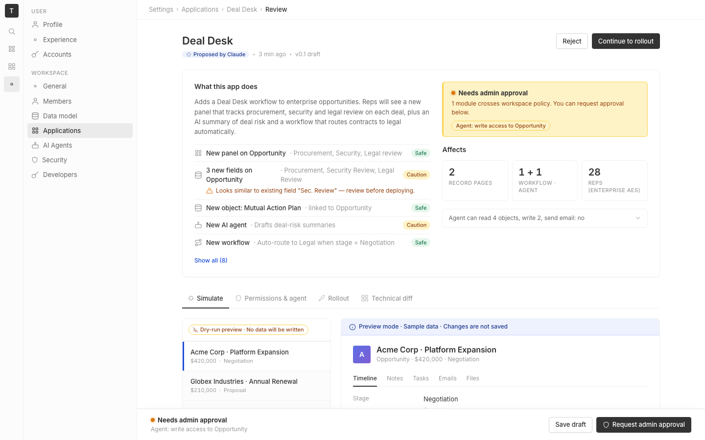

# m0-generalized · deal-desk-prototype-1

## Screenshots
| before (origin) | after (working copy) |
|---|---|
|  |  |

## Goal achievement
Tightened the prototype's visual design so it reads as a native Twenty settings page rather than a one-off mock. Anchored to Twenty's `twenty-ui` light tokens (gray scale 1–12, Inter, 4 px spacing, 4/6/8 px radii, indigo accent, soft P3-style status colors) and rebuilt the full stylesheet around them; lightly retouched markup for hierarchy and copy. Covers every nit from the prompt:

- **Typography** — 13 px base, Inter with cv11/ss03 features, 22 px h1 with -0.015 em tracking, 14 px section heads, 11 px uppercase eyebrows, tabular numerals on counts/money. No more 18 px/15 px outliers.
- **Color** — replaced the ad-hoc palette with semantic tokens (`--text-primary/secondary/tertiary`, `--bg-canvas/surface/muted/subtle`, `--border-subtle/default/strong`). Indigo primary, restrained purple for AI-only surfaces, calmer amber for caution. Status dots get a soft P3-style halo instead of a flat circle.
- **Spacing & rhythm** — single 4 px scale (`--s-1`…`--s-10`), consistent 24 px card padding, 8 px form gutters, eliminated stray `style={{ height: 24 }}` spacers and one-off `var(--space-3)` references.
- **Grid & layout** — page max-width tightened to 1040 px, summary grid rebalanced to 1.15:1, rollout column dropped from 360 to 320 px, simulate sidebar to 304 px. Side rails now align with `48 + 232` px shell width.
- **Iconography** — Inter-weight icons at 16 px nav / 14 px chrome / 11 px in tags. Stroke 1.75 stays, but opacity 0.7→1 on active states gives subtle affordance rather than color swaps.
- **Information hierarchy** — sticky-style "What this app does" heading drops from 15→14 px so the page h1 dominates; section eyebrows ("WORKFLOW WOULD TRIGGER") replace bold lede labels; AI-summary header demoted to 11 px uppercase with a 2 px purple rule instead of a full-color tile.
- **Composition & balance** — preview-frame no longer uses a heavy 2 px dashed blue border (an AI-slop tell); replaced with a 1 px subtle frame + soft shadow and a colored ribbon to do the "preview" signaling. Active sim-opp uses a 3 px inset left rule instead of a flat fill, which reads more like Twenty's selection state.
- **Responsive behavior** — added breakpoints (1024 px collapses the summary grid; 980 px collapses simulate and rollout to one column).
- **Forms** — chip inputs and number inputs get a real focus ring (`box-shadow: 0 0 0 3px var(--blue-soft)`), the stepper is now a single 28 px row with proper hover, and the duration radios share a baseline.
- **Tables & data density** — `.stable` rows hover, header band moved to `--bg-muted`, removed the 3fr/8fr lopsided columns for `minmax(180px, 1fr) 2fr`, tags column right-aligns naturally.
- **Empty / loading / error states** — "—" entry in the review row stays minimal; conflict line under a change row indents under its icon and uses amber ink with a 12 px warning glyph, not red text on white (which read as a hard error). Lock-blocked toggle uses a small lock + plain text instead of a half-broken switch.
- **Pixel polish** — `box-sizing` reset, `:focus-visible` outlines, real `::selection`, custom-but-subtle scrollbars, and `font-variant-numeric: tabular-nums` on every dollar/count.
- **Token consistency** — every value now flows through CSS variables; no inline hex, no `#hex` literals outside the `:root` block, no leftover `--space-N` references.
- **AI-slop tells removed** — dashed blue preview border, the gradient-laden "AI preview" pill at full strength, "historically a 2.4× risk signal" → reworded as a tighter, less padded sentence, and "Looks similar to existing field" conflict text recolored from red-on-white (false-error vibe) to amber ink with a warning icon. AI-summary card became a calm muted tile with a 2 px purple rule instead of a full purple wash.

## Cost
- wall time: 5m 15s
- turns: 54
- tokens (input / cache-create / cache-read / output): 67 / 143216 / 2980444 / 26937
- $ estimate: $3.059082000000001

## How Claude achieved it
1. Read `App.tsx` / `App.css` end-to-end to inventory every component and CSS variable in use.
2. Pulled Twenty's design tokens from `grounding/twenty/packages/twenty-ui/src/theme/constants/` — `GrayScaleLight`, `BackgroundLight`, `BorderCommon`, `BoxShadowLight`, `FontCommon`, `MainColorsLight`, `AccentLight` — to anchor color/space/radius/shadow values.
3. Rewrote `App.css` from scratch around a single 4 px spacing scale, semantic text/bg/border tokens, and Twenty's gray-scale 1–12 mapping. Added focus rings, hover states, tabular numerals, subtle scrollbars, and `:focus-visible` outlines for accessibility/polish.
4. Targeted edits in `App.tsx`: replaced ad-hoc `style={{ padding: 'var(--space-3)' }}` with a real `.sidebar-footer` container, removed a stray 24 px spacer, tightened AI-summary copy, and demoted the "AI preview" label to a quieter pill — keeping the markup surface stable so the redesign is mostly CSS.
5. Verified no `--space-*` references remained and that every visual element routes through tokens.

Browser screenshots were not possible from the agent's sandboxed Playwright session (it can't reach `localhost:5220`), so all work was driven by reading the markup + Twenty's reference tokens. The dev server hot-reloads, so the running prototype reflects the changes.

## Prompt
```
Improve the visual design of this prototype (http://localhost:5220/), which is a mock of a future feature built into twenty (live codebase is at ../../grounding/twenty for reference to use as a baseline to adhere to). Cover the full surface of visual design nits: typography, color, spacing & rhythm, grid & layout, iconography, information hierarchy, composition & balance, responsive behavior, forms, tables & data density, empty/loading/error states, pixel polish, token consistency, and AI-slop tells.
```
