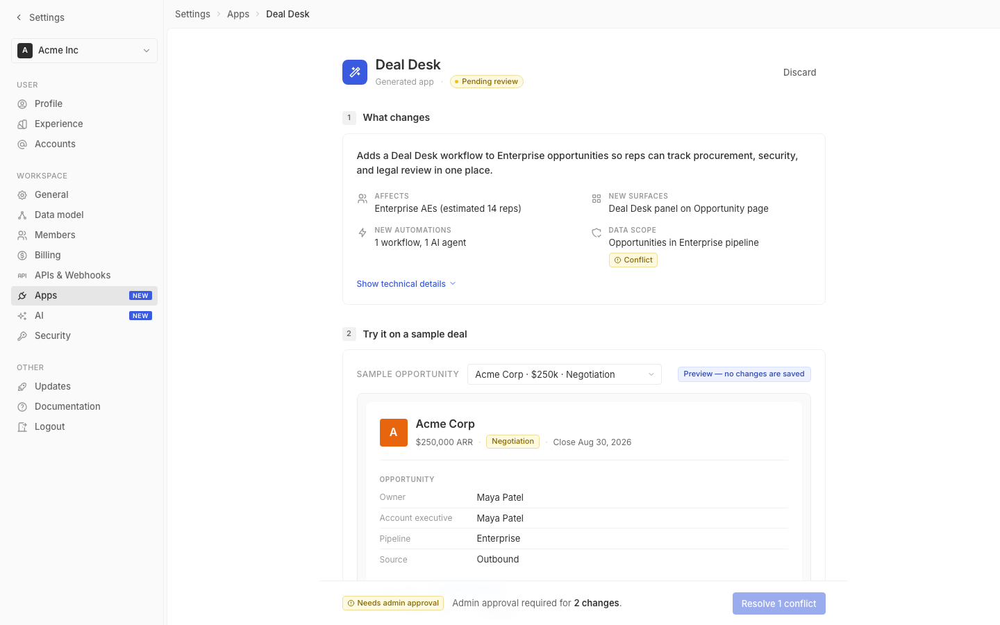

# m0-generalized · deal-desk-prototype-2

## Screenshots
| before (origin) | after (working copy) |
|---|---|
|  |  |

## Goal achievement
Substantially achieved. The prototype now reads as native to Twenty rather than a generic AI-generated mock. Major AI-slop tells were removed (purple→violet gradient on app/agent icon, orange→red gradient on the avatar, dashed yellow "AI preview" frame, "Built by Claude" subtitle). Color tokens were re-aligned to Twenty's actual indigoP3-based palette (`--color-blue: #3a5bdf` vs the prior generic `#4f46e5`), the body font scale was tightened to Twenty's 13px base, and every section was reworked for tighter typography, calmer borders, more breathing room, and consistent token usage. A few items not exhaustively reworked: rich hover/focus animation polish, full dark-mode parity, and pixel-perfect alignment to Twenty's actual icon stroke weights.

## Cost
- wall time: 6m 10s
- turns: 47
- tokens (input / cache-create / cache-read / output): 53 / 107236 / 3756295 / 32554
- $ estimate: $3.3624874999999994

## How Claude achieved it
1. **Sourced the real design system.** Read Twenty's theme constants (`packages/twenty-ui/src/theme/constants/*`) — `BackgroundLight`, `FontLight`, `BorderLight`, `MainColorsLight`, `GrayScaleLight`, `BoxShadowLight`, `FontCommon` — to identify the actual palette (indigoP3 for "blue", real gray-scale ramps), font sizes (~0.92rem default = ~13px), border radii, and subtle shadow recipe (`0px 2px 4px rgba(0,0,0,0.04), 0px 0px 4px rgba(0,0,0,0.06)`).

2. **Rewrote `styles.css` as a single token-driven sheet.**
   - Color: replaced the generic `#4f46e5` violet with `#3a5bdf` indigo and added matching `--color-blue-3/5/7/10/11` ramps; recolored yellow/green/red ramps to less-saturated tones consistent with Twenty's Radix-P3 step 9/11 mapping; added an `--color-orange-9` swatch for the avatar.
   - Typography: dropped body to 13px / line-height 1.45 with Inter feature-settings; reduced section headers from 16px→14px; reduced uppercase eyebrow labels from 12px to 10–11px with 0.06em tracking (Twenty pattern); added `letter-spacing: -0.015em` to the page title.
   - Spacing & rhythm: increased section gap to 32px, gave cards 20px padding, expanded page padding to 40/32/112, switched filter row to `grid-template-columns: repeat(auto-fit, minmax(160px, 1fr))` so it reflows responsively.
   - Borders/shadows: standardized to `--border-light/medium/strong`, removed dashed borders, swapped the deploy bar's heavy box-shadow for a translucent backdrop-blurred bar.
   - Forms: gave selects a custom inline SVG chevron via CSS `background-image` (so the chevron lives in the control, not as a sibling element), unified input heights at 30px, added consistent focus-ring `--ring-focus`.
   - Tables/data density: replaced per-row `border-bottom` on field-rows with sibling-combinator borders (`.field-row + .field-row`), tightened row heights, made labels a quieter `--font-tertiary`.

3. **Removed AI-slop tells in `App.tsx`.**
   - Killed the purple gradient (`linear-gradient(135deg, #6366f1, #8b5cf6)`) on both the page `app-icon` and the inline-styled `agent-header-row` icon — now a flat indigo.
   - Killed the orange gradient on the record avatar (now a flat `#e8650f`).
   - Removed the dashed-yellow "AI preview" frame; replaced with a subtle bordered card and a tiny "Generated summary" eyebrow with a Sparkles icon — same content, no neon "this is AI" cliché.
   - Toned the Deal Desk panel from a saturated blue background to a clean white card with an indigo eyebrow label — keeps the affordance ("Added by app") without screaming.
   - Replaced the "Built by Claude" subtitle with the more product-honest "Generated app".
   - Replaced punctuation-dot pseudo-elements (`subtitle-dot::before`) with explicit `<span className="subtitle-sep">·</span>` separators so the dots inherit color tokens and don't drift.

4. **Cleaned up inline styles.** Lifted ~12 ad-hoc inline styles (color="#999", inline minWidth, fontSize, marginTop, etc.) into proper classes (`.filter-placeholder`, `.advanced-panel`, `.advanced-panel .filter-helper`, `.pilot-conjunction`, `.record-meta-sep`, etc.) so future edits don't drift from tokens.

5. **Responsive polish.** Added a 900px breakpoint that collapses the summary grid to single column and tightens page padding, and a 720px breakpoint that hides the sidebar entirely and shrinks the field-row label column — covers tablet/mobile of the embedded settings shell.

## Prompt
```
Improve the visual design of this prototype (http://localhost:5221/), which is a mock of a future feature built into twenty (live codebase is at ../../grounding/twenty for reference to use as a baseline to adhere to). Cover the full surface of visual design nits: typography, color, spacing & rhythm, grid & layout, iconography, information hierarchy, composition & balance, responsive behavior, forms, tables & data density, empty/loading/error states, pixel polish, token consistency, and AI-slop tells.
```
