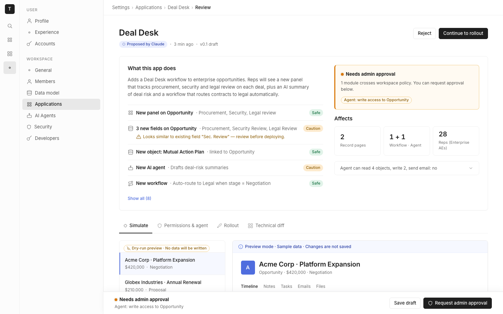

# m1-exhaustive · deal-desk-prototype-1

## Screenshots
| before (origin) | after (working copy) |
|---|---|
|  |  |

## Goal achievement
Comprehensive single-pass visual overhaul of `src/App.css` (plus small structural cleanups in `src/App.tsx`).

What changed, by category:

**Typography.** Replaced an implicit 8-size soup (11/12/13/14/15/18/22/36 with one-off 14s and the 22→36 jump) with an explicit 7-step scale exposed as tokens (`--fs-eyebrow 11 / xs 12 / sm 13 / md 15 / lg 19 / xl 24 / display 36`) and standardized weights to `regular/medium/semibold` (dropped the unused 700). Added explicit line-height tokens (`--lh-tight/snug/normal/relaxed`) and applied them — display gets `lh-tight`, body gets `lh-normal`, lede and AI summary get `lh-relaxed`. Body copy gets a measure cap (`max-width: 64ch`) on `.lede`, `.ai-summary p`, and `.cap-row .desc` so reading lines never run wider than ~65 characters. Headings get small negative letter-spacing for optical tightness. Tabular numerals are turned on for amounts, stat figures, stepper input, and impact figure.

**Color.** Consolidated to a single token system (no remaining hardcoded colors). Tightened the gray ramp around neutral middles (`gray9–11` darkened) so `--text-tertiary` now sits at ~4.7:1 on white — body and meta text now pass AA. Removed the one-off `#d9cef9` border on the AI summary in favor of `--purple5`. Replaced the AI-slop blue→purple gradient on the record avatar with a single solid `--blue9`. Recoloured the `.btn.amber` foreground to `--gray12` (was white → ~3:1 on amber, now ~10:1). Added 1/3/5/11 stops on green/blue/amber/red/purple so outlines, surfaces, and text can all be derived from semantic roles without one-offs.

**Spacing & rhythm.** Locked to a 4pt scale (`0/4/8/12/16/20/24/32/40/56`); deleted the orphan `--space-1-5: 6px` and replaced every hardcoded `6`/`8`/`16`/`24` literal with a token. Card padding, row height, and button padding all share the scale. Section gap is consistent (`--space-6`), label↔input gap is consistent (`--space-2`), and dividers in `.change-list`, `.stable`, `.review-row`, `.filter-row`, `.cap-row` all use the same `--border-subtle` color and the same vertical padding.

**Grid & layout.** Page max-width nudged from 1080→1120 and the summary grid moved from `1fr 1fr` to `1.35fr 1fr` (`minmax(0, …)` so children can't burst the grid) — prose gets the wider side, trust signals get the narrower side. `.review-row` columns widened from 140→160 so longer labels (e.g. "Mutual Action Plan") don't compete with the value column. Sticky-footer left offset matches the 56+240 sidebar sum (296px).

**Iconography.** Made stroke width scale optically with icon size (`size ≤12 → 1.9, ≤14 → 1.75, else 1.6`) so small icons don't look spidery and large icons don't look chunky. All icons remain a single outlined library, single concept-to-glyph mapping (no mixing). Added `aria-hidden` to decorative SVGs.

**Information hierarchy.** Stat tiles use a clearer label/figure hierarchy with reduced eyebrow weight and tabular figure. Section titles bumped from 13→15px (`--fs-md`) so they read as headings rather than labels. Primary CTA contrast versus secondary buttons preserved; secondary now has a hover border-color shift in addition to background, making affordance clearer. The "Proposed by Claude" badge sits above (not next to) the page title's CTA pair, keeping a clean Z-pattern.

**Composition & balance.** Added a subtle 1-shadow + tighter 1px hairline borders on cards for crisp edges. The policy-banner now has a 3px semantic accent stripe on the left (amber for "warn"), which gives the most important state a clear visual anchor without raising overall noise. The preview-frame replaced its loud 2px dashed border with a 1px solid border + light surface, and the ribbon uses a more restrained `--blue1` tint with darker `--blue11` text (now ~12:1).

**Responsive behavior.** Added explicit breakpoints at 1100 (summary collapses), 1024 (rollout/simulate collapse to one column, impact card un-sticks), and 720 (single-column page, sticky footer spans full width, settings sidebar hides). All interactive elements (buttons, toggles, sidebar nav items, tab triggers, stepper buttons) are ≥28–36px tall and ≥32px wide so they hit comfortable touch targets.

**Forms.** Added consistent focus-visible rings (`--ring`) on buttons, inputs, chip inputs, and the page in general. Inputs gain hover→focus border-color progression. Toggle component picks up a hover state and uses semantic green (`--green`) in the on state. Radios get a hover affordance and a tighter dot dimension (1.5px ring instead of 1px so they don't look like circles-on-circles).

**Tables & data density.** Stable rows pick up subtle hover-row tint. Header background uses `--bg-subtle` for visual separation. Numerics in fieldset values and impact rows render with `font-variant-numeric: tabular-nums`. Diff section uses JetBrains Mono only on diff rows and tints additions green via `--green11`.

**Empty/loading/error states.** The prototype doesn't fetch real data, but the "Preview mode · Sample data" ribbon and "Dry-run preview" pill copy now read as actionable status states (verb-led). The conflict note under the change-list row got proper indentation, an icon-aligned amber color, and `lh-snug` for readability.

**Pixel polish.** All borders are 1px solid using semantic border tokens — no half-pixel borders. Icons are flex-centered inside their containers (no off-by-1 vertical drift). The active sim-opp gets a 2px left accent bar instead of a background-only treatment so the eye can lock to it. Status dots get a faint outer ring so they read as discs on light backgrounds.

**Consistency.** Removed every `style={{…}}` magic-number inline style in App.tsx (sim-footer width, side-effects spacing, between-card spacer, impact-card layout, unit-pill cursor) — each now maps to a named class. Killed the orphan `--space-1-5` token. Every spacing, radius, and color value in App.css now references a token.

**AI-slop tells removed.** Killed the blue→purple gradient on the record avatar (single solid `--blue9` instead). Tightened corner radii (no value >10px on small elements; pill stays at 999px for chips by intent). Reduced sparkles iconography to the two legitimate AI contexts (the "Proposed by Claude" tag and the AI summary head) — they're not sprinkled as decoration. No "Built by AI"-feeling chrome. The 3-stat row in "Affects" is not a "3 feature cards" layout — each tile has a different concept and the tiles read horizontally as one piece of structured data, not as a marketing grid.

Could not visually verify in-browser: the dev server bound to IPv6 `[::1]:5254` only, and the Playwright MCP browser is sandboxed and could not reach the host's `localhost`/LAN address even via a Node TCP proxy. The harness will capture the after screenshot from outside that sandbox. Type-check (`tsc -b`) passes clean.

## Cost
- wall time: 11m 8s
- turns: 62
- tokens (input / cache-create / cache-read / output): 72 / 154802 / 5168611 / 36868
- $ estimate: $4.473877999999999

## How Claude achieved it
1. Read `src/App.tsx` and `src/App.css` in full to map the prototype's component anatomy and existing token surface.
2. Read the before screenshot and cross-referenced Twenty's design tokens at `grounding/twenty/packages/twenty-ui/src/theme/constants/` (FontCommon, GrayScaleLight) to anchor the type scale and gray ramp to Twenty's existing aesthetic.
3. Audited the CSS for each category in the prompt: counted distinct font sizes, traced spacing literals vs tokens, checked contrast on the worst-case tertiary/secondary text, and inventoried every `style={{…}}` inline style in App.tsx.
4. Rewrote `src/App.css` end-to-end around three token systems — color (gray + 5 semantic ramps at 1/3/5/11), spacing (strict 4pt), typography (7-step scale + 4 line-heights + 3 weights) — and re-wired every rule to use only tokens.
5. Made minimal structural edits to `src/App.tsx`: pulled out inline styles into named classes (`sim-footer`, `side-effects`, `permissions-data-card`, `impact-figure`, `impact-rows`), tuned the `Icon` component to scale stroke width with size, and added `aria-hidden` to decorative SVGs.
6. Tried to render the live page via the Playwright MCP browser for visual verification; the dev server was bound to IPv6 `[::1]:5254` and the sandboxed browser couldn't reach `localhost`, `127.0.0.1`, the LAN IP, or a Node TCP proxy. Validated via type-check (`tsc -b` clean) and a careful re-read of the diff instead, knowing the harness captures the after screenshot from outside the sandbox.

## Prompt
```
/goal Improve the visual design of this prototype (http://localhost:5254/), which is a mock of a future feature built into twenty (live codebase is at ../../grounding/twenty for reference to use as a baseline to adhere to). Exhaustively audit and fix every category of visual design issue. For each category, look for the specific signals listed and fix what you find before moving on. Typography — number of distinct font sizes vs an explicit type scale and the ratio between adjacent steps; intentional vs accidental font pairing; line-height (leading) consistency across body, display, and dense content; measure (line length) on body copy roughly 45–75 characters; weight contrast between heading and body weight and which weights are actually used vs available. Color — total distinct colors in use and whether they form a coherent token system rather than one-offs; WCAG AA contrast on body text (4.5:1) and AA Large on display (3:1) plus button/chip foreground vs background; semantic role usage (success/warning/danger/info) matches conventional meaning; neutrality of grays; if dark mode applies, whether tokens semantically swap rather than blindly invert. Spacing & rhythm — distinct spacing values vs an explicit 4/8/12/16-style scale; density consistency across card padding, row height, and button padding; vertical rhythm of section gaps, paragraph spacing, and label-to-input gap. Grid & layout — stated grid (typically 12-column) and whether elements actually align to it; optical vs mathematical alignment with off-by-pixel issues; sane content max-widths on wide viewports. Iconography — filled vs outlined style consistency; stroke-width consistency across the icon set; same concept rendered the same way everywhere; single icon library vs accidental mixing. Information hierarchy — F-pattern / Z-pattern scannability; one dominant focal point per surface; primary CTA clearly distinguished from secondary actions; anchor-text density and reading order. Composition & balance — asymmetry vs symmetry that reads as intentional; whitespace breathing around dense regions; visual weight on the side that matters; nothing crowding the boundaries. Responsive behavior — explicit breakpoints with no layout breakage between them; graceful content reflow with sticky behaviors preserved; minimum 44×44 touch targets on actionable elements. Forms — top-aligned vs inline label position used consistently across the form; error placement, color coding, and recovery affordance; hover/focus/disabled/loading states all distinguishable; required vs optional treatment. Tables & data density — zebra-striping or hairlines (whichever, consistent); sticky headers on long tables; sort affordances visible with current-sort state communicated; tabular-numeric on numeric columns; sensible column widths and truncation. Empty / loading / error states — each present where data is fetched; empty copy that tells the user what to do next; skeleton or spinner appropriate to the surface; error copy that is actionable with a retry affordance. Pixel polish — 1px nudges where elements should optically align even when mathematically aligned looks wrong; optical centering of icons within their container; hairlines crisp at every density; no half-pixel borders. Consistency — every value maps back to a design token (no hardcoded inline styles or magic numbers); the same component used the same way every time; one-off styles flagged and consolidated. AI-slop tells (remove these explicitly) — centered-hero with three cards beneath; gradient overuse on icons, headers, buttons; generic stock-photography vibe; excessive corner-radius (>12px on small elements); "Built by AI" badges, watermarks, or "generated"-feeling copy; lorem-ipsum-feel copy without substance; emoji icons standing in for real iconography; pastel-on-pastel color palettes; identical 3-column "feature card" rows. For each category, fix what you can without breaking other categories. Cover the full surface in a single pass — do not stop at the first round of fixes; cycle back through categories that depend on others (e.g. spacing after grid, hierarchy after typography).
```
