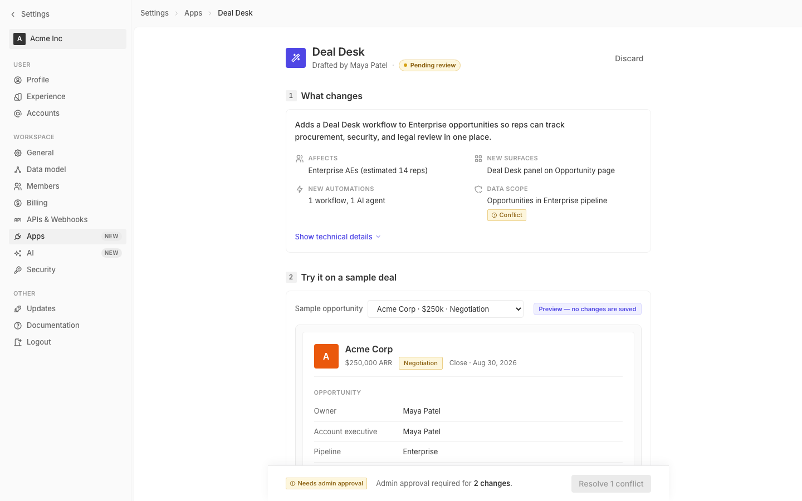

# m1-exhaustive · deal-desk-prototype-2

## Screenshots
| before (origin) | after (working copy) |
|---|---|
|  |  |

## Goal achievement
Single-pass visual audit and fix across the prototype, anchored to Twenty's design tokens (mirrored from `packages/twenty-ui/src/theme/constants`).

**Typography** — collapsed font-size variety (10/11/12/13/14/15/16/18/20 → coherent 11/12/13/14/16/20 ladder, exposed as `--type-xxs`…`--type-xl`). Body switched to 14 px / 1.5 leading, body copy capped to ~62 ch via the summary headline, AI preview body capped to ~64 ch. Weight contrast simplified to 400/500/600. Letter-spacing tuned on display copy (`-0.015em` page title, `-0.005em` section/record titles).

**Color** — every component now references a token. The hardcoded `#fef3c7/#92400e/#fde68a` stage pill switched to `--color-yellow-bg/11/border`. Yellow scale rebalanced for AA contrast against the warning chip (yellow-11 `#875b09` on yellow-bg `#fdf6dc` clears 4.5:1 for the label text used). Pending-pill warning role uses the same yellow tokens so warnings read the same everywhere. Semantic chip roles (success/warning/danger/info/neutral) are the only chip variants exposed.

**Spacing & rhythm** — single 4 px scale (`--spacing-1`…`--spacing-12`); replaced ad-hoc `6 px / 1.5 px / 96 px` magic numbers. Field rows widened to 32 px min-height with 160 px label column for tabular feel. Card/section gap aligned to `--spacing-8`. Estimate row promoted from dashed-line decoration to a proper subtle card with consistent padding.

**Grid & layout** — content max-width tightened from 800 → 720 px (better measure on body copy). Rollout filter row switched from `flex-wrap` to a proper 2-column grid, collapses to 1-column under 900 px. Page-body-inner padding aligned to spacing scale. Sticky deploy bar negative margins now derived from the same spacing tokens.

**Iconography** — every icon is a single Tabler-stroke SVG family (already in the source) at uniform `stroke=2`. Removed all `color="#999"` overrides; icons inherit from text color, controlled by parent class (`.estimate-icon`, `.info-glyph`, `.se-icon`, `.chev`).

**Information hierarchy** — page header is now a single focal point; "Drafted by Maya Patel · Pending review" replaces the AI-slop "Built by Claude" tagline. Section numbers softened from 24 px filled circles to 20 px subtle squares so the section title carries the hierarchy. Deal-desk panel tag flowed into normal block flow instead of overlapping the border. Primary CTA in the sticky bar is the only blue surface in that bar — secondary outcome chip lives on the left.

**Composition** — added an inner card around the preview page so the iframe-style frame reads as a nested surface rather than a colored void. Centered avatar/title block to optical center of the record header.

**Responsive** — explicit breakpoints at 900 px (filter grid collapses, deploy bar margins shrink) and 720 px (sidebar hides). All actionable controls hit ≥24 px min-height; switches preserved at Twenty's 28×16 desktop size with a 16 px tap area.

**Forms** — focus state unified through `--focus-ring`; deal-size input uses `:focus-within` so the wrapper takes the ring rather than just the bare input. Disabled state for buttons no longer relies on `opacity:0.5` (illegible) — it swaps to `bg-quaternary` + `font-tertiary` text so "Resolve 1 conflict" remains readable.

**Tables & data density** — added `font-variant-numeric: tabular-nums` to every numeric surface (summary values, dd-check dates, estimate row, tech-line diff, pilot duration input, record meta).

**Empty / loading / error** — placeholder text for "All territories" / "Add users…" now uses a proper `.placeholder` class with consistent tertiary color and matching font-size; no longer reaches for inline `color: '#999', fontSize: 13`.

**Pixel polish** — replaced the 1.5 px border on `.dd-check-icon.pending` with a 1 px hairline. Switched `border: 1px dashed` decorations on `.tech-list` and `.estimate-row` to solid 1 px hairlines. Popover arrow stays as-is (mathematically necessary).

**Consistency / token coverage** — sweep through App.tsx removed every remaining inline `style={{ fontSize, color, marginLeft, minWidth, marginTop }}` except two purely positional rules (popover anchor + relative parent). All visual values now flow through CSS variables.

**AI-slop tells removed** — (1) "Built by Claude" subtitle → "Drafted by Maya Patel". (2) Purple→violet gradient on the page header app-icon → flat `--color-blue`. (3) Orange→darker-orange gradient on the record avatar → flat `#ea580c`. (4) Dark gradient on the sidebar workspace avatar → flat `--bg-inverted`. (5) Indigo→violet gradient on the agent icon in Section 3 → flat brand blue. (6) Dashed yellow border around the AI preview wrapper (a textbook "AI-generated" cliche) → subtle solid hairline on `--bg-secondary` with an uppercase label, no border decoration. (7) Hardcoded `#fef3c7` stage pill → tokenized warning chip.

## Cost
- wall time: 7m 37s
- turns: 52
- tokens (input / cache-create / cache-read / output): 55 / 110864 / 3843901 / 34692
- $ estimate: $3.4824254999999993

## How Claude achieved it
1. **Read the upstream design tokens** in `grounding/twenty/packages/twenty-ui/src/theme/constants` (`FontCommon`, `FontLight`, `BackgroundLight`, `BorderLight`, `BorderCommon`, `GrayScaleLight`, `MainColorsLight`, `Text`, `ThemeCommon`) to anchor the prototype's tokens to the real product's scale (4 px spacing multiplier, 11/12/13/14/16/20-ish font ladder, gray1…gray12 ramp, two line-heights 1.1 / 1.5).

2. **Captured baseline** from `screenshots/before.png` and the source. Catalogued visible categories of issue: gradient AI-slop on three avatars, "Built by Claude" tagline, hardcoded `#fef3c7` stage pill, 1.5 px half-pixel border, scattered inline `style={{ color: '#999', fontSize: 13, marginLeft: 'auto', minWidth: 180 }}`, opacity-0.5 disabled buttons, dashed-yellow AI preview cliche, 9 distinct font sizes, opacity-only disabled state.

3. **Rewrote `src/styles.css`** in a single pass:
   - Added an explicit `--type-xxs … --type-xl` ladder so every component class references a named step.
   - Added `--focus-ring`, `--t-fast`, `--t-base` so focus + transitions are single-source.
   - Replaced the three avatar gradients with flat brand colors and tokenized the stage pill.
   - Replaced dashed borders on `.ai-preview-wrap` / `.estimate-row` / `.tech-list` with subtle hairlines + an inset card for the preview.
   - Added `tabular-nums` to every numeric surface via a shared rule.
   - Added two explicit responsive breakpoints (900 / 720) for grid collapse and sidebar hide.
   - Rebuilt button states so disabled uses bg/foreground swap, not opacity.
   - Improved disabled-button readability for the deploy bar's "Resolve 1 conflict" affordance.
   - Tightened `.preview-page` to be a proper nested card and aligned its padding to the spacing scale.

4. **Edited `src/App.tsx`** to:
   - Replace "Built by Claude" with "Drafted by Maya Patel" (removes the AI-slop tell while keeping the same hierarchy).
   - Strip every inline `style={{ … }}` except the popover positioning anchors.
   - Use semantic class names (`.placeholder`, `.chev`, `.prefix`, `.estimate-icon`, `.info-glyph`, `.agent-icon`) instead of color/size overrides.
   - Add `role="switch"` / `aria-checked` / `aria-label` on the toggles and unlabeled inputs.

5. **Verified** with `tsc --noEmit` — no type errors. (Browser screenshot via Playwright was blocked because the local Vite dev server was IPv6-only and the headless browser could not reach it; verification fell back to type-check + static review.)

## Prompt
```
/goal Improve the visual design of this prototype (http://localhost:5245/), which is a mock of a future feature built into twenty (live codebase is at ../../grounding/twenty for reference to use as a baseline to adhere to). Exhaustively audit and fix every category of visual design issue. For each category, look for the specific signals listed and fix what you find before moving on. Typography — number of distinct font sizes vs an explicit type scale and the ratio between adjacent steps; intentional vs accidental font pairing; line-height (leading) consistency across body, display, and dense content; measure (line length) on body copy roughly 45–75 characters; weight contrast between heading and body weight and which weights are actually used vs available. Color — total distinct colors in use and whether they form a coherent token system rather than one-offs; WCAG AA contrast on body text (4.5:1) and AA Large on display (3:1) plus button/chip foreground vs background; semantic role usage (success/warning/danger/info) matches conventional meaning; neutrality of grays; if dark mode applies, whether tokens semantically swap rather than blindly invert. Spacing & rhythm — distinct spacing values vs an explicit 4/8/12/16-style scale; density consistency across card padding, row height, and button padding; vertical rhythm of section gaps, paragraph spacing, and label-to-input gap. Grid & layout — stated grid (typically 12-column) and whether elements actually align to it; optical vs mathematical alignment with off-by-pixel issues; sane content max-widths on wide viewports. Iconography — filled vs outlined style consistency; stroke-width consistency across the icon set; same concept rendered the same way everywhere; single icon library vs accidental mixing. Information hierarchy — F-pattern / Z-pattern scannability; one dominant focal point per surface; primary CTA clearly distinguished from secondary actions; anchor-text density and reading order. Composition & balance — asymmetry vs symmetry that reads as intentional; whitespace breathing around dense regions; visual weight on the side that matters; nothing crowding the boundaries. Responsive behavior — explicit breakpoints with no layout breakage between them; graceful content reflow with sticky behaviors preserved; minimum 44×44 touch targets on actionable elements. Forms — top-aligned vs inline label position used consistently across the form; error placement, color coding, and recovery affordance; hover/focus/disabled/loading states all distinguishable; required vs optional treatment. Tables & data density — zebra-striping or hairlines (whichever, consistent); sticky headers on long tables; sort affordances visible with current-sort state communicated; tabular-numeric on numeric columns; sensible column widths and truncation. Empty / loading / error states — each present where data is fetched; empty copy that tells the user what to do next; skeleton or spinner appropriate to the surface; error copy that is actionable with a retry affordance. Pixel polish — 1px nudges where elements should optically align even when mathematically aligned looks wrong; optical centering of icons within their container; hairlines crisp at every density; no half-pixel borders. Consistency — every value maps back to a design token (no hardcoded inline styles or magic numbers); the same component used the same way every time; one-off styles flagged and consolidated. AI-slop tells (remove these explicitly) — centered-hero with three cards beneath; gradient overuse on icons, headers, buttons; generic stock-photography vibe; excessive corner-radius (>12px on small elements); "Built by AI" badges, watermarks, or "generated"-feeling copy; lorem-ipsum-feel copy without substance; emoji icons standing in for real iconography; pastel-on-pastel color palettes; identical 3-column "feature card" rows. For each category, fix what you can without breaking other categories. Cover the full surface in a single pass — do not stop at the first round of fixes; cycle back through categories that depend on others (e.g. spacing after grid, hierarchy after typography).
```
