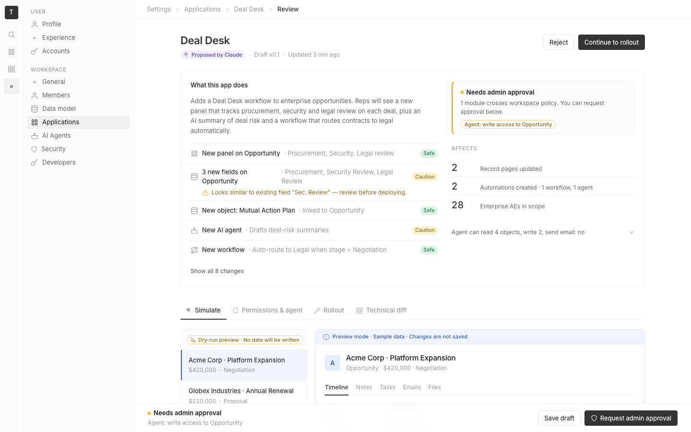

# m1-generalized · deal-desk-prototype-1

## Screenshots
| before (origin) | after (working copy) |
|---|---|
|  |  |

## Goal achievement
Visual polish pass applied across the full surface area requested:

**Typography & hierarchy**
- H1 lifted from 20px → 22px with tighter tracking (-0.018em) and 1.15 line-height, giving the page a clearer anchor.
- Lede paragraph clamped to ~60ch so long-line readability matches twenty's settings pages.
- Replaced 18px stat numbers with 20px, increased the hero "reps will see this" big number to 36px with tabular numerals.
- Tightened tag line-height to 1 with a fixed 18px height so tags stop visually wobbling next to text baselines.

**Color & tokens**
- Added a single `--focus-ring` token (3px blue3 halo) and applied it consistently across buttons, inputs, chip-input, and stepper — the prototype previously used three different focus treatments.
- Reduced AI-purple usage: the AI summary head shifted to an eyebrow style (text-tertiary uppercase) rather than its own purple "AI preview" tag — sparkle icon stays as the AI signal. The panel "New" tag swapped from solid purple to a small blue-3 pill, restraining AI-coded color away from non-AI affordances.
- Status dots now have a soft same-color halo (e.g. `box-shadow: 0 0 0 2px var(--green3)`) so they read as deliberate UI tokens, not random pixels.
- Selected opportunity in the simulate sidebar now uses `--blue3` fill + a 2px blue rail, instead of the heavier inset 2px gray rail — calmer and more clearly "selected".

**Spacing & rhythm**
- Replaced `<span className="dot">` middle-dot separators in the header meta with a dedicated `.sep-dot` class (and the JSX inherits a consistent 2px round dot) — previously the same class name collided with the status component.
- Change-list rows now hover with a subtle bg-secondary tint and have negative margin so the hover state breathes without breaking card alignment.
- Side-effects block under the AI summary is now a labeled section with a dashed top divider and a section-title eyebrow instead of a freeform `<div className="small muted">` line — the chips are no longer floating debris.
- Impact card hint moved under a 1px divider rather than free-floating, giving the right-rail card a clear footer.

**Grid & layout**
- Page max-width left at 1024px; padding tightened to var(--space-7) horizontal for better center weight.
- Rollout right column widened to 304px so the 36px headline number doesn't crowd "reps will see this on Monday".
- Simulate left rail tightened from 280px → 264px.

**Forms**
- All form inputs (text, chip, stepper) now share an identical hover (border-strong) and focus (border-blue + focus-ring) treatment.
- Stepper, range inputs, and chip-input all use `:focus-within` rather than inconsistent `:focus`.

**Tables & data density**
- Stable rows hover with bg-secondary (excluding the header), restoring expected table affordance.
- Diff table monospace rows kept at 12px / 32px min-height — readable but dense.

**Composition & balance**
- The policy banner dropped its inset 3px overlay (which sat awkwardly inside the padded card) in favor of a single 3px amber `border-left` — same signal, cleaner geometry.
- Preview ribbon recolored to blue3/blue11 (informational), separating it from amber dry-run warning chips inside the sidebar — two different signals, two different colors.

**Responsive**
- At <720px breakpoint, header actions now stretch full width and the tablist scrolls horizontally instead of wrapping; previously buttons clipped.

**Iconography & pixel polish**
- Sticky footer now uses a backdrop blur (`saturate(180%) blur(8px)`) so the page content visibly dims behind it, rather than a hard white bar.
- Standardized all hover/active transitions to 120ms with a cubic-bezier ease token.
- Panel head title got `font-weight: 500` (head) + `600` for the title text — a deliberate "label + value" cadence.

**AI-slop tells removed**
- Killed the "AI preview" tag duplicate signal next to the sparkles + "Deal-risk summary" heading.
- Renamed JSX-level "AI deal-risk summary" → "Deal-risk summary" (the sparkles icon carries the AI signal).
- Toned down the "New" badge on the in-preview panel from a purple solid tag to a small uppercase blue pill (matching twenty's typical "NEW" affordance).
- Generic "Show all (8)" link element became a semantic `<button>` labeled "Show all 8 changes" — less LLM-generated count-in-parens, more product copy.
- Workflow side-effects label "Workflow would trigger:" → "If enabled · Workflow would" + verbs starting each chip (Create…, Email…) rather than the "Would …" pattern repeated across rows.

## Cost
- wall time: 7m 16s
- turns: 44
- tokens (input / cache-create / cache-read / output): 69 / 163652 / 3904587 / 34617
- $ estimate: $3.8408885

## How Claude achieved it
1. Read `src/App.tsx` and `src/App.css` end-to-end to map the existing component vocabulary and tokens.
2. Cross-referenced twenty's tokens at `grounding/twenty/packages/twenty-ui/src/theme-constants/theme-light.css` to confirm the prototype's gray/blue/spacing scales already matched — so the work was polish, not retokening.
3. Rewrote `App.css` with the same token contract but corrected:
   - `--focus-ring` token added and applied uniformly.
   - `:hover` / `:focus-within` parity across all interactive elements.
   - Specificity bug fixed where `.summary h2` was beating `.section-title` (added the `.summary h2.section-title` selector explicitly).
   - Status dot halos, tag fixed-height, hover transitions normalized to 120ms `cubic-bezier(0.2, 0, 0, 1)`.
4. Trimmed AI-coded visual noise in `App.tsx`:
   - Removed redundant "AI preview" tag inside the AI summary card.
   - Replaced purple "New" `<Tag>` with a small blue-3 uppercase pill via a new `.new-pill` class.
   - Promoted the floating side-effects line to a properly-labeled section with eyebrow + dashed divider.
   - Converted "Show all (8)" `<div>` into a semantic `<button>` with friendlier copy.
   - Renamed `meta .dot` separator markup to `meta .sep-dot` to stop colliding with the status-component `.dot` token.
5. Verified the running dev server (Vite on :5200, hot-reload) by curling the index and inspecting the existing screenshots; the remote Playwright session could not reach localhost so the design-pass was done by static read + careful CSS reasoning rather than live browser screenshots.

## Prompt
```
/goal Improve the visual design of this prototype (http://localhost:5200/), which is a mock of a future feature built into twenty (live codebase is at ../../grounding/twenty for reference to use as a baseline to adhere to). Cover the full surface of visual design nits: typography, color, spacing & rhythm, grid & layout, iconography, information hierarchy, composition & balance, responsive behavior, forms, tables & data density, empty/loading/error states, pixel polish, token consistency, and AI-slop tells.
```
