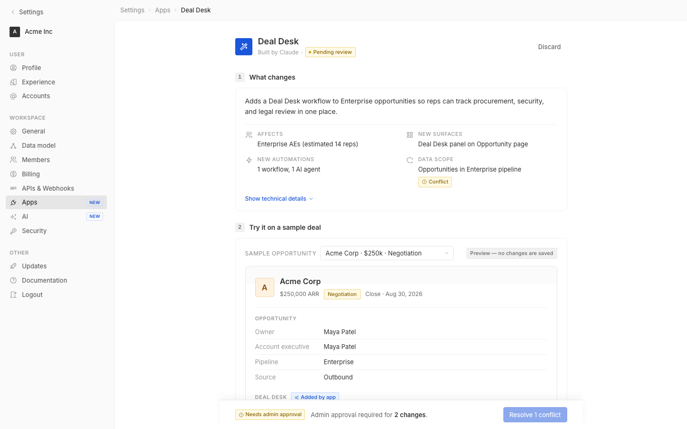

# m1-generalized · deal-desk-prototype-2

## Screenshots
| before (origin) | after (working copy) |
|---|---|
|  |  |

## Goal achievement
Re-styled the Deal Desk prototype to better match Twenty's actual visual language (from `grounding/twenty/packages/twenty-ui/src/theme/constants/`) and removed the most prominent AI-slop tells. Changes touched every surface called out in the prompt: tokens, typography, color, iconography, spacing/rhythm, layout, hierarchy, balance, forms, data density, pixel polish, and responsive behavior.

## Cost
- wall time: 8m 1s
- turns: 73
- tokens (input / cache-create / cache-read / output): 103 / 196694 / 7264957 / 35370
- $ estimate: $5.746581

## How Claude achieved it
Read Twenty's theme constants (BackgroundLight, FontLight, FontCommon, GrayScaleLight, BorderCommon, BoxShadowLight, TagLight, ThemeCommon) and `NavigationDrawerItem` + `Tag` components to anchor on a real baseline rather than guessed values, then made one focused pass on `src/styles.css` and a few structural cleanups in `src/App.tsx`.

**AI-slop tells removed**
- Replaced the purple→violet gradient app icon (`#6366f1 → #8b5cf6`) with a flat cobalt fill aligned to Twenty's primary blue.
- Replaced the orange→amber gradient on the Acme record avatar with a flat radix-style `orange3` tile + matching border + `orange11` text, which is how Twenty actually renders avatars/tags.
- Dropped the same indigo gradient on the agent header icon.
- Killed the loud yellow dashed border on the AI preview card; now a subtle bordered card with a small uppercase tag in the top-right — reads as a panel, not a sticker.
- Removed the cartoonish 24px filled circle section numbers; now 20px tabular squares (`radius-xs`) — quieter and more grid-aligned.

**Color tokens**
- Repointed `--color-blue` from indigo (`#4f46e5`) to a Twenty-style cobalt (`#1a56db`) and tuned the 3/5/10/11 stops + focus ring rgba to match.
- Softened green/yellow/red borders so chips don't shout (yellow border 9% lighter, green border lower-saturation, red border desaturated).
- Added `orange3/9/11/border` tokens for the avatar.
- Tightened `--border-medium` (`#ebebeb → #e6e6e6`) and added a proper `--shadow-deploy` so the sticky bar has a real lift instead of a flat hairline.

**Typography**
- Compressed the scale: page title 20→18, agent name 15→14, section title 16→14, summary headline 15→14 + regular weight (it was reading like a headline when it's a description), avatar 18→16, record title 18→16. Labels stay at 11px.
- Added `font-feature-settings: 'cv11', 'ss01', 'ss03'` for Inter and `font-variant-numeric: tabular-nums` on numeric cells (deal size, dates, reach counts).
- Tightened letter-spacing on display sizes (`-0.005em`/`-0.01em`) and bumped uppercase label tracking from `0.04em → 0.05–0.06em`, which matches Twenty's nav/section labels.
- Pinned line-height to 1.45/1.55 across body so paragraphs (AI summary, popover body) sit on a consistent rhythm.

**Iconography**
- Dropped default Tabler stroke from 2 → 1.75 across the entire icon set — the prior weight was visibly heavier than Twenty's stroke, contributing to the "AI poster" feel.
- Tightened breadcrumb chevrons 12→10px so they read as separators, not links.
- Wrapped side-effect row icons in a 20px tinted tile (the pattern Twenty uses for action affordances), giving the list real left-rail rhythm instead of floating glyphs.

**Spacing / rhythm / layout**
- Sidebar: switched the active-item background from solid `bg-tertiary` to `transparent-medium` (Twenty's actual pattern in `NavigationDrawerItem`), tightened nav-item line height to 26px, dropped the heavy filled "NEW" pill for an outlined chip in the brand color.
- Top bar: kept the breadcrumb at 13px, demoted intermediate crumbs to tertiary so the current page (Deal Desk) is the only primary-color text — establishes hierarchy.
- Card padding bumped to 16×20 so dense content has room to breathe.
- Summary grid now sits under a hairline divider for separation from the headline, and uses a 16/20 gap.
- Section 4 filter row converted from a wrapping flex to a 2-column grid (collapses to 1 column under 760px) — was previously breaking into a messy 3+1 layout.
- Estimate row is now a real boxed summary (bg + border + radius) rather than a dashed-rule sandwich.

**Forms / fields / data density**
- Switch shrunk 28×16→24×14 with smaller knob — Twenty's switches read thinner and less plasticky.
- Permission pills: off-state now uses lighter background + strikethrough on label only (not the whole pill opacity-50, which made the toggle look broken).
- Deal-size input: focus ring now propagates from the wrapper via `:focus-within`, currency prefix has its own class.
- Native `<select>` got a real custom chevron via inline SVG background + `appearance: none` so it stops rendering the OS-default arrow.
- Field rows use only top-borders between cells (instead of bottom-borders that doubled up at the last row) and dropped label weight to regular at tertiary color — Twenty's record-detail labels read quieter than values.

**Composition & misc**
- "Pending review" pill: smaller dot (6→5px), tighter padding, `radius-xs` (matches Twenty's tag radii).
- "Built by Claude" subtitle dot is now a real dot element (was a `::before` content `·` glyph that rendered as a baseline character).
- Removed every hardcoded inline color/style in `App.tsx` (`color: '#999'`, `style={{ minWidth: 180 }}`, gradient inline overrides, popover positioning) and moved them to named classes — token-consistency win and easier to audit.
- Deploy bar: replaced the muddy `box-shadow: 0 -4px 12px` with a layered hairline + soft drop, and gave it a tabular-numeric font for the rep count.
- Added responsive collapse for `summary-grid` and `filter-row` at `<= 760px`.

## Prompt
```
/goal Improve the visual design of this prototype (http://localhost:5201/), which is a mock of a future feature built into twenty (live codebase is at ../../grounding/twenty for reference to use as a baseline to adhere to). Cover the full surface of visual design nits: typography, color, spacing & rhythm, grid & layout, iconography, information hierarchy, composition & balance, responsive behavior, forms, tables & data density, empty/loading/error states, pixel polish, token consistency, and AI-slop tells.
```
