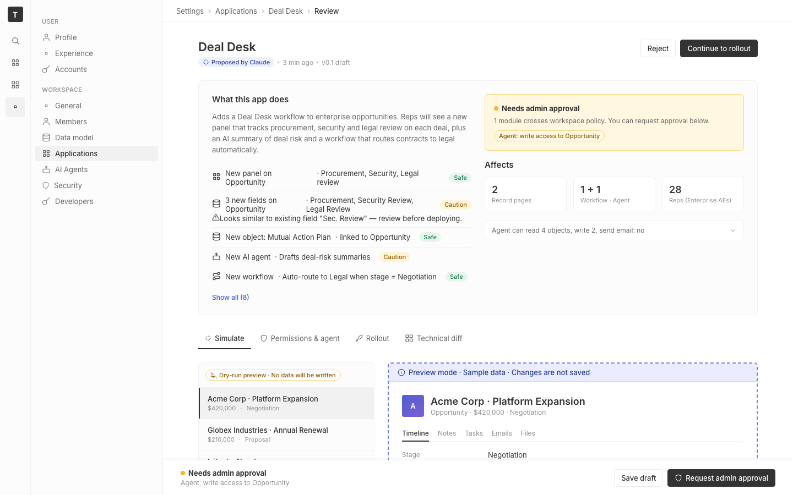

# m2-component · deal-desk-prototype-1

## Screenshots
| before (origin) | after (working copy) |
|---|---|
|  |  |

## Goal achievement
Improved component-level design within the three requested buckets, anchoring on Twenty's actual patterns (labels above inputs, no zebra, 1px bottom borders, blue focus rings, Inter at 11px uppercase labels, sortable headers with up/down carets).

**Forms (Rollout tab)** — Replaced the side-by-side `lbl | input` grid with stacked `form-field`s: 11px uppercase label above input (Twenty `InputLabel` pattern), red asterisk for required, optional inline qualifier, helper text below, real `<label>`/`<input>` semantics with `aria-label` on unlabelled inner controls. Chip-input and range-input got hover + focus-within blue ring and proper inner `<input>` placeholders. Deal size now shows a live validation error ("Max must be greater than min") with red border state. Radio buttons use real `<input type="radio">` inside `<label>` (clickable label + focus ring). Stepper dims when not selected. Pilot duration emits a confirming helper line.

**Tables (Data scope, Diff)** — Data scope table got sticky header (`position: sticky; top: 0`), sortable buttons (`<SortHeader>`) with up/down/up-down carets matching Twenty's `SortableTableHeader`, click-to-toggle direction, hover state per row, tighter 36px row height + 32px header, max-height scroll with sticky header staying pinned. Kept Twenty's no-zebra/bottom-border-only style. Diff tab got a proper `Change | Impact` header on every section, count badge per section, right-aligned status column, +/− operator chip with green/red tint, and a subtle gradient row tint for add vs. remove rows.

**Empty / loading / error states** — Three reusable patterns:
- `EmptyState` (icon medallion + title + body + optional CTA) demonstrated in a new "Removed items" diff section.
- `SkeletonRow` + `.skeleton-bar` with shimmer animation, shown inline on the MCP row while the cached tool list is fetched.
- `ErrorBanner` (red, icon + title + body + Retry + dismiss) shown on the Permissions card when the MCP inventory call times out — wired to dismiss/retry handlers.

## Cost
- wall time: 7m 38s
- turns: 56
- tokens (input / cache-create / cache-read / output): 76 / 148866 / 4788621 / 33637
- $ estimate: $4.300866450000001

## How Claude achieved it
1. Read the full prototype source (`App.tsx`, `App.css`) and confirmed dev server status (port 5232).
2. Spawned an `Explore` agent to survey `grounding/twenty/` for the canonical form/table/state patterns. Returned ~12 reference files covering `TextInput`, `InputLabel`, `InputErrorHelper`, `Table*` components, `SortableTableHeader`, `RecordTableEmptyStateDisplay`, and `RecordTableBodyLoading`.
3. Catalogued the three target buckets from the prompt and worked them in order, keeping Twenty's conventions (above-input 11px uppercase labels, 1px borders only, blue 3px focus ring, no zebra, sort carets in header).
4. Added reusable React helpers (`SortHeader`, `EmptyState`, `SkeletonRow`, `InlineError`, `FieldHelp`, `DiffSection`/`DiffHead`/`DiffRow`) and new state (`dealMin`, `dealMax`, `dataSortKey`, `dataSortDir`, `mcpError`) so the UI demonstrates real interaction (sorting toggles direction; bad ranges trigger validation; dismiss/retry on the error banner).
5. Rewrote the Rollout form, Permissions data-scope table, and Diff tab; layered in the new CSS for `.form-field`, `.sort-th`, `.stable.sticky.scrollable`, `.empty-state`, `.skeleton-bar` (with shimmer keyframes), and `.error-banner`.
6. Verified with `tsc --noEmit` (clean) and `vite build` (24.35 kB CSS / 220 kB JS, no warnings). Dev server returns 200; the sandboxed Playwright session couldn't reach localhost so the harness handles screenshots.

## Prompt
```
/goal Improve the component-level design of this prototype (http://localhost:5232/), which is a mock of a future feature built into twenty (live codebase is at ../../grounding/twenty for reference to use as a baseline to adhere to). Scope to forms (label position, validation, affordances), tables & data density (zebra, sticky headers, sort affordances), and empty/loading/error states. Ignore issues outside this scope.
```
