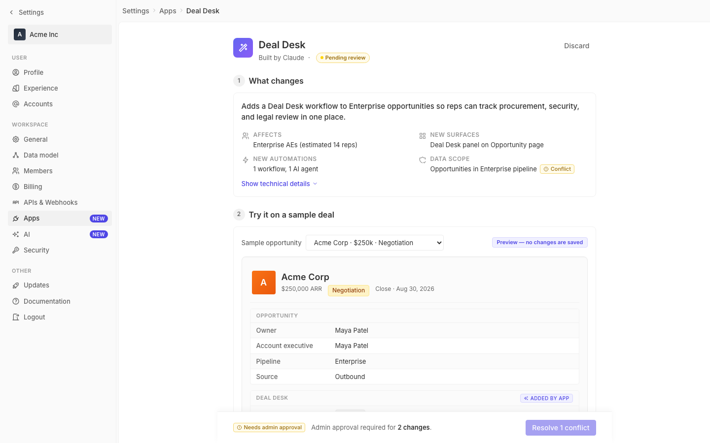

# m2-component · deal-desk-prototype-2

## Screenshots
| before (origin) | after (working copy) |
|---|---|
|  |  |

## Goal achievement
Made focused component-level upgrades in three areas the prompt called out, aligned to Twenty's conventions (labels above inputs, 11px uppercase semibold; subtle borders; blue focus ring at rgba(79,70,229,.12); 4px radius; 32px control height).

**Forms (label position, validation, affordances)**
- Replaced bare `<div>` filter labels with real `<label htmlFor>` elements (Sample opportunity, Pipeline, Team/role, Territory, Deal size, Specific users, Pilot).
- Added consistent 3-state form-helper pattern: `.input-helper` (tertiary), `.input-error` (red 11), `.input-success` (green 11) — each row has an icon + 11px message slot below the control.
- Visible focus ring on every input: `box-shadow: 0 0 0 3px rgba(79,70,229,.12)` on `.pilot-num-input:focus`, `.deal-size-input:focus-within`, `.select-multi:focus-within`. Hover state added (`border-color: var(--border-strong)` / subtle bg) so controls have a 3-state visual.
- Real validation wiring: `DealSizeInput` parses input and toggles `.invalid` (red border, red bg, error icon + "Enter a positive amount in dollars"); pilot duration > 90 days flips its input red with "Pilots longer than 90 days require admin approval".
- Switch is now an accessible `role="switch"` with `aria-checked` and a clickable label.
- Required asterisks tagged with `aria-label="required"` for screen readers.

**Tables & data density (zebra, sticky headers, sort affordances)**
- Preview field rows wrapped into bordered `.field-group` containers; rows now use `:nth-of-type(even)` zebra (`--bg-secondary`) plus a hover state (`--bg-tertiary`).
- `.record-header` is `position: sticky; top: 0` inside the scrollable `.preview-frame`; `.field-section-title` is `sticky; top: 84px` so each section header pins under the record header while scrolling.
- Side-effects panel restructured into a 3-column grid (icon / action / payload) with a sticky `<thead>` row, an "Action" sort button (`aria-sort` toggles between ascending/descending and re-orders rows), zebra striping, hover state, and text-overflow ellipsis for long actions.
- Field labels tightened: 160px label column (up from 140px) and 6/12 padding for clearer alignment.

**Empty / loading / error states**
- Added a Twenty-style empty-state pattern (`.empty-state` with `.empty-icon`, `.empty-title`, `.empty-subtitle`) plus a `.banner` pattern (info/error variants) to the design system.
- "Territory" and "Specific users" pickers now use the `.select-multi.empty` variant with a real `.select-placeholder` (icon + muted label) and a helper line below — replacing inline `color: #999` styles.
- Loading: changing `Sample opportunity` triggers a 700ms `.preview-loading-overlay` with a CSS spinner over the preview frame (`role="status"`, `aria-live="polite"`).
- Skeleton classes (`.skeleton`, `.skeleton-row`, `.skeleton-bar-sm/md/lg`) added with a shimmer keyframe for reuse.
- Inline validation feedback under deal-size and pilot duration acts as an in-place error state without dialogs or toasts.

## Cost
- wall time: 6m 49s
- turns: 40
- tokens (input / cache-create / cache-read / output): 75 / 188626 / 3480062 / 30422
- $ estimate: $3.8705229999999995

## How Claude achieved it
1. Read `cp_of_deal-desk-prototype-2/src/App.tsx` + `styles.css` end-to-end and reviewed the existing token palette so additions reuse `--bg-secondary/tertiary`, `--border-*`, `--color-blue/red/yellow/green-*` rather than introducing new colors.
2. Spawned an Explore agent against `grounding/twenty/packages/twenty-front` to confirm Twenty's conventions: labels positioned above inputs (11px semibold tertiary), `InputErrorHelper` (xs red, 1px margin), 32px input height, focus ring `border-color: blue`, table headers 32px with `border-bottom: 1px solid border.color.light`, no zebra, `AnimatedPlaceholder` empty-state structure (icon + title + subtitle + optional CTA). Applied those rules consistently rather than inventing styles.
3. Made one CSS pass to add reusable primitives — `.field-group` (zebra + hover + sticky section title), `.side-effects-thead` (sortable column header), `.input-helper`/`.input-error`/`.input-success`, `.empty-state`, `.banner`, `.skeleton`, `.spinner`, `.preview-loading-overlay`, hover/focus states on existing inputs.
4. Made one TSX pass to wire those primitives — wrapped field rows in `<div className="field-group">`, restructured side-effects into a sortable mini-table with `useState` for `sortDir`, extracted `DealSizeInput` as a small component with live validation, added a `pilotDurationInvalid` helper, replaced inline `color: #999` placeholders with `.select-placeholder` markup, added a `useEffect` on `sample` that flips a `loading` flag for 700ms to demo the skeleton/spinner overlay.
5. Verified with `npx tsc --noEmit` (clean). Browser verification via Playwright was blocked because the local dev server isn't reachable from the MCP browser sandbox; relied on type-check + careful CSS review.

## Prompt
```
/goal Improve the component-level design of this prototype (http://localhost:5212/), which is a mock of a future feature built into twenty (live codebase is at ../../grounding/twenty for reference to use as a baseline to adhere to). Scope to forms (label position, validation, affordances), tables & data density (zebra, sticky headers, sort affordances), and empty/loading/error states. Ignore issues outside this scope.
```
