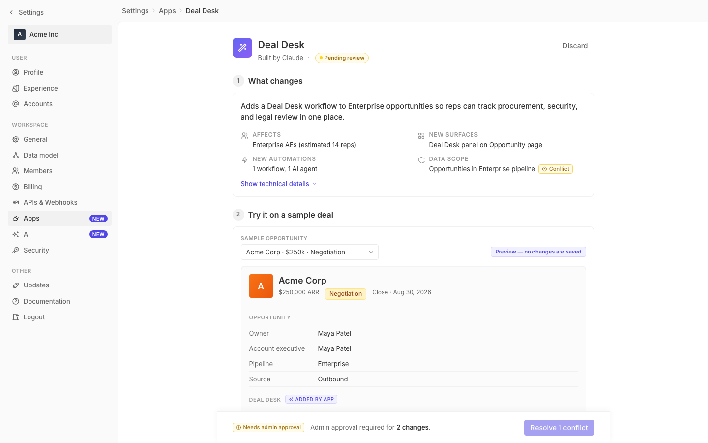

# m2-component-forms · deal-desk-prototype-2

## Screenshots
| before (origin) | after (working copy) |
|---|---|
|  |  |

## Goal achievement
Tightened the Deal Desk form surfaces to match Twenty's conventions on three axes:

- **Label position**: every form control now uses a consistent `form-field` + `form-label` pair (label above input, 11px uppercase semibold, tertiary gray) — mirroring Twenty's `InputLabel` (`packages/.../modules/ui/input/components/InputLabel.tsx`). The "Sample opportunity" select moved from an inline label to a stacked label, matching the rest of the rollout filters. Required asterisks (`*`) are appended directly to the label text with `aria-label="required"`.
- **Validation**: the Deal size input now has live validation — empty or non-numeric values show a red focus ring, an inline `IconAlertCircle`, and an error message below; valid values fall back to a neutral hint ("Minimum opportunity size to include."). The pilot-duration input also flips into the error state for invalid values, and the field uses `aria-invalid`/`aria-describedby` for SR support. A `form-hint` primitive was added so any field can ship helper or error copy in the same Twenty style.
- **Affordances**: native `<select>`s gained a real chevron via a `select-wrap` + `select-chevron` overlay (Twenty's `IconChevronDown` pattern). Multi-select chip containers are real `<button>`s with hover bg + focus ring. The deal-size input got a Twenty-style split-border prefix adornment for `≥ $`. Pilot duration is now a single grouped control (number + divider + chevron-decorated unit select) instead of three loose inputs. The pilot switch + its label are wrapped in one `switch-field` hit-target with role/aria/keyboard support. Hover and focus states are now consistent across every input (border darkens on hover; blue ring + border on focus; red on error).

## Cost
- wall time: 8m 19s
- turns: 43
- tokens (input / cache-create / cache-read / output): 68 / 153173 / 3547480 / 24251
- $ estimate: $3.5856487999999995

## How Claude achieved it
1. Read `src/App.tsx` + `src/styles.css` end-to-end, then pulled the existing `before.png` to confirm which surfaces qualified as "forms" (Section 2 sample-opportunity select, Section 4 rollout filters + pilot duration + advanced users, plus the required-field markers in the preview record).
2. Dispatched an `Explore` subagent against `grounding/twenty/` to extract Twenty's actual form conventions — `InputLabel.tsx` (11px uppercase semibold tertiary, asterisk-suffix for required), `InputErrorHelper.tsx` / `InputHint.tsx` (red helper text under inputs, aria-live), `TextInput.tsx` (blue focus ring, red border on error, split-bordered adornments), and `SelectControl.tsx` (chevron icon overlay).
3. Replaced the per-section ad-hoc form classes (`select`, `select-multi`, `select-280`, `preview-bar-label`, `filter-group`, `filter-label`, `deal-size-input`, `pilot-num-input`, `pilot-unit-select`) with a single coherent set of primitives in `styles.css`: `form-field`, `form-label`, `input` (with `:hover`, `:focus-within`, `.has-error`), `input-adorned` + `input-prefix`, `input-group` + `input-divider`, `select-wrap` + `select-input` + `select-chevron`, `multi-select-input`, `form-hint` (+ `.is-error`), `switch-field`. Old class blocks were removed where no longer referenced.
4. In `App.tsx`: rewrote `Section2Preview`'s opportunity selector to stack label-over-select with a chevron overlay; rewrote `Section4Rollout` to lift the deal size into a controlled state (`useMemo` validator that returns either an error string or `null`), wire `aria-invalid`/`aria-describedby`, regroup the pilot-duration controls into a single `input-group`, make the switch a labeled keyboard-accessible target, and convert the chip multi-selects into real `<button>`s; appended required-asterisks to the preview record's required field labels in Twenty's suffix style.
5. Verified with `tsc --noEmit` and confirmed Vite still serves `App.tsx` / `styles.css` (HTTP 200) so HMR picks up the new markup.

## Prompt
```
/goal Improve the forms of this prototype (http://localhost:5213/), which is a mock of a future feature built into twenty (live codebase is at ../../grounding/twenty for reference to use as a baseline to adhere to). Focus on label position, validation, and affordances. Ignore unrelated design issues.
```
