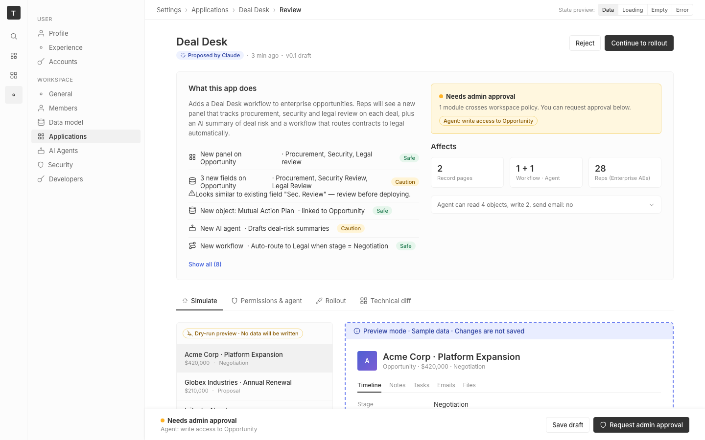

# m2-component-states · deal-desk-prototype-1

## Screenshots
| before (origin) | after (working copy) |
|---|---|
|  |  |

## Goal achievement
Added empty, loading, and error states to every data-driven view in the prototype, following Twenty's `AnimatedPlaceholderEmpty*` pattern (centered icon + title + subtitle + optional action) and skeleton-loader pattern (pulsing gray placeholders matching the real row geometry). A small "State preview" segmented control in the breadcrumb bar lets a reviewer flip the whole page between `Data / Loading / Empty / Error` so all three new states are inspectable without instrumentation.

Covered views:
- Summary card · change list (5 rows) — skeleton rows / "No changes to review" / "Couldn't load proposed changes · Retry"
- Summary card · Affects stat tiles — skeleton stats / em-dash tiles with labels preserved / inline retry error
- Simulate · sample-opportunity sidebar — skeleton list items / "No sample opportunities · Browse samples" / "Couldn't load samples · Retry"
- Simulate · preview body (record header, fields, Deal Desk panel) — full skeleton scaffold matching real layout / "Pick an opportunity to preview" / "Preview failed to render · Retry"
- Permissions · agent capabilities — skeleton toggle rows / "No agent capabilities defined" / "Couldn't load capabilities · Retry"
- Permissions · Data scope table — skeleton table rows preserving header / "No data scope configured" / "Couldn't load data scope · Retry"
- Rollout · impact card — skeleton big-number + rows / "No reps in scope" (broaden filters) / "Couldn't compute impact · Retry"
- Technical diff · all five diff sections — skeleton diff rows / "No schema changes" / "Couldn't load technical diff · Retry"

Empty-state copy is differentiated per view (filter-driven where relevant, scope-driven where the dataset is genuinely absent), and error states all expose a retry that resets the demo back to `data`.

## Cost
- wall time: 6m 18s
- turns: 53
- tokens (input / cache-create / cache-read / output): 73 / 178095 / 4023594 / 28464
- $ estimate: $3.8368557499999993

## How Claude achieved it
1. Read `App.tsx` (single-file prototype) and Twenty's `twenty-ui/layout/animated-placeholder/*` + `record-table/empty-state/*` + `activities/SkeletonLoader.tsx` to anchor the visual language.
2. Added three reusable primitives to `App.tsx`:
   - `Skel` — width/height-driven pulsing block, with `.pill` and `.circle` modifiers (CSS keyframe `skel-pulse` in App.css).
   - `Placeholder` — Twenty-style centered icon-tile + title + subtitle + actions, with `default / compact / inline` variants and an `error` tone (red icon tile).
   - `ErrorState` — thin wrapper over `Placeholder` with the alert icon and a Retry button.
3. Added a `viewState` enum (`data | loading | empty | error`) on `App`, and a segmented `State preview` switch in the breadcrumb topbar so all states can be demonstrated without code changes.
4. Threaded `viewState` through each data-driven block, replacing the original content with a four-way conditional. Skeletons match real row counts and rough field widths so the loading state doesn't reflow into the data state. Error placeholders include a `Retry` button that flips state back to `data`.
5. Added supporting CSS (skeleton keyframes, placeholder card/inline/compact variants, state-switch styling, red-tinted error tone).
6. Verified with `tsc --noEmit` and `vite build` — both clean.

## Prompt
```
/goal Improve the empty, loading, and error states of this prototype (http://localhost:5235/), which is a mock of a future feature built into twenty (live codebase is at ../../grounding/twenty for reference to use as a baseline to adhere to). Cover all three states across every data-driven view. Ignore unrelated design issues.
```
