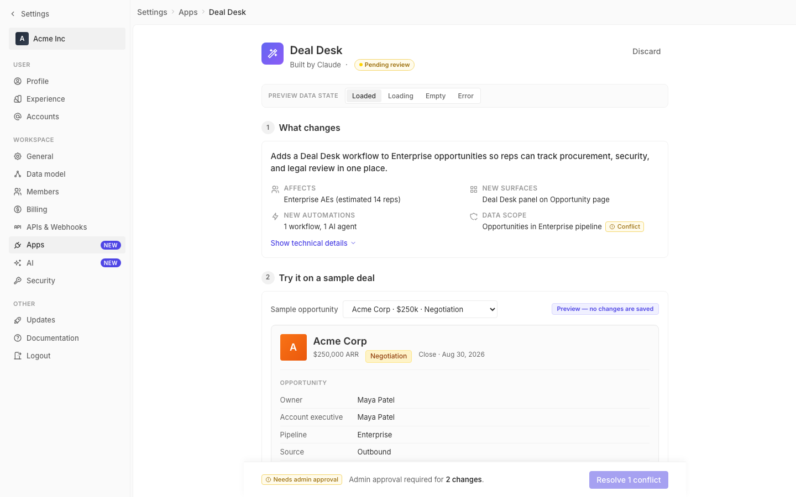

# m2-component-states · deal-desk-prototype-2

## Screenshots
| before (origin) | after (working copy) |
|---|---|
|  |  |

## Goal achievement
Achieved. Every data-driven section now renders explicit loading, empty, and
error variants in addition to its loaded state, following the patterns Twenty
uses (`AnimatedPlaceholder` icon + title + subtitle + CTA for empty/error,
`SkeletonLoader` shimmer rows for loading). A small "Preview data state"
toolbar at the top of the page lets reviewers flip between `loaded /
loading / empty / error` and see every variant in place.

Coverage:
- Section 1 "What changes" — skeleton headline + summary grid; empty (scope
  not analyzed) with "Run review" CTA; error (couldn't load) with Try again.
- Section 2 "Try it on a sample deal" — covers all three nested data views:
  the sample dropdown, the record preview (header / fields / Deal Desk panel
  / AI risk summary), and the side-effects list. Loading is a full
  preview-frame skeleton + side-effects row skeletons; empty shows "No sample
  opportunities yet" in the preview frame and "No side effects for this run"
  in the list; error shows render-failure + retry in both the preview frame
  and the side-effects list.
- Section 3 "What the AI agent can do" — skeleton agent header + skeleton
  permission pills across reads/writes/acts; empty ("No permissions set"
  + "Add permission" CTA); error (policy fetch failed) with retry.
- Section 4 "Who gets it" — skeleton filters + estimate row; empty
  ("No reps match this filter") with "Edit filters"; error
  ("Couldn't compute rollout reach") with retry.
- Sticky deploy bar — disables and explains itself in loading/empty/error
  rather than promising a deploy that can't happen.

## Cost
- wall time: 6m 46s
- turns: 39
- tokens (input / cache-create / cache-read / output): 59 / 186765 / 3404482 / 29861
- $ estimate: $3.7106986499999994

## How Claude achieved it
1. Read the prototype (`src/App.tsx`, `src/styles.css`) end-to-end to enumerate
   the four data-driven views and the sub-views inside Section 2 (sample
   selector, preview frame, AI risk summary, side-effects list).
2. Spawned an Explore agent over `grounding/twenty/` to surface Twenty's
   canonical patterns:
   - `twenty-ui/src/layout/animated-placeholder/components/EmptyPlaceholderStyled.tsx`
     and `ErrorPlaceholderStyled.tsx` for the icon + title + subtitle + CTA
     shell.
   - `twenty-front/src/loading/components/PageContentSkeletonLoader.tsx` and
     `activities/components/SkeletonLoader.tsx` for skeleton-shimmer sizing.
3. Added shared primitives in `App.tsx`: a `DataState` union, a CSS-shimmer
   `<Skel/>` primitive, and a `<StatePanel/>` component with `empty | error`
   variants and `sm | md` sizes (so it works both as a full card replacement
   and inline inside the side-effects list).
4. Refactored each section component to branch on a new `state` prop and
   render the matching variant. Loaded paths were left untouched. Each
   non-loaded variant offers an action (Run review / Try again / Add
   permission / Edit filters) that calls the App's `retry` handler.
5. Taught the sticky `DeployBar` about `DataState` so it shows a skeleton
   while loading, a danger chip + disabled button on error, and a "Nothing
   to deploy" message when empty — instead of cheerfully promising deploys.
6. Added a small `<StateDemoBar/>` above the page header (segmented control,
   four tabs) so the three new states are reviewable side by side.
7. Wrote CSS for `.skel` (gradient shimmer, with `prefers-reduced-motion`
   fallback), `.state-panel` / `.state-icon-wrap`, and the demo bar — all
   using the existing Twenty design tokens so visuals stay on-brand.
8. Verified with `tsc --noEmit` (clean) and confirmed the dev server still
   serves a 200.

## Prompt
```
/goal Improve the empty, loading, and error states of this prototype (http://localhost:5215/), which is a mock of a future feature built into twenty (live codebase is at ../../grounding/twenty for reference to use as a baseline to adhere to). Cover all three states across every data-driven view. Ignore unrelated design issues.
```
