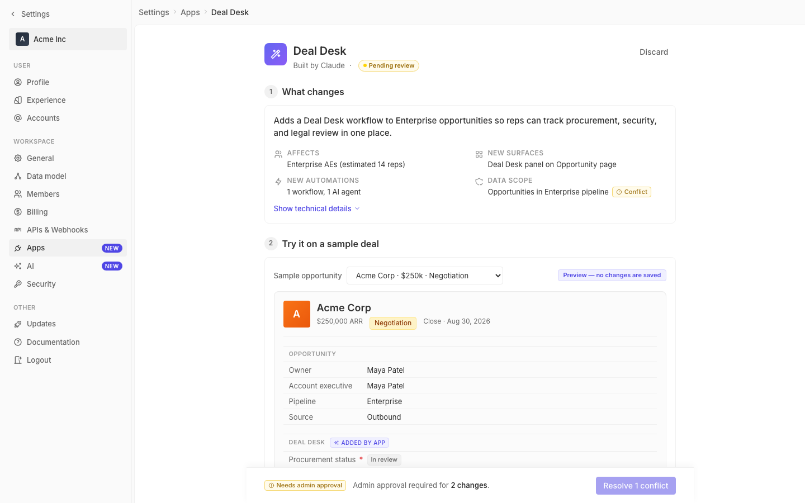

# m2-component-tables · deal-desk-prototype-2

## Screenshots
| before (origin) | after (working copy) |
|---|---|
|  |  |

## Goal achievement
Converted the three most table-like surfaces in the prototype — the Technical Details list, the Side Effects list, and the Mutual Action Plan checks — into proper data tables that share a single primitive with zebra striping, sticky column headers, and sort affordances. Field rows in the Preview also gained zebra striping and the section titles ("Opportunity", "Deal Desk") were made sticky inside the scrollable preview frame so column context stays visible while scrolling longer records. Row heights were tightened (≈28px vs. the previous ~36–40px) for higher data density, matching Twenty's `RecordTable` density (Twenty uses 32px header rows with sticky positioning — see `record-table-header/components/RecordTableHeader.tsx`).

## Cost
- wall time: 4m 25s
- turns: 37
- tokens (input / cache-create / cache-read / output): 376 / 176306 / 2531553 / 21861
- $ estimate: $2.916094

## How Claude achieved it
- Read the prototype (`src/App.tsx`, `src/styles.css`) and Twenty's table primitives at `packages/twenty-front/src/modules/ui/layout/table/components/` to anchor on the reference patterns (`SortableTableHeader`, sticky `position: sticky; top: 0` headers, grid-based rows).
- Introduced a single reusable `.data-table` CSS primitive driven by `display: grid` + `display: contents` rows. It provides:
  - **Sticky headers** via `position: sticky; top: 0` on header cells, with a higher `z-index` than body rows and a slightly darker fill (`--bg-secondary`).
  - **Zebra striping** via `:nth-of-type(odd|even)` on body rows, plus a hover state using `--bg-tertiary`.
  - **Sort affordances** via a new `<SortHeader>` component (modeled on Twenty's `SortableTableHeader`) that cycles `asc → desc → off`, shows a dim `IconArrowsSort` on hover and a blue `IconArrowUp/Down` when active, and drives `useMemo`-based sorting of the row arrays.
  - The wrapper is `max-height: 320px; overflow-y: auto` so the sticky header is exercised when content overflows.
- Refactored three sections to use the primitive:
  - **Technical details** (`Section1Summary`): replaced grouped `tech-line` divs with a sortable `Change | Kind | Name` table. The `op` column renders an inline glyph chip (`+`/`~`/`=`) colored green/yellow/grey for added / modified / reused.
  - **Side effects** (`Section2Preview`): replaced the four `side-effect-row` items with a `Type | Action | Payload` table. Type column is sortable; row count chip moved into the header.
  - **Mutual action plan** (the Deal Desk panel inside the preview): replaced `deal-desk-checks` rows with a `Step | Status | Date` table, where Status is a chip (`Complete`/`In review`/`Pending`) and Date is right-aligned with tabular-nums.
- **Preview density**: `.field-row` got `padding: 4px 10px` (was `6px 0`), `min-height: 28px`, even-row zebra background, and a hover state. `.field-section-title` is now `position: sticky; top: 0` inside the preview scroll container so the "Opportunity" / "Deal Desk" group labels stay pinned while scrolling.
- Added three new Tabler-style icons (`IconArrowUp`, `IconArrowDown`, `IconArrowsSort`) using the existing `ico()` factory so sort indicators match the rest of the icon set.
- Removed the now-unused styles (`.deal-desk-checks`, `.deal-desk-check`, `.side-effects-list`, `.side-effect-row`, the old `.tech-list`/`.tech-group`/`.tech-line` rules) to keep the stylesheet tight.
- Verified with `tsc --noEmit` (clean). Vite HMR picked up the edits against the running dev server at :5214.

## Prompt
```
/goal Improve the tables and data density of this prototype (http://localhost:5214/), which is a mock of a future feature built into twenty (live codebase is at ../../grounding/twenty for reference to use as a baseline to adhere to). Focus on zebra striping, sticky headers, and sort affordances. Ignore unrelated design issues.
```
