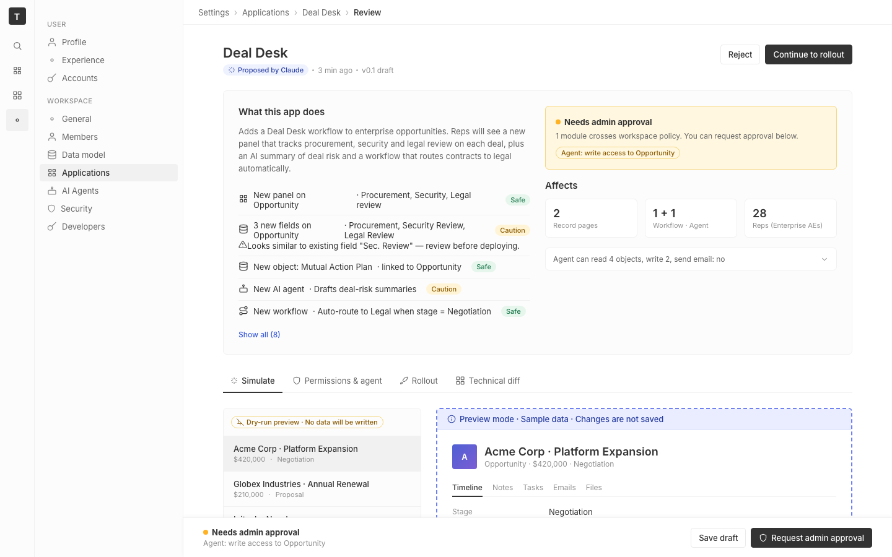
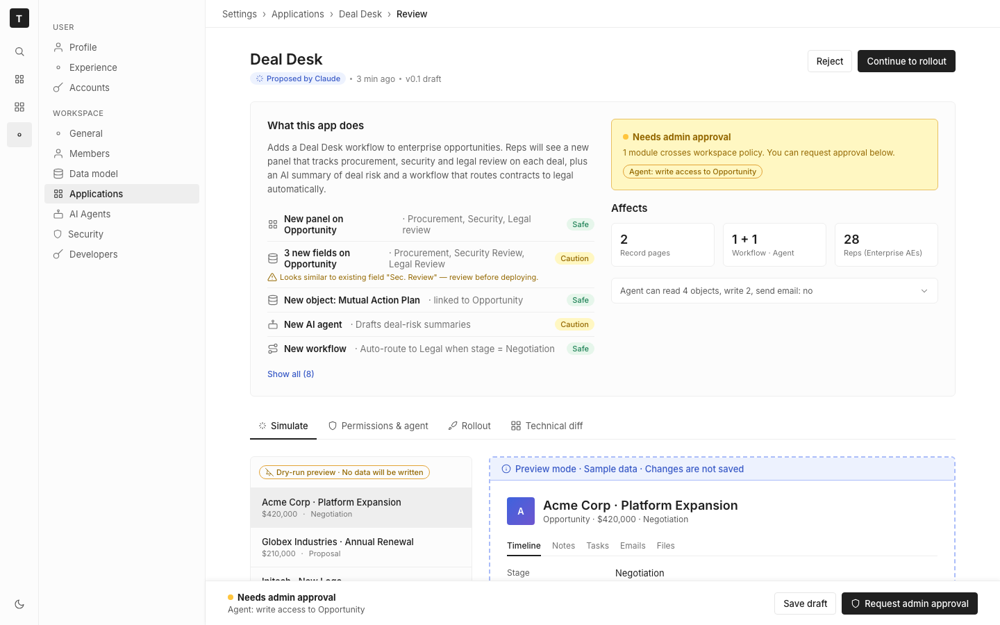

# m2-foundational-color · deal-desk-prototype-1

## Screenshots
| before (origin) | after (working copy) |
|---|---|
|  |  |

## Goal achievement
Achieved. The prototype now uses a Twenty-aligned color foundation (Radix-style 1–12 numbered scales for gray, indigo "blue", green, amber, red, violet "purple"), a layered semantic-role token system (`--text-*`, `--bg-*`, `--border-*`, `--bg-{role}-soft`, `--text-{role}`), and a full dark theme that swaps every raw scale while leaving semantic roles untouched. Tags follow Twenty's Radix pattern (bg = `color3`, text = `color11`) so they keep AA contrast in both themes. Hardcoded colors (record-avatar gradient, AI-summary border, body shadows) were replaced with tokens. Low-contrast body labels (`fieldset .k`, `review-row .k`, `cap-row .desc`, etc.) were promoted from `--text-tertiary` (gray9, ~2.9:1) to `--text-secondary` (gray11, ~5.7:1) for WCAG AA at 12 px. The page now respects `prefers-color-scheme` on first paint and exposes a sun/moon toggle in the left nav for manual override (`[data-theme="dark"|"light"]`).

## Cost
- wall time: 6m 3s
- turns: 32
- tokens (input / cache-create / cache-read / output): 42 / 99921 / 2486260 / 32650
- $ estimate: $2.6840962500000005

## How Claude achieved it
1. **Read Twenty's theme constants** (`packages/twenty-ui/src/theme/constants/*`) — `GrayScaleLight/Dark`, `MainColorsLight`, `SecondaryColorsLight`, `BackgroundLight/Dark`, `BorderLight`, `FontLight`, `TagLight/Dark` — to learn that Twenty uses Radix Colors P3 with the 1–12 step scale (indigo for "blue", violet/purple for AI accents, amber for caution, green for success, red for danger), where 3/11 forms the canonical tag bg/text pair.
2. **Rewrote `src/App.css`** as a three-layer token system:
   - *Raw palette*: full 1–12 hex scales for gray, blue (indigo), green, amber, red, purple (violet), in both light and dark variants.
   - *Semantic roles*: `--text-{primary,secondary,tertiary,light,inverse,danger,warning,success,info,accent}`, `--bg-{primary,secondary,tertiary,hover,inverse,{role}-soft}`, `--border-{light,medium,strong,info,warning,success,danger,accent,focus}`, plus AI surface tokens (`--ai-bg`, `--ai-border`, `--ai-text`).
   - *Theme switching*: dark scales applied via `@media (prefers-color-scheme: dark)` (when not overridden) and `[data-theme="dark"]`. Only raw scales swap — semantic roles stay constant, so the rest of the CSS needed no theme-aware changes.
3. **Fixed semantic-role usage** in the existing CSS: `policy-banner.warn` now uses `--border-warning` + `--bg-warning-soft` + `--text-warning` instead of hardcoded amber; `preview-ribbon` uses `--bg-info-soft` + `--text-info` + `--border-info`; `ai-summary` uses the violet AI tokens; `side-effect-chip` uses amber semantic tokens; primary button uses `--bg-inverse`; tag outline variants got proper paired borders for every color.
4. **Replaced hardcoded color literals**: `record-avatar` gradient now interpolates `--blue9 → --purple9`; AI-summary border `#d9cef9` → `--ai-border`; shadows switched to `rgb(var(--shadow-channel) / α)` so they re-tint cleanly in dark mode.
5. **Bumped contrast** for body labels (`fieldset .k`, `review-row .k`, `cap-row .desc`, `sticky-footer .sub`, `record-sub`) from `--text-tertiary` (gray9) to `--text-secondary` (gray11) so 12 px labels clear WCAG AA on `bg-secondary`.
6. **Added a theme toggle** in `App.tsx`: sun/moon icon in the left nav, seeded from `prefers-color-scheme`, persisted to `documentElement[data-theme]` via `useEffect`. Verified with `tsc --noEmit` (no errors).

## Prompt
```
/goal Improve the color usage of this prototype (http://localhost:5224/), which is a mock of a future feature built into twenty (live codebase is at ../../grounding/twenty for reference to use as a baseline to adhere to). Focus on palette, contrast, semantic roles, and dark mode. Ignore unrelated design issues.
```
