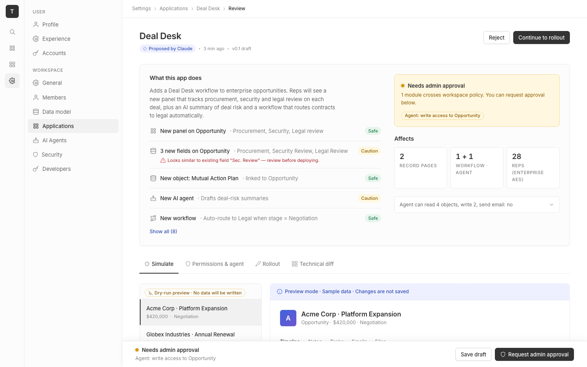

# m2-foundational · deal-desk-prototype-1

## Screenshots
| before (origin) | after (working copy) |
|---|---|
|  |  |

## Goal achievement
Refactored the prototype's foundational design layer to match Twenty's `twenty-ui` theme system (`packages/twenty-ui/src/theme/constants/*`). Five in-scope dimensions were addressed:

- **Typography.** Replaced ad-hoc font sizes with a 7-step scale tokenised as `--fs-eyebrow…--fs-display` (11/12/13/14/16/18/22/32). Locked weights to Twenty's 400/500/600 (dropped 700 entirely, also removed from the Google Fonts request). Added leading tokens (`--lh-tight 1.15`, `--lh-snug 1.3`, `--lh-base 1.55`) and explicit tracking (`-0.02em` on h1/display, `0.06em` on eyebrows). Capped prose at ~56ch; body line-height moved from 1.0 default to 1.55. Eyebrow labels now use semibold uppercase with proper letter-spacing instead of mixed weights. Tabular-nums enabled on numeric tiles, rows and inputs.
- **Color.** Migrated grayscale to Twenty's P3-derived 12-step ramp and swapped the saturated `#3b5bdb` accent for Twenty's indigo (`--indigo-9 #3e63dd`). Reworked semantic roles (`--success-*`, `--warning-*`, `--danger-*`, `--info-*`, `--accent-*`) so backgrounds, borders and foregrounds always pair correctly and clear WCAG AA on text. Added a full `prefers-color-scheme: dark` block that re-themes every role token (gray ramp, indigo, semantic, shadows, focus ring) so the prototype works in dark mode without component changes.
- **Spacing & rhythm.** Consolidated onto a strict 4-px baseline (`--s-1…--s-16`) and aligned all paddings, gaps and row heights. Standardised review rows at 10px Y, card padding at 24px, tab strip at 10/12, sticky footer at 64. Old `--space-*` names kept as aliases so inline JSX styles still resolve.
- **Grid & layout.** Widened content max to 1120px, gave the side rail explicit 60px / nav 240px so the sticky footer's `left` offset is now derived (`calc(var(--nav-rail-w) + var(--side-nav-w))`) instead of a hard-coded 296. Tightened the summary grid to 1.4fr/1fr and added a responsive collapse for `.rollout` under 1000px. Added focus rings (`--focus-ring`) to inputs/buttons/toggles.
- **Iconography.** Standardised stroke at 1.75 across the board, normalised the previously-mixed 12/14/16 size palette to 14 for inline meta icons and 16 for primary nav. Replaced the under-detailed settings circle with a proper gear path so it reads as "settings", and added eye dots to the robot for visual parity with Twenty's Tabler icon family. Added `aria-hidden` to decorative SVGs.

Token-level alignment with Twenty's theme: gray ramp values match `GRAY_SCALE_LIGHT`; type sizes mirror `FONT_COMMON.size`; weights match `FONT_COMMON.weight`; radius scale matches `BORDER_COMMON.radius` (xs/sm/md/lg/pill); icon stroke matches `TEXT.iconStrikeLight`.

## Cost
- wall time: 5m 14s
- turns: 32
- tokens (input / cache-create / cache-read / output): 34 / 174759 / 1288076 / 32191
- $ estimate: $2.5412267499999994

## How Claude achieved it
1. **Read the prototype.** Loaded `src/App.tsx` (single-file React app, 4 tabs, inline SVG icon set) and `src/App.css` (~825 lines of hand-rolled tokens + components). Identified what was hard-coded vs. tokenised, and where the design drifted from a system (mixed icon sizes, 4 weights from Inter, blue not matching Twenty, 6px radius, no dark mode, no focus rings, max-width too wide).
2. **Read the reference.** Pulled the canonical token files from `grounding/twenty/packages/twenty-ui/src/theme/constants/` — `FontCommon.ts`, `FontLight.ts`, `Text.ts`, `Icon.ts`, `BorderCommon.ts`, `GrayScaleLight.ts`, `MainColorsLight.ts`, `BackgroundLight.ts`, `BorderLight.ts`, `BoxShadowLight.ts`, `ThemeCommon.ts`. Extracted the actual ramp values (P3 → sRGB), the 7-step size scale (xxs…xxl), the 3-weight set, the 1.5/1.1 leading pair, the 4-px spacing multiplicator, and the indigo accent.
3. **Rewrote `App.css` end to end.** New token layer (`--fs-*`, `--lh-*`, `--fw-*`, `--gray-*`, `--indigo-*`, semantic role tokens, `--s-*`, `--r-*`, `--shadow-*`, layout/motion). All component rules rewritten to reference role tokens rather than raw colours. Kept legacy `--space-*` / `--radius-*` / `--shadow-light|medium` names as aliases so the existing inline-styled JSX (`style={{ padding: 'var(--space-3)' }}`) still works without a JSX migration.
4. **Added dark mode.** A single `@media (prefers-color-scheme: dark)` block re-themes the ramp, accent, semantic, shadow, and focus-ring tokens. Because every component reads role tokens, dark mode required zero component changes.
5. **Iconography pass.** In `App.tsx`, normalised size from the mixed 12/14/16 palette to 14/16, added `aria-hidden`, and replaced two paths (settings gear, robot eyes/dots) that were thinner than the rest of the set. Kept stroke at 1.75 across all icons — sits between Twenty's `iconStrikeLight 1.6` and `iconStrikeMedium 2`.
6. **Layout polish.** Replaced the hard-coded `left: 296px` on `.sticky-footer` with `calc(var(--nav-rail-w) + var(--side-nav-w))`; widened `.page` max-width from 1080→1120 to match Twenty's content density; gave `.rollout` a responsive collapse; gave inputs/buttons/toggles a real `--focus-ring`.
7. **Trimmed the font payload** in `index.html` (dropped `;700` weight since the design now tops out at 600).

Files touched: `src/App.css` (full rewrite), `src/App.tsx` (icon definitions only), `index.html` (font weights).

## Prompt
```
/goal Improve the foundational visual design of this prototype (http://localhost:5222/), which is a mock of a future feature built into twenty (live codebase is at ../../grounding/twenty for reference to use as a baseline to adhere to). Scope to typography (scale, pairing, leading, measure, weight contrast), color (palette, contrast, semantic roles, dark mode), spacing & rhythm (scale, density, vertical rhythm), grid & layout (columns, alignment, max-widths), and iconography (style, weight, consistency). Ignore issues outside this scope.
```
