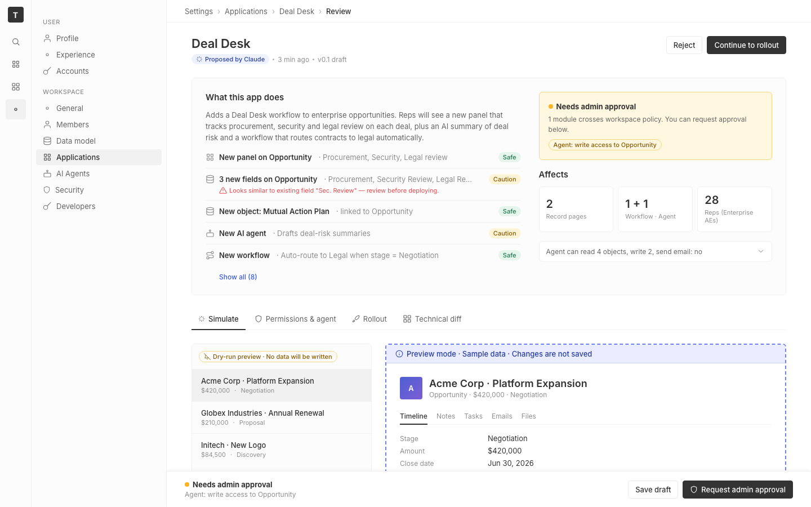

# m2-foundational-grid · deal-desk-prototype-1

## Screenshots
| before (origin) | after (working copy) |
|---|---|
|  |  |

## Goal achievement
Tightened the grid system across all four tabs of the Deal Desk review page. The change-list, stat-tile row, data-scope table, and technical-diff rows now form true vertical columns with tags right-aligned. Page max-width, summary grid ratio, and topbar padding were unified so content lines up edge to edge.

## Cost
- wall time: 9m 16s
- turns: 74
- tokens (input / cache-create / cache-read / output): 108 / 96688 / 6071751 / 22576
- $ estimate: $4.2051155

## How Claude achieved it
Edits were scoped to `cp_of_deal-desk-prototype-1/src/App.css` only — JSX was left untouched. Specific changes:

- **`.page` max-width**: 1080 → 1120 px, asymmetric vertical padding (`space-6` top / `space-8` bottom) so the page header sits closer to the breadcrumbs.
- **`.topbar` padding**: `0 space-6` → `0 space-8` so the breadcrumb left edge aligns with the page content left edge.
- **`.summary` grid**: `1fr 1fr` → `minmax(0,1.35fr) minmax(0,1fr)` with `align-items: start`. The description column was getting cramped while the trust column had short content and was stretching tall to match.
- **`.change-row-wrap .main`**: kept as flex, but added `flex-shrink: 0` to icon/label/tag and `min-width: 0` + ellipsis on `.detail`. The `.grow` spacer now reliably pushes tags into a single right-hand column across all rows.
- **`.show-all` and `.conflict`**: indented `16px + space-2` so they line up with the row label column rather than the icon column.
- **`.stats-row`**: `display: flex` → `display: grid` with `repeat(3, minmax(0, 1fr))`. Tiles got a `min-height: 64px`, flex column layout, and slightly larger numeric font for visual balance.
- **`.stable-head` / `.stable-row`**: `3fr 8fr` → `minmax(0,1fr) minmax(0,2fr)` with a column gap. The old ratio crushed the Object column.
- **`.diff-table`**: overrides to `minmax(0,1fr) auto` so the tag column hugs the right edge for the monospace diff rows.

Reference: twenty's `SettingsPageContainer` uses a single column layout at 512 px for forms — this prototype is wider because of its 2-column summary, so I kept it wide but tightened the column proportions and gutter consistency.

## Prompt
```
/goal Improve the grid and layout of this prototype (http://localhost:5226/), which is a mock of a future feature built into twenty (live codebase is at ../../grounding/twenty for reference to use as a baseline to adhere to). Focus on columns, alignment, and max-widths. Ignore unrelated design issues.
```
