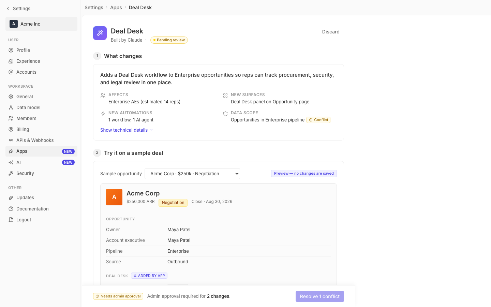

# m2-foundational-grid · deal-desk-prototype-2

## Screenshots
| before (origin) | after (working copy) |
|---|---|
|  |  |

## Goal achievement
Improved the page's grid alignment and max-widths to match Twenty's settings-page conventions:

- **Left-aligned the content column.** `.page-body-inner` was `max-width: 800px; margin: 0 auto`, which centered the card and produced a large empty band between the sidebar and the content. Switched to `margin: 0` so the content sits flush-left after the sidebar (mirroring Twenty's `SettingsPageContainer`, which left-aligns a fixed-width column instead of centering).
- **Made the rollout filter row a real grid.** Was `flex; flex-wrap: wrap` with per-control inline `minWidth: 180`, which collapsed unevenly. Now `grid-template-columns: repeat(4, minmax(0, 1fr))` so the four filters (Pipeline / Team / Territory / Deal size) share equal columns and align with the section above. Removed the now-unneeded inline `minWidth` overrides on the selects.
- **Widened the preview field-label column** from 140px → 180px so labels like "Account executive" / "Procurement status" no longer sit hard against the value column. Closer to Twenty's 220px detail-table convention while still fitting the card width.
- **Made the summary grid columns equal-width** with `repeat(2, minmax(0, 1fr))` and slightly larger gaps (`spacing-4 spacing-6`), so the two columns line up cleanly even when value text wraps.
- **Bumped card padding** from `spacing-4` (16px) → `spacing-5` (20px) for breathing room consistent with Twenty's section spacing.

## Cost
- wall time: 3m 23s
- turns: 33
- tokens (input / cache-create / cache-read / output): 53 / 83486 / 2653870 / 11648
- $ estimate: $2.1401874999999997

## How Claude achieved it
1. Read `App.tsx` + `styles.css` to inventory grid/alignment rules in the prototype.
2. Cross-referenced Twenty's settings layout primitives (`SettingsPageContainer`, `SettingsLayoutDetailScaffold`) in `../../grounding/twenty/...` to confirm:
   - Settings content is left-aligned (not centered) inside the page area.
   - Detail tables use a fixed label column (220px in Twenty) with `gridTemplateColumns: '220px 1fr'`.
   - `SettingsPageContainer` sets a width and lives inside a flex column — it does not use `margin: 0 auto`.
3. Edits, all CSS-only except removing one inline `minWidth: 180`:
   - `styles.css` `.page-body-inner`: `margin: 0 auto` → `margin: 0`.
   - `styles.css` `.field-row`: `grid-template-columns: 140px 1fr` → `180px 1fr`.
   - `styles.css` `.filter-row`: switched from `flex; flex-wrap: wrap` to `grid; grid-template-columns: repeat(4, minmax(0, 1fr))`; added rule to force `.filter-group .select` to `width: 100%; min-width: 0` so children fill grid cells.
   - `styles.css` `.summary-grid`: `1fr 1fr` → `repeat(2, minmax(0, 1fr))` with `spacing-4 / spacing-6` gaps.
   - `styles.css` `.card`: padding bumped from `spacing-4` → `spacing-5`.
   - `App.tsx`: removed `style={{ minWidth: 180 }}` from the three `.select-multi` filter selects so the grid controls their width.
4. Verified the sticky `.deploy-bar` negative margins (`-32px`) still match `.page-body-inner`'s 32px padding so the bar continues to stretch edge-to-edge.

## Prompt
```
/goal Improve the grid and layout of this prototype (http://localhost:5206/), which is a mock of a future feature built into twenty (live codebase is at ../../grounding/twenty for reference to use as a baseline to adhere to). Focus on columns, alignment, and max-widths. Ignore unrelated design issues.
```
