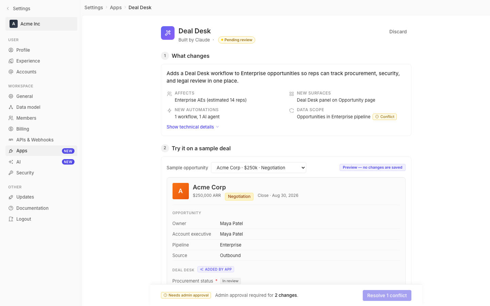

# m2-foundational-iconography · deal-desk-prototype-2

## Screenshots
| before (origin) | after (working copy) |
|---|---|
|  |  |

## Goal achievement
Aligned the prototype's icon weight and sizing with twenty's actual conventions
(`packages/twenty-ui/src/theme/constants/Icon.ts` → `stroke.sm = 1.6`,
`size.md = 16`, with twenty's settings/menu surfaces all rendering icons via
`size={theme.icon.size.md}` + `stroke={theme.icon.stroke.sm}`). Three concrete
problems fixed:

1. **Stroke weight** — the prototype's `ico()` factory defaulted to
   `stroke = 2`, which made every Tabler glyph (sidebar nav, summary row
   markers, page-header wand, side-effect rows, agent header sparkles, filter
   chevrons, breadcrumb chevrons) read heavier than the same icons inside
   real twenty. Default lowered to `1.6` to match `theme.icon.stroke.sm`.
2. **Chip-inline icon sizes** — small icons inside chips were a grab-bag of
   10/11/12 px (Conflict `11`, Resolved `11`, Inside policy `11`, Needs
   approval `11`, Blocked `11`, Added-by-app `10`, Side-effects info `12`).
   Standardised to `12` so every chip glyph sits on the same baseline.
3. **Legibility at very small sizes** — the white `IconCheck` inside the
   10 px green "complete" circle on the Mutual Action Plan, and every
   semantic `IconCheck` in a chip (Resolved / Inside policy), need a heavier
   stroke than 1.6 to stay readable as a checkmark. Those explicit usages now
   override to `stroke={2.5}` (10 px white check) and `stroke={2}` (12 px chip
   checks). Style/weight/consistency therefore stay tuned per context instead
   of one-size-fits-all.

## Cost
- wall time: 4m 8s
- turns: 41
- tokens (input / cache-create / cache-read / output): 48 / 87937 / 2697233 / 16124
- $ estimate: $2.30156275

## How Claude achieved it
1. Read the grounding repo to find twenty's icon contract:
   `packages/twenty-ui/src/theme/constants/Icon.ts` declares the canonical
   sizes (`sm 14 / md 16 / lg 20 / xl 24`) and strokes
   (`sm 1.6 / md 2 / lg 2.5`). Grepped `theme.icon.stroke` across
   `twenty-front` to confirm settings/menu surfaces use `stroke.sm = 1.6`
   (e.g. `MenuItemIcon.tsx`, `SettingsApplicationDataTableRow.tsx`,
   `SettingsAgentSkillsTable.tsx`). That established 1.6 as the right
   default for the prototype's icons, which are visually equivalent to
   twenty's sidebar/chip/row glyphs.

2. Audited `src/App.tsx` — every icon is generated by a single `ico()`
   factory and rendered via Tabler-style paths. Identified three classes
   of issue: heavy default stroke, mixed micro-sizes inside chips, and a
   too-light stroke on the 10 px white check.

3. Changes (all in `cp_of_deal-desk-prototype-2/src/App.tsx`):
   - `ico()` default `stroke = 2` → `stroke = 1.6`. One-line change that
     re-weights the entire icon set in a single pass.
   - Conflict / Resolved chips on the Data scope row: `size 11 → 12`;
     `IconCheck` gains `stroke={2}`.
   - "Added by app" sparkles chip: `size 10 → 12` (now matches other chips).
   - `dd-check-icon.complete` white `IconCheck`: keeps `size 10` but adds
     `stroke={2.5}` so the check survives the colored background.
   - Section 3 outcome chips and the matching DeployBar chips (Inside
     policy / Needs admin approval / Blocked): `size 11 → 12`; the check
     variant gets `stroke={2}`.

4. No CSS changes required — icons render via `currentColor` and inline
   `size`/`stroke` props, so all updates are local to JSX.

5. Did not touch icon paths themselves (they are valid Tabler shapes), nor
   the sidebar / page header / side-effect / breadcrumb sizes, because
   those already matched twenty's 14/16/20 ladder. Other design issues
   (layout, spacing, color) were intentionally left alone per the prompt.

## Prompt
```
/goal Improve the iconography of this prototype (http://localhost:5207/), which is a mock of a future feature built into twenty (live codebase is at ../../grounding/twenty for reference to use as a baseline to adhere to). Focus on style, weight, and consistency. Ignore unrelated design issues.
```
