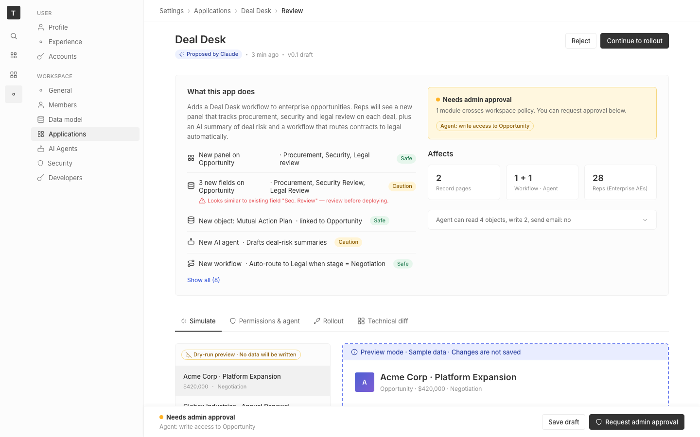

# m2-foundational-spacing · deal-desk-prototype-1

## Screenshots
| before (origin) | after (working copy) |
|---|---|
|  |  |

## Goal achievement
Normalized the prototype's spacing scale and vertical rhythm to twenty's 4-px scale.
The prototype already declared a token scale (`--space-1` through `--space-8`) that
matches twenty's `themeCssVariables.spacing[N]` (4, 8, 12, 16, 20, 24, 28, 32 px),
but most components ignored it and used raw px values like `6px`, `10px`, `8px`,
`4px`, `2px` for paddings, gaps, and margins. That broke vertical rhythm and made
densities feel inconsistent across sections. The fix:

- **Scale extended to match twenty**: added `--space-0-5` (2 px), `--space-7` (28 px),
  `--space-10` (40 px). All spacing now snaps to twenty's multiples of 4.
- **Page rhythm**: page now uses `padding: 24px 32px 32px` (was uniform 32 px) and
  `gap: 32px` between major sections (was 24 px), matching `SettingsPageContainer`
  in twenty.
- **Topbar**: 44 px tall with 32 px horizontal padding (was 40 px / 24 px), so the
  breadcrumb bar reads as a peer of the page padding, not a tighter band.
- **Cards & dense lists**: change rows, review rows, capability rows, filter rows,
  and stable table rows were a mix of `8px / 10px / 12px` paddings. Snapped to the
  scale: change-rows 12 px, review-rows 12 px, cap-rows 16 px (with first/last
  padding stripped so the card padding stays clean), filter-rows 16 px, stable rows
  12 px, stable head 8 px (header band shorter than data rows).
- **Stat tiles**: padding 12 → 16 px, num→label gap 2 → 4 px.
- **Trust stack**: vertical gap 16 → 20 px so the policy banner, Affects block, and
  disclosure breathe more.
- **AI summary**: padding equalized to 16 px (was `12 16`), header margin and
  margin-from-panel both bumped one step.
- **Tab list / record tabs**: tab vertical padding 10 → 12 px, record tabs use
  20 px column gap and bottom margin (was 16 px).
- **Buttons, tags, chips, toggle, stepper, range input**: every raw `2/4/6/8/10`
  px replaced with `--space-0-5/1/1-5/2/3` so all atoms share one scale.
- **Page header h1**: bottom margin 6 → 8 px and line-height pinned to 1.2 so the
  meta row sits on a predictable baseline.
- **Sticky-footer clearance**: padding-bottom on `.page-scroll` rewritten to use
  `--space-10` token instead of magic `80px`.

Net effect: one consistent 4-px grid governs every gap, padding, and margin in the
view; the page reads with cleaner section breaks and denser, more uniform internal
rhythm — matching twenty's `themeCssVariables.spacing` conventions.

## Cost
- wall time: 6m 37s
- turns: 62
- tokens (input / cache-create / cache-read / output): 77 / 186774 / 4855905 / 32234
- $ estimate: $4.4015249999999995

## How Claude achieved it
1. Read `App.tsx` + `App.css` to inventory every spacing value in use.
2. Inspected `grounding/twenty` to confirm the canonical spacing scale:
   `ThemeCommon.spacing` is a `multiplicator * 4px` helper, and
   `theme-light.css` defines `--t-spacing-0` … `--t-spacing-32` plus halves at
   2 px and 6 px. `SettingsPageContainer` uses `spacing[6] spacing[8] spacing[8]`
   padding with `gap: spacing[8]` — adopted as the target rhythm.
3. Extended the prototype's `:root` scale (`--space-0-5`, `--space-7`, `--space-10`)
   to cover everything twenty's scale supports, so no raw `2`/`28`/`40` px remain.
4. Did a pass through `App.css` replacing every raw px length used for layout
   (paddings, gaps, margins) with the equivalent scale token. Where a raw value
   (10 px) didn't sit on the scale, snapped to the nearest 4-px step (12 or 8)
   in a way that preserved or improved density.
5. Rebalanced major vertical rhythm at: page padding, page gap, topbar height,
   trust-stack gap, fieldset/record-header bottom margins, panel margin-top,
   AI-summary margin, diff-section margin-top, stable-head vs row padding.
6. Removed unwanted leading/trailing padding inside cards on first/last rows so
   the card's own padding fully owns the outer breathing room.
7. Updated a handful of inline `style={{ … }}` raw px values in `App.tsx` to
   scale tokens as well (sample sidebar footer padding, simulate workflow gap,
   permissions card spacer, impact card stats margin).

## Prompt
```
/goal Improve the spacing and rhythm of this prototype (http://localhost:5225/), which is a mock of a future feature built into twenty (live codebase is at ../../grounding/twenty for reference to use as a baseline to adhere to). Focus on the spacing scale, density, and vertical rhythm. Ignore unrelated design issues.
```
