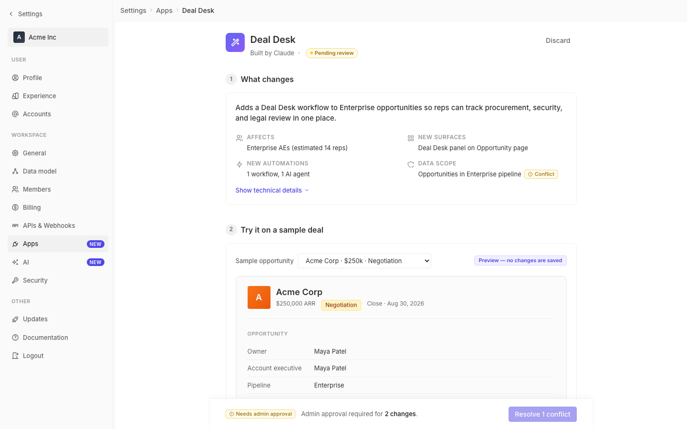

# m2-foundational-spacing · deal-desk-prototype-2

## Screenshots
| before (origin) | after (working copy) |
|---|---|
|  |  |

## Goal achievement
Rebuilt the prototype's spacing rhythm around Twenty's 4px scale. The biggest change is **section rhythm**: between-section gap went from 24px → 40px (matches Twenty's `themeCssVariables.spacing[10]`, the gap Twenty uses inside `SettingsPageContainer` and `StyledMainContent`). Section-header → content gap went from 12px → 16px (Twenty's `H2Title` margin-bottom). Card interior padding from 16px → 20px so card content no longer hugs the border. Page-body padding was retuned to Twenty's `24px / 32px / 80px` (top / sides / bottom-for-sticky-deploy-bar) instead of the prototype's flat 32px + a magic 96px.

Within blocks, lots of one-off literals (`2px`, `4px`, `6px`, `8px` mixed in) were replaced with `--spacing-1/2/3` so density is consistent: field rows breathe at 8px instead of 6px; deal-desk-checks and side-effect-rows use the 8/12px scale; popovers, AI preview, and the deal-desk panel went from 12px → 16px interior padding so the labeled tags don't crowd the content; nav-section gaps and label-paddings now align to the scale (4/8px) instead of a hard-coded `2px`. Tech-list and perm-subsection vertical rhythm also stepped up to 16px to match the new section-header rhythm. The sticky deploy bar's `margin: 0 -32px -96px` was rewritten to derive from `--spacing-8 / --spacing-20` so it stays in sync with the page padding.

Net effect: a single 4px scale (`--spacing-1` through `--spacing-20`, with `10/12/16/20` added) drives all vertical rhythm, sections feel deliberate instead of stacked, and dense inner content (field rows, perm pills, side-effects, deal-desk checklist) has consistent micro-spacing.

## Cost
- wall time: 6m 45s
- turns: 77
- tokens (input / cache-create / cache-read / output): 112 / 210366 / 7497389 / 25453
- $ estimate: $5.700367000000001

## How Claude achieved it
1. Read the prototype (`App.tsx`, `styles.css`) and confirmed the existing scale is 4px-based (`--spacing-1` = 4px … `--spacing-8` = 32px) but truncated and inconsistently applied — many hard-coded `2/4/6/8/12px` values bypassed the tokens.
2. Cross-referenced Twenty's spacing conventions in `grounding/twenty`:
   - `themeCssVariables.spacing` exposes the same 4px scale up to spacing-21+.
   - `SettingsPageContainer` uses `spacing-6 / spacing-8 / spacing-20` for page padding and `spacing-10` gap between sections (via `StyledMainContent` in `SettingsSecurity.tsx`).
   - `H2Title` puts `spacing-4` below the title and `spacing-2` between title and description.
   - `ThemeCommon.ts` confirms `spacingMultiplicator: 4`.
3. Extended the prototype's token set (added `--spacing-0/7/10/12/16/20`) so the scale matches Twenty rather than stopping at `--spacing-8`.
4. Re-tuned every spacing decision in `styles.css` to use the scale, focusing on:
   - **Page rhythm:** section gap 24 → 40px, page-body padding 32/32/96 → 24/32/80, page-header margin-bottom 24 → 32px.
   - **Section internals:** section-header margin-bottom 12 → 16px, card padding 16 → 20px, summary grid gap 12/16 → 16/24, tech-list and perm sub-sections use 16px verticals.
   - **Dense rows:** field-row padding 6 → 8px, side-effect-row padding 8/12 → 12/12, deal-desk-checks gap 6 → 8, activity-item 8 → 8px (now token).
   - **Nested panels:** AI-preview, deal-desk-panel, popover all bumped from 12px → 16px interior padding so labeled tags don't crash into content.
   - **Sticky deploy bar:** rewrote `margin: 0 -32px -96px` and `padding-left/right: 32px` to derive from `--spacing-8 / --spacing-20` so it stays in sync with the page-body padding.
5. Verified CSS brace balance and left the component tree (`App.tsx`) untouched — this is a pure token/rhythm pass with no markup changes.

## Prompt
```
/goal Improve the spacing and rhythm of this prototype (http://localhost:5205/), which is a mock of a future feature built into twenty (live codebase is at ../../grounding/twenty for reference to use as a baseline to adhere to). Focus on the spacing scale, density, and vertical rhythm. Ignore unrelated design issues.
```
