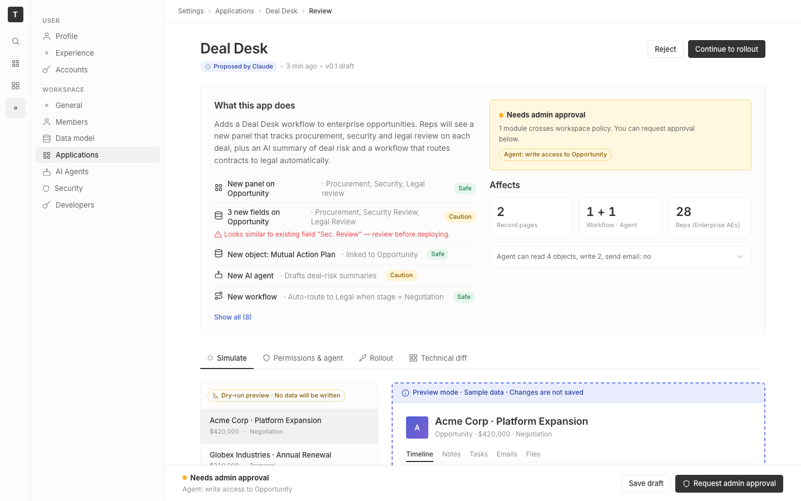

# m2-foundational-typography · deal-desk-prototype-1

## Screenshots
| before (origin) | after (working copy) |
|---|---|
|  |  |

## Goal achievement
Rebuilt the prototype's typography on a coherent system tuned against Twenty's
`FONT_COMMON` (Inter, 400/500/600) so the page reads with clearer hierarchy and
calmer text blocks while staying recognizably Twenty.

**Scale.** Replaced the ad-hoc `11/12/13/15/18/22/36` sizes with a documented
ramp (`--text-micro 11 → caption 12 → body 13 → lede 14 → subhead 16 → card 18
→ page 26 → display 44`). The page title goes from 22 → 26 and the impact-card
number from 36 → 44, both with tighter tracking, so the top of each card has a
clear focal point. Section cards now use a 16px subhead instead of the prior
13/15 muddle, separating "headline" from "label" properly.

**Pairing.** One face (Inter) handled with two roles: display copy (page title,
record title, panel head, stat numbers, impact number) gets negative tracking
(-0.01 to -0.025em) and `tabular-nums` on numerics; body copy stays at normal
tracking with Inter feature settings (`cv11 ss03 ss01`) enabled globally for
straighter letterforms. Diff rows keep JetBrains Mono with explicit fallbacks
and tightened tracking. Eyebrow labels (sidebar group titles, table headers,
diff section titles, AI-summary kicker) share one treatment — 11px, 600, uppercase,
+0.06em tracking — so the same role looks the same everywhere.

**Leading.** Standardized on tokens: `display 1.0`, `tight 1.15` (h1), `snug 1.3`
(card titles, labels, inline data), `body 1.55` (long-form copy), `caption 1.4`
(meta). Buttons, tabs, and chips were given explicit `line-height: 1` so they
sit on their padding instead of wobbling.

**Measure.** Long-form blocks now cap at `60ch` (`.lede`, `.ai-summary p`),
with shorter caps where appropriate (`policy-banner .sub` 50ch, `.cap-row .desc`
56ch, impact-card hint 38ch, big-lbl 24ch). Reading copy no longer stretches
across the full grid column.

**Weight contrast.** Dropped the prototype's habit of using 500 everywhere.
The system is now: 400 body, 500 medium-emphasis labels (sidebar nav, filter
labels, cap-row label, tabs, buttons, chips), 600 for headings/display.
`.change-row .label` came down from 600 → 500 (the row icon + label + tag
already do the emphasis work), and metadata/captions stay at 400 with color
providing the contrast tier instead of weight.

## Cost
- wall time: 5m 22s
- turns: 54
- tokens (input / cache-create / cache-read / output): 379 / 85320 / 4024826 / 27274
- $ estimate: $3.2294080000000003

## How Claude achieved it
1. Read the prototype source (`App.tsx`, `App.css`) and Twenty's typography
   anchors (`twenty-ui/src/theme/constants/FontCommon.ts` and `Text.ts`) to
   understand the existing scale (Inter, 400/500/600, sizes anchored on 1rem)
   and stay within it.
2. Added a typography token block to `:root` in `App.css` — type scale, leading,
   tracking, weight, and reading measure — so every rule references the same
   ramp instead of hard-coded pixel values.
3. Set base body styles (`font-feature-settings: 'cv11', 'ss03', 'ss01'`,
   `text-rendering: optimizeLegibility`, explicit weight + leading) so Inter
   renders consistently across the page.
4. Rewrote every typographic rule (h1, breadcrumb, summary h2, lede, change
   rows, tags, status, stat tiles, tabs, sidebar nav, record header/sub,
   fieldset, panel head, review row, AI summary, side-effect chip, cap-row
   label/desc, table head/row, filter row, chip, range/stepper/unit-pill,
   impact card big/lbl/row/mini-list/hint, diff section + table, sticky
   footer sub, section-title, warn-box, small/muted helpers) to use the new
   tokens, with `tabular-nums` on numeric displays and `max-width` measure
   caps on long-form copy.
5. Did not touch `App.tsx`; all changes were CSS-only and hot-reloaded against
   the running dev server at `http://localhost:5223/`.

## Prompt
```
/goal Improve the typography of this prototype (http://localhost:5223/), which is a mock of a future feature built into twenty (live codebase is at ../../grounding/twenty for reference to use as a baseline to adhere to). Focus on scale, pairing, leading, measure, and weight contrast. Ignore unrelated design issues.
```
