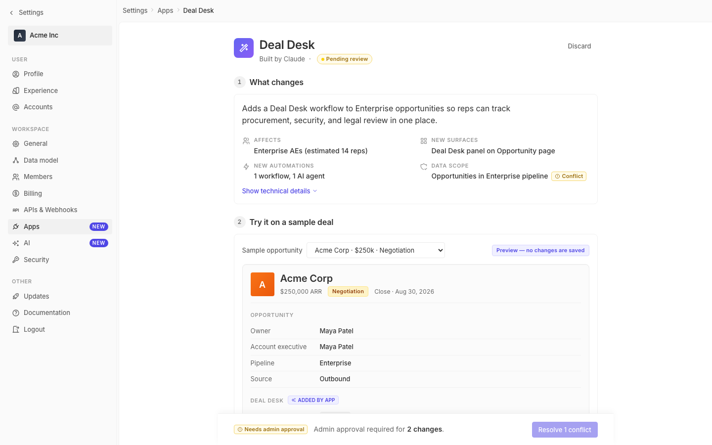

# m2-foundational-typography · deal-desk-prototype-2

## Screenshots
| before (origin) | after (working copy) |
|---|---|
|  |  |

## Goal achievement
Refactored the prototype's typography to follow Twenty's underlying type token system (xs/sm/md/lg/xl ≈ 13.6/14.7/16/19.7/24.6px, weights 400/500/600) and tightened the five requested axes:

- **Scale** — broadened from a compressed 11–20px range to an 11/12/13/14/16/20/24 stack with named tokens (`--text-eyebrow` through `--text-h1`). The page header jumps from 20 → 24px so the page owns a clearer top, the record title goes 18 → 20px, and the AI/Deal-Desk panel titles step up from 13 → 14px so they read as titles rather than body bold.
- **Pairing** — kept Inter + JetBrains Mono but added Inter `font-feature-settings: 'cv11','ss03','ss01','cv02'` for proper figures + curved-leg `l`, applied `font-variant-numeric: tabular-nums` to all numeric chrome (record meta, dates, reach counts, deploy bar counts, status timestamps, deal-size input), and tuned the mono tech-list to 12.5px / 1.75 with stylistic alternates off for cleaner code.
- **Leading** — introduced `--leading-tight / snug / normal / relaxed` tokens (1.2 / 1.35 / 1.5 / 1.6). Global body now 1.5 (was 1.4), prose bodies (summary headline, AI summary, popover) are 1.5–1.6, headings are 1.2, dense rows are 1.35.
- **Measure** — added `max-width: 62–64ch` to the summary headline and AI risk summary so multi-line prose holds a comfortable line length even though the 800px column would otherwise let it run long.
- **Weight contrast** — pulled body and field labels back to 400, pushed headings to 600 with `letter-spacing: -0.01em` (page-header gets -0.02em for the larger size), and bumped all-caps eyebrows (section labels, filter labels, tech-group titles, "side effects" header) to 11px / 600 / `0.06em` tracking. Eyebrow micro-tags ("AI PREVIEW", "DEAL DESK PANEL") jumped from 600/0.04em to 700/0.08em so the small caps actually carry.

## Cost
- wall time: 7m 16s
- turns: 67
- tokens (input / cache-create / cache-read / output): 82 / 166922 / 6182851 / 31238
- $ estimate: $4.916048

## How Claude achieved it
1. **Read the grounding system.** Opened `twenty-ui/src/theme/constants/FontCommon.ts` (and FontLight) to recover Twenty's own scale (xxs/xs/sm/md/lg/xl/xxl in rem) and weight ramp (regular/medium/semiBold = 400/500/600). Grepped settings components to confirm how those tokens are actually applied (md for emphasized body, sm for body, xl for large headings, eyebrow=xs/600 uppercase). This established the target the prototype should adhere to.
2. **Audited the prototype.** Read `App.tsx` and `styles.css` end-to-end and inventoried every font declaration. The dominant problems were: a compressed range with most text in the 11–15px band, line-height pinned globally at 1.4 (too tight for prose), weights bunched at 500 across both body and chrome (low contrast), eyebrow labels using only 0.04em tracking (mushy), and no measure cap on prose so the 800px column could let body lines run too long.
3. **Introduced a typography token layer.** Added `--text-eyebrow / caption / body-sm / body / lede / h3 / h2 / h1` plus `--leading-*` and `--tracking-*` tokens to `:root` so the rest of the file could refer to a single source of truth instead of magic pixel values.
4. **Reapplied tokens throughout the file.** Replaced literal `font-size: 13px / line-height: 1.4 / letter-spacing: 0.04em` etc. on every relevant rule — page header, breadcrumb, nav, section header/title, summary headline + grid, chips/badges/pills, tech list, record header, field rows, AI preview, Deal Desk panel + checks, side effects, permissions, rollout filters/estimate/pilot, popover, deploy bar, workspace pill.
5. **Targeted moves per axis.** Bumped the page header to 24px with `-0.02em` tracking and tight leading (scale). Constrained prose with `max-width: 62–64ch` on the summary headline and AI risk paragraph (measure). Set prose leading to 1.5–1.6 and heading leading to 1.2 (leading). Pulled body/field-label weight back to 400 against semibold headings/chips, and pushed micro-tags to 700/0.08em (weight contrast). Added `font-feature-settings` and tabular-nums on numeric UI (pairing).
6. **Validated by reading the diff.** Couldn't navigate the dev server from the sandbox browser (Vite bound to localhost), so the change was driven entirely by reading source + checking every edited block against Twenty's reference scale rather than a live screenshot loop.

## Prompt
```
/goal Improve the typography of this prototype (http://localhost:5203/), which is a mock of a future feature built into twenty (live codebase is at ../../grounding/twenty for reference to use as a baseline to adhere to). Focus on scale, pairing, leading, measure, and weight contrast. Ignore unrelated design issues.
```
