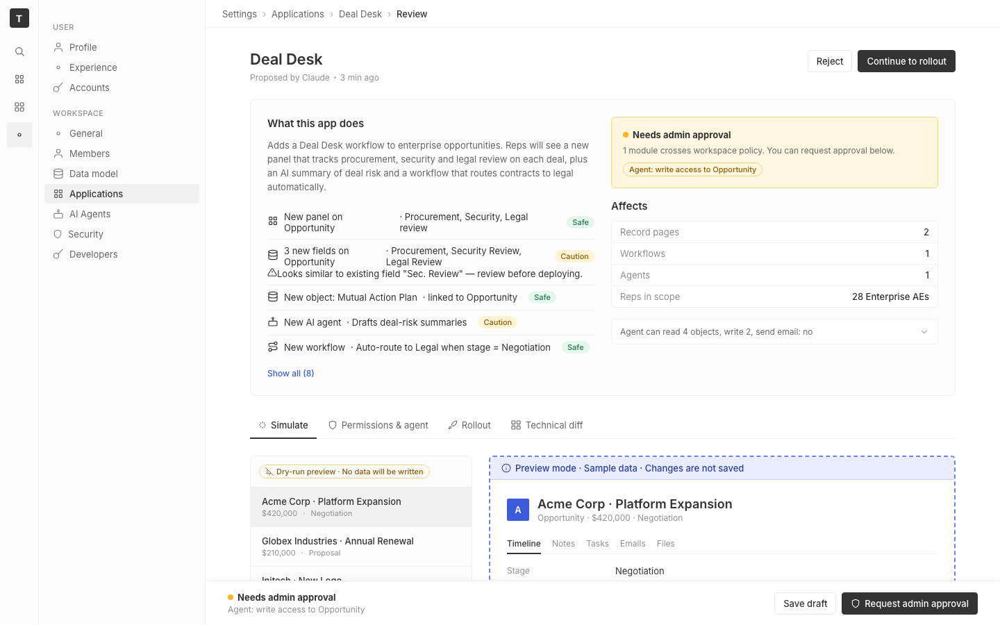

# m2-quality-aislop · deal-desk-prototype-1

## Screenshots
| before (origin) | after (working copy) |
|---|---|
|  |  |

## Goal achievement
Targeted the three call-outs in the prompt:

- **3-cards / centered-hero pattern.** The "Affects" section was a row of three boxed stat tiles with 18 px big-numbers (`2`, `1 + 1`, `28`). That's the stock SaaS landing-page pattern, not a twenty settings page. Replaced with a single dense key/value list inside one bordered container (Record pages · Workflows · Agents · Reps in scope), matching the field-set density used elsewhere in twenty's settings UI.
- **Gradient overuse.** The record avatar in the Simulate preview used `linear-gradient(135deg, #4e60d3, #7c5dd4)` — a generic AI-mockup purple. twenty's `Avatar.tsx` uses a single solid `backgroundColor`; switched to a flat `var(--blue)` and trimmed the 40 px tile down to 32 px so it reads like a twenty record header, not a hero logo.
- **Generic stock vibe.** Removed the decorative "✨ Proposed by Claude" blue solid pill and the filler "v0.1 draft" chip from the page header (kept the "Proposed by Claude · 3 min ago" line as plain meta). The "AI deal-risk summary" preview was a purple-tinted card with sparkles icon and an "AI preview" purple pill — repainted as a plain white card with a thin purple left rule and a small "Drafted by agent · preview" meta line, so the AI labeling stays informative without screaming for attention.

Left untouched: the change-list rows, the policy banner, the tabs, the rollout filters, the technical diff, and the sticky footer — the prompt explicitly said to ignore unrelated design issues.

## Cost
- wall time: 3m 50s
- turns: 36
- tokens (input / cache-create / cache-read / output): 56 / 123707 / 2489040 / 12952
- $ estimate: $2.34176875

## How Claude achieved it
1. Read `src/App.tsx` and `src/App.css` in the prototype to inventory the rendering surface.
2. Cross-referenced the grounding repo at `../../grounding/twenty/` for design anchors — confirmed that the twenty front-end barely uses `linear-gradient` (only `repeating-linear-gradient` in the spreadsheet drop zone) and that `Avatar.tsx` paints a flat seeded `backgroundColor`, not a gradient.
3. Identified three concrete AI-slop tells that match the prompt's call-outs:
   - the right-hand "Affects" 3-stat-tile cluster (3-cards pattern),
   - the `record-avatar` purple → indigo gradient (gradient overuse),
   - the sparkles-and-purple AI summary card plus the decorative "✨ Proposed by Claude" pill and "v0.1 draft" chip in the page header (stock vibe).
4. Edited `App.tsx` to: drop the sparkles + "v0.1 draft" chrome from the page header, swap the three stat tiles for a four-row affects list, and simplify the AI summary header (no sparkles icon, no purple pill — replaced with a small "Drafted by agent · preview" meta).
5. Edited `App.css` to: replace the gradient on `.record-avatar` with `var(--blue)` and shrink it to 32 px, introduce a dense `.affects-list` key/value style that matches twenty's tabular settings density, and repaint `.ai-summary` as a white card with a thin purple left rule instead of a purple-tinted block.
6. Vite hot-reloaded the changes; the dev server stayed up at `:5239`.

## Prompt
```
/goal Remove AI-slop tells from this prototype (http://localhost:5239/), which is a mock of a future feature built into twenty (live codebase is at ../../grounding/twenty for reference to use as a baseline to adhere to). Focus on centered-hero+3-cards, gradient overuse, and generic stock vibe. Ignore unrelated design issues.
```
