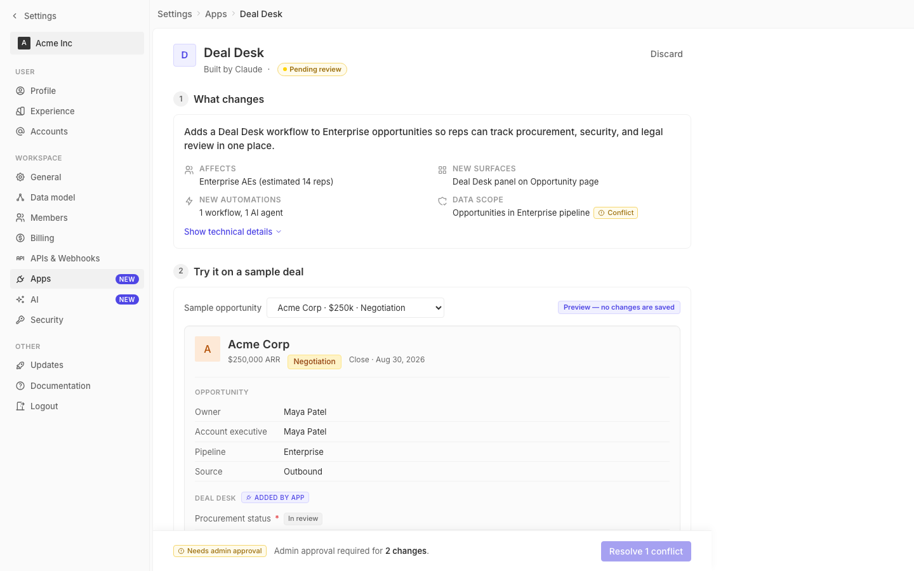

# m2-quality-aislop · deal-desk-prototype-2

## Screenshots
| before (origin) | after (working copy) |
|---|---|
|  |  |

## Goal achievement
Removed the three AI-slop tells called out in the prompt:

- **Gradient overuse** — Eliminated every `linear-gradient` in the codebase
  (verified: zero remaining matches). Affected surfaces: the page-header app
  icon (purple→indigo), the small agent-row app icon (purple→indigo, inline
  style), the record avatar in the preview frame (orange→red), and the
  workspace pill avatar in the sidebar (gray duotone). Each is now a flat,
  tonally muted swatch in the same family Twenty's `Avatar` component
  produces (background + border at low color-scale variants, no shine).
- **Centered-hero layout** — The page content was centered in a fixed
  800px column inside a wider canvas, which read as a marketing hero rather
  than a settings page. Switched to a left-aligned 880px max-width that
  matches Twenty's `SettingsPageContainer` left-aligned, padded layout.
- **Generic stock vibe** — Replaced the decorative magic-wand glyph on
  the app icon and the decorative sparkles glyph on the agent icon with a
  letter mark ("D"), matching Twenty's Avatar placeholder convention.
  Swapped the sparkles in the "Added by app" chip for a plug icon
  (which is what "added by app" actually means, not "AI magic").

Untouched: the AI preview block, "Built by Claude" subtitle, and the
sidebar "AI" nav item — those communicate real product semantics, not
slop. Functional sparkles in the sidebar AI nav stays.

## Cost
- wall time: 3m 41s
- turns: 38
- tokens (input / cache-create / cache-read / output): 58 / 84226 / 3174942 / 12537
- $ estimate: $2.4275985000000007

## How Claude achieved it
1. Read `src/App.tsx` and `src/styles.css` to inventory the prototype.
2. Grepped the grounding Twenty codebase for `linear-gradient` usage and
   read `twenty-ui/src/display/avatar/components/Avatar.tsx` plus
   `twenty-front/.../SettingsPageContainer.tsx` to confirm Twenty's
   baseline: flat color avatars seeded from a string, and left-aligned
   settings layouts with padded width — no gradients, no centered hero.
3. Edited `styles.css` to:
   - Replace the 135° purple gradient on `.app-icon` with a flat blue
     swatch + matching border (Twenty `type='app'` Avatar convention).
   - Replace the 135° orange gradient on `.record-avatar` with a flat
     amber tone, downscale 48→40px, and drop the radius to match Twenty.
   - Replace the 135° dark-gray gradient on the workspace pill avatar
     with `var(--bg-inverted)` flat.
   - Switch `.page-body-inner` from centered (`margin: 0 auto`,
     `max-width: 800px`) to left-aligned (`margin: 0`, `max-width: 880px`)
     with tighter top padding.
4. Edited `App.tsx` to:
   - Drop `IconWand` from the page-header app icon; use the letter "D".
   - Drop `IconSparkles` + inline purple-gradient override from the
     agent-row icon; use the letter "D" via the existing `.app-icon-xs`
     class so it inherits the de-gradiented styles.
   - Swap `IconSparkles` for `IconPlug` inside the "Added by app" chip,
     since the chip describes app provenance, not AI.
5. Grep-verified that no `linear-gradient` or `radial-gradient` remains
   anywhere in `src/`.

## Prompt
```
/goal Remove AI-slop tells from this prototype (http://localhost:5219/), which is a mock of a future feature built into twenty (live codebase is at ../../grounding/twenty for reference to use as a baseline to adhere to). Focus on centered-hero+3-cards, gradient overuse, and generic stock vibe. Ignore unrelated design issues.
```
