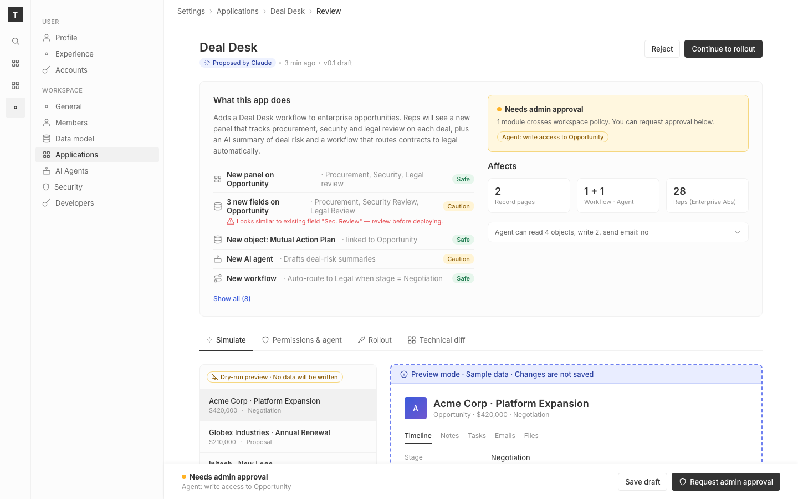

# m2-quality-consistency · deal-desk-prototype-1

## Screenshots
| before (origin) | after (working copy) |
|---|---|
|  |  |

## Goal achievement
Tightened token adherence and pattern consistency across the prototype's CSS and JSX, aligning more closely with twenty's design-token conventions. The visible UI is essentially unchanged (one intentional shift: card corners go from 6px → 8px to match twenty's `BORDER_COMMON.radius.md = '8px'`).

Concretely:
- **Radius scale**: replaced the ad-hoc `--radius-md: 6px` + `--radius-lg: 8px` split with a single `--radius-md: 8px` (matches `twenty-ui/src/theme/constants/BorderCommon.ts`). `--radius-pill` corrected from `50px` to `999px` (twenty's pill value).
- **New font-size tokens** (`--font-xxs`…`--font-2xl`): replaced ~40 scattered hardcoded `font-size: 11px/12px/13px/15px/18px/22px` declarations with the tokens, mirroring twenty's `FONT_COMMON.size` scale.
- **Added `--purple5` and `--space-2-5`** tokens; killed the only stray hex (`#d9cef9` on `.ai-summary`) and the `#4e60d3/#7c5dd4` magic gradient on `.record-avatar` (now `var(--blue) → var(--purple)`). White literals replaced with `var(--gray1)`.
- **Space tokens**: replaced ~30 hardcoded `gap`/`padding`/`margin` px values (`4/6/8/10` px) with `--space-1`, `--space-1-5`, `--space-2`, `--space-2-5`. Spacing now flows from the token scale, not arbitrary pixels.
- **Outline-tag pattern unified**: `.tag.outline` now sets a single `border: 1px solid var(--border-strong)` base, with color/border overrides per accent — replacing two divergent rules (`amber5` border vs `gray6` literal).
- **Dead CSS removed**: `.change-row` (orphaned — markup used `.change-row-wrap`, so `.conflict` styling was actually unreachable; fixed and re-attached under `.change-row-wrap .conflict`), `.btn.amber`, `.card.plain`, `.card.tight`, `.toggle .locked-text`, `.sep-dot`, `.warn-box`, `.fieldset .v.muted` — all defined, never referenced.
- **Inline styles eliminated** in `App.tsx`: 6 `style={{…}}` blocks (sim-footer padding, workflow-preview spacing, between-cards gap, button block layout, show-all margin override, unit-pill cursor) were replaced with reusable utility classes (`.btn.block`, `.sim-footer`, `.workflow-preview`, `.card + .card`, `.show-all.inline`, `.impact-card .stats`). The `.unit-pill` got its inherent `cursor: pointer` since it's always interactive.
- **Nav-icon affordance**: the topnav icons claimed to be clickable but had no hover or cursor; added the same `cursor: pointer` + tertiary-bg hover already used by `.settings-sidebar .nav-item`, so the two nav surfaces share a single interaction pattern.

## Cost
- wall time: 7m 31s
- turns: 65
- tokens (input / cache-create / cache-read / output): 85 / 156325 / 5724797 / 33446
- $ estimate: $4.6760047500000015

## How Claude achieved it
1. **Audited the source of truth.** Read `twenty-ui/src/theme/constants/{BorderCommon,FontCommon,GrayScaleLight,BackgroundLight,BorderLight,FontLight,TagLight,MainColorsLight,Text}.ts` to extract twenty's actual token shape: 4-step spacing multiplier, `radius.md = 8px`, `radius.pill = 999px`, named font sizes (`xxs`/`xs`/`sm`/`md`/`lg`/`xl`/`xxl`), gray1–gray12 scale, and the foreground/background/border semantic layer.

2. **Diffed the prototype's tokens against twenty.** The prototype already had a parallel gray scale and semantic foreground/background tokens — the gaps were (a) radius scale split into `md/lg`, (b) no font-size tokens at all (every component hardcoded px), (c) a stray magic hex and gradient, and (d) inconsistent uses of `gap/padding` (raw px) for things the space scale could express.

3. **Inventoried unused/divergent rules.** Grepped JSX for every CSS class to find dead rules (`.change-row`, `.btn.amber`, `.card.plain`, `.card.tight`, `.locked-text`, `.sep-dot`, `.warn-box`, `.fieldset .v.muted`). Noticed `.change-row .conflict` was orphaned — the markup uses `.change-row-wrap` — so the conflict notice was silently unstyled. Re-attached and indented it under the icon's column for cleaner alignment.

4. **Made the edits in token-shaped passes**: tokens → buttons/cards → change rows → tags/status → permissions/tables → rollout controls → impact card → footer/utilities. Each pass removed a coherent batch of magic numbers in favor of `--font-*`, `--space-*`, or `--radius-*`.

5. **Moved inline styles into reusable classes.** Six `style={{…}}` in `App.tsx` became utilities (`.btn.block`, `.sim-footer`, `.workflow-preview`, `.card + .card` adjacency rule, `.show-all.inline`, `.impact-card .stats`) so the same patterns can recur without one-off overrides.

6. **Cross-checked.** Re-grepped for `radius-lg`, `change-row(?!-wrap)`, dead-class names, and any remaining `style={{`; all returned zero. Hot reload picks up edits in place; the dev server was left running.

## Prompt
```
/goal Improve the design-token and pattern consistency of this prototype (http://localhost:5238/), which is a mock of a future feature built into twenty (live codebase is at ../../grounding/twenty for reference to use as a baseline to adhere to). Focus on token adherence and repeated patterns. Ignore unrelated design issues.
```
