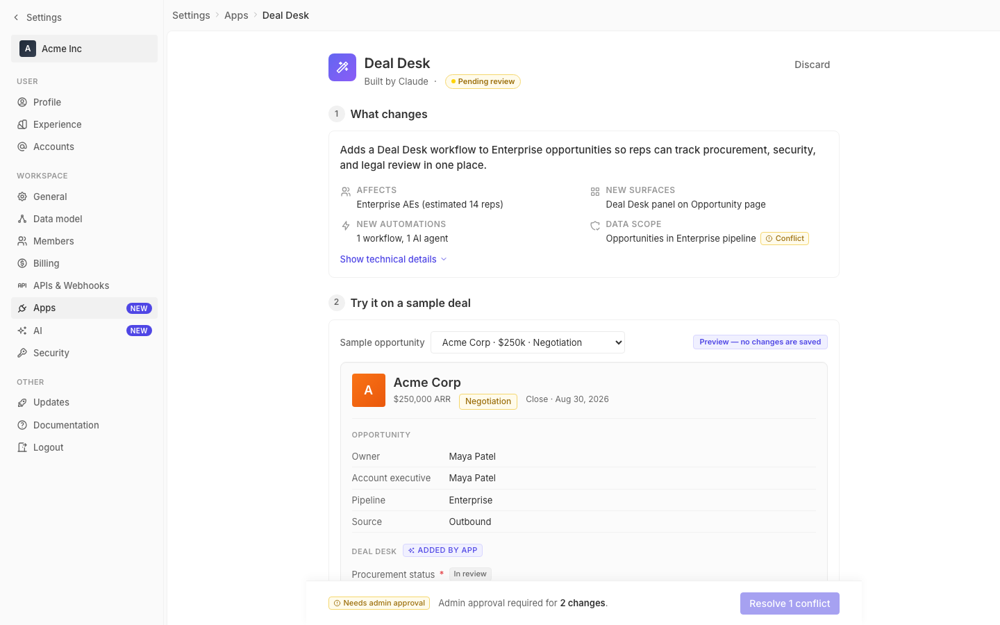

# m2-quality-consistency · deal-desk-prototype-2

## Screenshots
| before (origin) | after (working copy) |
|---|---|
|  |  |

## Goal achievement
Tightened design-token adherence and consolidated repeated UI patterns across the prototype, using the Twenty light theme (radix-style scales for yellow/green/red/blue/gray + spacing/radius/shadow tokens) as the reference. The visible UI is unchanged; what changed is that values now flow through tokens/classes instead of being one-off literals, so future colour/spacing changes propagate consistently.

Concretely:
- The `.record-meta .stage-pill` (Negotiation pill in the sample-deal preview) was the only chip in the file using raw Tailwind-amber hex values (`#fef3c7` / `#92400e` / `#fde68a`). It now uses the same `--color-yellow-bg / -11 / -border` tokens that every other warning chip in the prototype already uses — making it a true `chip.warning` peer instead of a visual lookalike.
- The focus ring on `.btn:focus` and `.select:focus` repeated `rgba(79, 70, 229, 0.12)` literally. Hoisted to a new `--shadow-focus-blue` token so both states share one source of truth.
- Removed a duplicated `linear-gradient` inline style on the agent-icon in Section 3 — it was re-declaring the exact gradient already on `.app-icon`. Now the class alone drives it.
- The four Section-4 filter selects each carried `style={{ minWidth: 180 }}`, an `IconChevronDown size={14} color="#999"`, and a placeholder span with `color: '#999', fontSize: 13`. Introduced three classes (`.select-multi.select-wide`, `.select-trailing`, `.select-placeholder`) so the markup states intent, not literal values. The advanced "Specific users" select reuses the same primitives via `.select-xwide` and a new `.filter-helper` for the helper text.
- The "Added by app" chip in Section 2 was inline-overriding the standard `.chip` font-size to 10px and using `marginLeft: 8`. Removed both — added a small `.chip-inline-label` utility for the spacing and let the chip stay at its canonical 11px size, matching every other chip in the page.
- Replaced one-off inline colours (`color: '#666'`, `color: '#999'` on `IconUsers`, `IconInfoCircle`, "for" label, the deal-size `≥ $` prefix) with token-driven classes (`.text-secondary`, `.select-placeholder`, the existing `.se-icon`), or by letting icons inherit `currentColor` from a properly-coloured parent.
- Normalised a stray `padding: 8px 0` on `.activity-item` and `padding: 4px 8px 4px 8px` on `.select-multi` to use `--spacing-1 / --spacing-2`, and replaced the popover-trigger `padding: 2px 8px` on the stage pill to use the same spacing token.

Only two `style={{}}` props remain in App.tsx — both are pure positioning (`position: relative` on the conflict-chip container, and the popover's `top: 'calc(100% + 8px)'`/`left: 0`). Those are legitimate uses of inline style, not token violations.

## Cost
- wall time: 4m 29s
- turns: 39
- tokens (input / cache-create / cache-read / output): 49 / 98913 / 3404309 / 18243
- $ estimate: $2.77668075

## How Claude achieved it
1. **Read the prototype end-to-end** — `styles.css` (1249 lines) and `App.tsx` (1230 lines) — to map every place that defined or consumed a token-shaped value.
2. **Cross-referenced the Twenty design system** at `grounding/twenty/packages/twenty-ui/src/theme/constants/` (BorderCommon, FontCommon, GrayScaleLight, MainColorsLight, SecondaryColorsLight, TagLight, BoxShadowLight, ThemeCommon) to confirm the prototype's `--color-*`, `--spacing-*`, `--radius-*` and `--font-*` vars line up with Twenty's actual scale (radix P3 colours, 4-px spacing multiplier, radii 2/4/8/999, tag bg=color3 / text=color11 etc.). This established that the existing `:root` tokens are sound; the work was about *adherence*, not redefining the system.
3. **Inventoried every literal that should have been a token**: hex colours outside the palette, focus-ring rgba duplicated across rules, inline `color="#…"` on icons, inline `fontSize`/`marginLeft`/`minWidth` numbers, and inline gradients that duplicated a class definition.
4. **Promoted repeated patterns into named primitives in CSS**: `--shadow-focus-blue`, `.select-wide` / `.select-xwide` (sizing variants on the existing `.select-multi`), `.select-placeholder`, `.select-trailing`, `.filter-helper`, `.chip-inline-label`, `.text-secondary`, `.advanced-panel`. Each one replaces 2–4 inline declarations.
5. **Rewrote the JSX to consume those primitives**, deleting inline `style={{}}` props except the two true positioning cases. Where an icon was hardcoded to `color="#666"` or `color="#999"`, removed the prop entirely so the icon inherits `currentColor` from the already-tokenised parent.
6. **Verified the dev server still served both files** (`curl /src/App.tsx` and `/src/styles.css` returned 200 after the edits, Vite HMR untouched).

## Prompt
```
/goal Improve the design-token and pattern consistency of this prototype (http://localhost:5218/), which is a mock of a future feature built into twenty (live codebase is at ../../grounding/twenty for reference to use as a baseline to adhere to). Focus on token adherence and repeated patterns. Ignore unrelated design issues.
```
