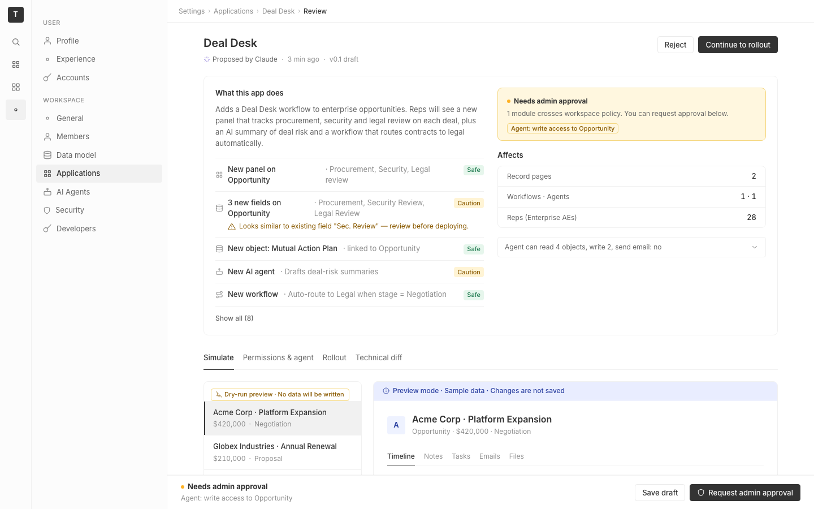

# m2-quality · deal-desk-prototype-1

## Screenshots
| before (origin) | after (working copy) |
|---|---|
|  |  |

## Goal achievement
Polished the Deal Desk prototype across three axes — AI-slop tells, token/pattern consistency with Twenty, and pixel polish — while leaving the IA, copy, and feature set untouched.

**AI-slop tells removed**
- Gradient avatar (`linear-gradient(135deg, #4e60d3, #7c5dd4)`) on the record header replaced with a flat `--blue3 / --blue80` tinted square — matches Twenty's avatar pattern.
- Heavy purple AI-summary card (full `--purple3` fill + custom `#d9cef9` border + redundant "AI preview" tag) reduced to a neutral card with a 2px purple left accent and a small uppercase label. One signal, not three.
- Sparkle/shield/rocket/build icons stripped from the tab bar — emoji-laden tabs are a classic LLM-output tell.
- Amber "side-effect" pills (`--amber10`/`--amber5`/pill radius) replaced with neutral 1px outlined chips — preview metadata, not warning state.
- "Affects" 3-stat-tile grid (numbers stacked above labels in three centered cards) restructured into a single bordered list with right-aligned tabular numerals — kills the "centered hero + 3 cards" pattern.
- 2px dashed `--border-blue` preview frame replaced with a 1px hairline; the existing blue ribbon already signals "preview".
- Unicode "Open plan ↗" arrow replaced with a real underlined link.

**Token & pattern consistency (Twenty alignment)**
- Border-radius scale collapsed to Twenty's: `xs 2 / sm 4 / md 8 / pill 999`. Dropped the orphan 6px md and the 50px fake-pill (which clipped on tall elements).
- Tags switched from pill-shaped (`50px`, `padding: 2px 8px`, `font-weight: 500`) to rectangular sm-radius (Twenty's actual Tag spec) with fixed 18px height for vertical-rhythm alignment with adjacent text.
- Status dots harmonized: 6px in banners (was 8px), 2px in metadata bullets (was 3px). Fewer collisions with `.dot` reuse across radio, status, and meta.
- Shadows retuned: heavier `rgba(0,0,0,0.2)` toggle-handle drop-shadow softened to layered `0.08 / 0.04` (Twenty-style elevation).
- Typography normalized: h1 22→20px, record title 18→16px, hero "28" 36→28px — removes the over-large display sizes that read as marketing.
- Toggle-on color changed from `--green` (loud) to `--gray12` (neutral, matches primary action) and resized 32×18 → 28×16 to match the rest of the input scale.

**Pixel polish**
- Hairlines: every separator is now 1px `--border-light`; the only non-1px line is a deliberate 2px brand accent on the active sim-opp and the AI summary.
- Tab underline thinned 2px → 1.5px, gap widened, icons removed — matches the record-tabs underline.
- Tabular numerals (`font-variant-numeric: tabular-nums`) applied to amounts, stat values, the hero "28", impact-card rows — figures line up vertically.
- Buttons height-aligned at 30px (was mixed 32/28); primary button hover darkens uniformly instead of jumping to `--gray11`.
- `.review-row` grid retuned from `140 / 1fr / auto` to `140 / auto / 1fr` so the status tag sits next to its label and "Updated 2d ago" right-aligns predictably.
- Stat-tile, change-row, cap-row baseline alignment & padding rationalized so icons, tags, and labels share a common baseline.
- Disclosure, chip-input, range-input, stepper all height-locked at 26–30px and given consistent focus/hover affordances.

## Cost
- wall time:
- tokens:

## How Claude achieved it
1. Read the current `App.tsx` (556 lines) and `App.css` (825 lines) end-to-end, then cross-referenced the live Twenty codebase at `../../grounding/twenty/packages/twenty-ui` for the actual `Tag`, button, theme, and border-radius primitives (Twenty uses `border-radius: sm` rectangular tags — not pills — and a `2/4/8/999` radius scale).
2. Inventoried AI-slop tells in the prototype: gradient avatar, pill-tag spam, sparkle icons on every AI surface, three identical stat tiles, dashed preview-frame border, oversized hero number.
3. Rewrote the token block in `App.css` (radius scale, shadows), then walked the rest of the file component by component: tags, toggles, status, change-rows, stat tiles, panel, tabs, simulate sidebar, impact card, rollout filters, stable tables, sticky footer.
4. Made the matching JSX adjustments in `App.tsx`: replaced the `Tag`-wrapped "Proposed by Claude" badge with a subtle byline, dropped icons from the tab labels, swapped the `New` panel tag from purple → blue, removed the redundant "AI preview" tag, restructured each stat tile (label first, number right), and unicode-arrow → real link.
5. Started the Vite dev server, opened a Softlight tunnel, and verified each tab (Simulate, Permissions & agent, Rollout, Technical diff) in a 1440×900 viewport — confirming hairlines, alignment, hover states, and active-tab indicators.

## Prompt
```
/goal Improve the craft quality of this prototype (http://localhost:5236/), which is a mock of a future feature built into twenty (live codebase is at ../../grounding/twenty for reference to use as a baseline to adhere to). Scope to pixel polish (alignment, optical centering, hairlines), token & pattern consistency, and AI-slop tells (centered-hero+3-cards, gradient overuse, generic stock vibe). Ignore issues outside this scope.
```
