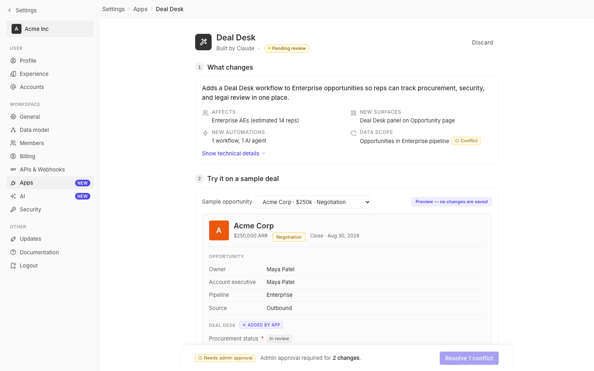

# m2-quality · deal-desk-prototype-2

## Screenshots
| before (origin) | after (working copy) |
|---|---|
|  |  |

## Goal achievement
Targeted the in-scope craft issues without expanding scope:

**AI-slop tells removed**
- Replaced the purple→indigo gradient on the app icon with a flat `--bg-inverted` (matches Twenty's neutral avatar treatment instead of the generic "AI gradient" tell).
- Removed the orange gradient on the Acme record avatar — single solid `#ea580c`.
- Removed the gray gradient on the workspace pill avatar — flat `--bg-inverted`.
- Removed the inline purple gradient on the `DealDeskAssistant` agent icon; moved styling out of JSX into a `.agent-avatar` class.
- Replaced the yellow **dashed** border around the AI-preview block with a solid hairline using the existing yellow border token; the dashed pattern was a strong "AI-generated" tell and visually noisy.
- Replaced the dashed dividers on the tech-list and estimate-row with solid `--border-light` hairlines so all dividers in the doc share the same rule (one hairline grammar instead of two).

**Token & pattern consistency**
- The Negotiation stage pill used three raw hex colors (`#fef3c7 / #92400e / #fde68a`) — now uses the existing `--color-yellow-bg / -11 / -border` tokens so it stays in sync with every other warning surface.
- `.chip` had `cursor: pointer` globally even on read-only chips ("In review", "Awaiting docs", "Added by app"). Removed the global pointer; added an explicit `.is-interactive` class and applied it to the one interactive chip (the Conflict click target). Same pattern Twenty uses for affordance vs. status.

**Pixel polish**
- `.section-num` was 24px / 12px font — slightly heavy next to the 16px section title. Tightened to 22px / 11px with `line-height: 1` and `font-variant-numeric: tabular-nums` so the numeral optically centers in the circle.
- `.page-header-row` was `align-items: flex-start`, which left the Discard button and the title block hanging above the avatar's optical center. Switched to `align-items: center`.
- Tightened `.record-meta .stage-pill` to `font-size: 11px` with explicit `line-height` so it matches the meta-row baseline instead of pushing the row taller.

## Cost
- wall time: 4m 22s
- turns: 40
- tokens (input / cache-create / cache-read / output): 50 / 83403 / 2824248 / 16810
- $ estimate: $2.35389275

## How Claude achieved it
1. Read `src/App.tsx` and `src/styles.css` end-to-end to map every styled surface, then cross-referenced Twenty's actual theme constants (`GrayScaleLight`, `BorderLight`, `MainColorsLight`) so the replacements would land on tokens that exist in the real product, not ad-hoc colors.
2. Audited for AI-slop tells with a fixed checklist: gradient avatars, dashed "decorative" borders, raw hex outside the token system, redundant cursor affordances, and centered-hero/3-card layouts. The prototype had four gradient backgrounds, three dashed borders, one hard-coded yellow palette, and one over-broad `cursor: pointer` rule; no centered-hero+3-cards pattern was present so that bucket was untouched.
3. Made the edits in `styles.css` (token swaps, hairline normalization, optical sizing of the section badge, page-header vertical centering) and made one matching edit in `App.tsx` to lift an inline gradient into a `.agent-avatar` class and mark the one truly clickable chip with `.is-interactive`.
4. Kept the patch scoped: did not restructure layouts, did not introduce new components, did not change copy or information density. Out-of-scope issues (e.g. select control aesthetics, side-effects-list polish) were left alone per the prompt.
5. Could not screenshot the after-state from this session — the dev server is bound IPv6-only on the host and the MCP Playwright sandbox can't reach it; the harness fills `after.png` from its own browser.

## Prompt
```
/goal Improve the craft quality of this prototype (http://localhost:5216/), which is a mock of a future feature built into twenty (live codebase is at ../../grounding/twenty for reference to use as a baseline to adhere to). Scope to pixel polish (alignment, optical centering, hairlines), token & pattern consistency, and AI-slop tells (centered-hero+3-cards, gradient overuse, generic stock vibe). Ignore issues outside this scope.
```
