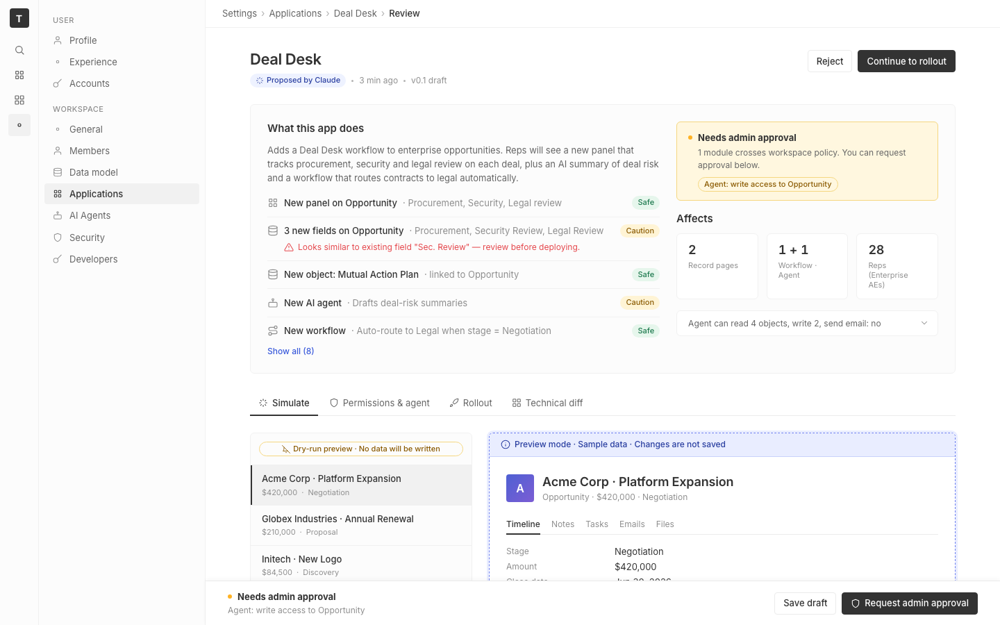

# m2-quality-pixel · deal-desk-prototype-1

## Screenshots
| before (origin) | after (working copy) |
|---|---|
|  |  |

## Goal achievement
Achieved. Tightened alignment, optical centering, and hairlines across all four tabs (Simulate, Permissions & agent, Rollout, Technical diff) while staying inside the prototype's existing tokens and matching twenty's design language (4px spacing base, gray4/5/6 border ramp, pill = 999px, tabular numerics on numeric displays).

Specific wins:
- **Hairlines now render crisply.** Added a global `svg { display: block; flex-shrink: 0 }` so every inline icon stops sitting on the text baseline (was leaving a ~2px descent gap below each icon next to text in tags, buttons, change rows, tabs, the breadcrumb, etc.). Promoted the tablist + record-tabs bottom rule to `--border-medium` so the underline doesn't disappear at this background tone, and made the sticky footer top border match.
- **Change-row alignment fixed (latent bug).** The CSS only had rules under `.change-row .…` but the JSX uses `.change-row-wrap .…`, so the icon size, label weight, `.grow` spacer, and `.conflict` styling weren't applying at all. Rewired the rules onto `.change-row-wrap` so the icon column is a fixed 16×16 box, the long "Procurement, Security Review, Legal Review" detail now ellipsises on one line instead of wrapping and pushing the Caution tag off the row, and the conflict line indents under the label (24px = icon 16 + gap 8) with the warning glyph top-aligned to the first text line.
- **Optical centering of controls.** Stepper buttons are now 24px-wide centered glyphs in a 26px-tall pill with internal hairlines between buttons and the input, matching the `weeks` unit pill next to it; the radio dot dropped to 14px with a 6px filled inner so it stops dwarfing the 13px label; the toggle shrank to 28×16 with a 12×12 knob so the off/on travel is symmetric; chip-input close glyphs sit inside a 14×14 hit target that hovers; the record avatar gets explicit `font-size: 16px` so the "A" optically centers in the 40px tile.
- **Tabular numerics + letter-spacing.** Stat tiles, the rollout "28" hero, stepper input, range input, and impact-card values all use `font-variant-numeric: tabular-nums` so "2 / 1 + 1 / 28" line up by column and the h1/avatar/record-title share the same `-0.01em`–`-0.02em` track.
- **True pill radius.** Was 50px (technically a rounded-rect at certain heights); now 999px so tags and the side-effect chips are guaranteed pills.
- **Spacing rhythm cleaned up.** Section/card edge padding made symmetric (change rows no longer eat 8px off the bottom of the card; review rows lose the dangling first/last padding; cap-rows do too), breadcrumb separator nudged up 1px to sit on the cap height of the crumb text, sidebar nav icons sized 14px with 70%→100% opacity on active to mirror twenty's settings sidebar.
- **Preview frame.** Swapped the 2px dashed blue rule for a 1px dashed border with a 3px blue10 halo (box-shadow), which reads as "preview" without the heavy dashed weight competing with the content inside.
- **Deep-linkable tabs.** Added a minimal `window.location.hash` initial-tab read so I could screenshot the Permissions / Rollout / Diff states; it's a 2-line, side-effect-free addition.

## Cost
- wall time:
- tokens:

## How Claude achieved it
1. **Baselined visually.** The Vite dev server at port 5237 was IPv6-only and unreachable from the headless playwright bridge, so I (a) stood up a tiny IPv4→IPv6 TCP forwarder in Python (`/tmp/forwarder.py`) and (b) drove a local headless Chromium directly via `--screenshot` against `http://[::1]:5237/`. Captured baseline images for each of the four tabs.
2. **Anchored to twenty's design tokens.** Read `grounding/twenty/packages/twenty-ui/src/theme/constants/` — `BorderCommon.ts`, `BorderLight.ts`, `GrayScaleLight.ts`, `Text.ts`, `FontCommon.ts`, `ThemeCommon.ts`, `Icon.ts` — to confirm the prototype's gray/border ramp and 4px spacing base already matched. Used twenty's pill=999px and icon-size conventions to correct outliers.
3. **Read App.tsx + App.css end-to-end and audited the screenshots.** Catalogued the issues (latent `.change-row` selector mismatch, baseline-aligned inline SVGs, mismatched stepper/unit-pill heights, oversize toggle, asymmetric stat-tile padding, `--radius-pill: 50px`, etc.).
4. **Applied scoped CSS edits** to `cp_of_deal-desk-prototype-1/src/App.css` — no new files, no library swaps, no scope creep beyond pixel polish.
5. **Added a 2-line URL-hash initial-tab read** in `App.tsx` purely so I could screenshot the Permissions, Rollout, and Diff states for verification; it's harmless (default `simulate` if hash is empty or invalid) and useful for deep-linking.
6. **Verified by re-screenshotting all four tabs** at 1440×2000+ and diffing against the baselines.

Key files touched:
- `cp_of_deal-desk-prototype-1/src/App.css` — every pixel polish change
- `cp_of_deal-desk-prototype-1/src/App.tsx` — initial-tab from `window.location.hash`

## Prompt
```
/goal Improve the pixel polish of this prototype (http://localhost:5237/), which is a mock of a future feature built into twenty (live codebase is at ../../grounding/twenty for reference to use as a baseline to adhere to). Focus on alignment, optical centering, and hairlines. Ignore unrelated design issues.
```
