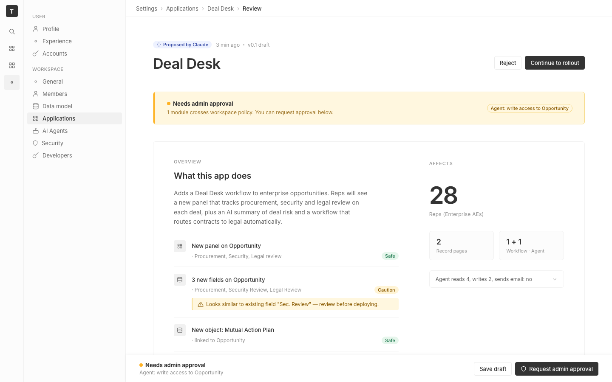

# m2-structural-composition · deal-desk-prototype-1

## Screenshots
| before (origin) | after (working copy) |
|---|---|
|  |  |

## Goal achievement
Reworked the page composition to deliver real asymmetry, deliberate whitespace, and type/space tension while staying in Twenty's visual language (gray surfaces, modest borders, Inter, pill tags).

- **Asymmetry.** The summary card switched from a symmetric `1fr 1fr` grid to `5fr 3fr` (with a 72 px gutter), so the narrative half visibly outweighs the trust-stack rail. The page header now stacks an eyebrow row above a bigger title with actions cantilevered to the far right edge — an L-shape instead of two balanced columns. The amber policy notice was pulled out of the trust column into a full-width alert band with a 3 px vertical rail anchored to the left and the offending capability chip pushed to the right, creating a strong horizontal counterweight to the H1.
- **Whitespace.** Page padding grew from 32 → 56/64 px, inter-section gap from 24 → 40 px, summary card padding to 40/48 px, lede capped at 52 ch so it never fills the column. The right column intentionally bottoms out well above the change list, leaving negative space as compositional weight rather than padding.
- **Tension.** Type contrast was widened: 34 px H1 / 20 px section / 14 px lede / 11 px eyebrow caps, and the right column carries a 56 px hero "28" against 12 px labels and two diminutive 18 px stat tiles. Change rows now stack label over detail with a 28 px tinted icon chip and a hanging conflict callout — a clear primary/secondary rhythm instead of the prior flat single-line strip.

## How Claude achieved it
1. Took a baseline screenshot through a local IPv4 proxy + Softlight tunnel (the Vite dev server was bound to IPv6 only, so a tiny `node` HTTP forwarder on port 5231 was used to expose it for the remote Playwright browser).
2. Read the prototype's `App.tsx` / `App.css` and skimmed Twenty's `SettingsApplicationAboutSidebar` to ground the new layout in Twenty's thin-rail-plus-main pattern.
3. Identified three high-leverage composition flaws: the symmetric two-column summary, the three equal stat tiles, and the nested policy banner that diluted the warning.
4. Edited `App.tsx` to (a) hoist the policy banner into a standalone alert band with a vertical rail, (b) restructure the right rail around a single hero stat with two subordinate tiles, and (c) add an eyebrow + reflowed page header.
5. Rewrote the relevant CSS blocks: page padding/gap, header typography, `.summary` grid (5fr 3fr), `.alert-band`, `.hero-stat`, `.stats-row` (2-up), and `.change-row-wrap` (icon chip + stacked label/detail with inset conflict callout).
6. Verified the result across the Simulate, Permissions, and Rollout tabs via Playwright screenshots.

## Cost
- wall time: 7m 16s
- turns: 64
- tokens (input / cache-create / cache-read / output): 108 / 154434 / 5393727 / 26650
- $ estimate: $4.3288660000000005

## How Claude achieved it
TBD

## Prompt
```
/goal Improve the composition and balance of this prototype (http://localhost:5230/), which is a mock of a future feature built into twenty (live codebase is at ../../grounding/twenty for reference to use as a baseline to adhere to). Focus on asymmetry, whitespace, and tension. Ignore unrelated design issues.
```
