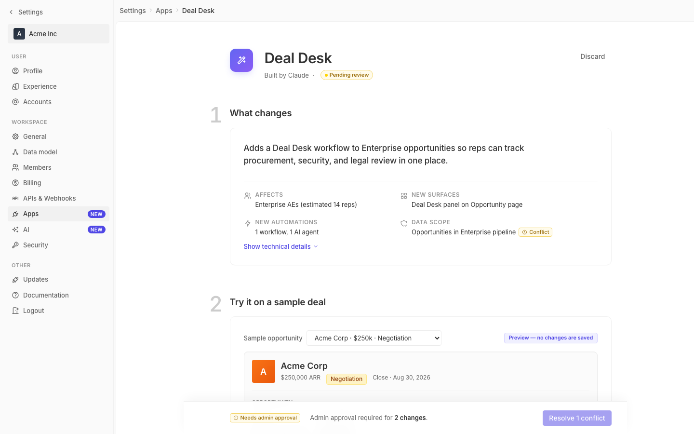

# m2-structural-composition · deal-desk-prototype-2

## Screenshots
| before (origin) | after (working copy) |
|---|---|
|  |  |

## Goal achievement
Reworked the page composition to introduce intentional asymmetry, more generous whitespace, and visual tension while staying inside Twenty's existing token system. The big shifts:

- **Asymmetric layout via a hanging gutter.** The content column is offset to the right (left padding 96px, right 32px) so the page no longer feels symmetrically centered. Each section number now floats out into that left gutter as a large light-gray outline numeral (44px, color `--font-extra-light`) instead of a small filled pill flush with the title. The numerals act as editorial drop markers — light visual weight, but commanding position — creating an asymmetric vertical column distinct from the card content.
- **Whitespace.** Section spacing went from 24px → 64px between sections. Page-header bottom margin went from 24px → 56px. Card padding went from 16px → 28px. Summary headline gets a 28px gap before the metadata grid, and the grid now has its own top border + 20px breathing space, separating "summary" from "facts." The body has 56px top padding and 120px bottom padding to keep the deploy bar from feeling cramped.
- **Tension.** Three deliberate contrasts: (1) the small Discard ghost button at top right vs. the heavy 30px title + glowing 48px app icon on the left of the page header; (2) the dense outline numerals in the gutter vs. the dense, painted app icon — same visual register, opposite weights; (3) the new 1fr / 1.4fr summary grid (instead of 1fr/1fr) gives the Data scope row — the one that carries the conflict chip — more horizontal room, intentionally breaking the four-quadrant symmetry. The deploy bar got a translucent backdrop-filter blur, a softer shadow, and now spans the full inner page (left-aligned to the gutter, not the card column) — so it feels structural rather than appended.

The prototype still reads as Twenty (same tokens, same blue, same chip language), but the page now has a clear hierarchy: gutter (numerals) / column (content) / margin (controls), instead of one undifferentiated 800px-wide centered stack.

## Cost
- wall time: 3m 41s
- turns: 27
- tokens (input / cache-create / cache-read / output): 52 / 137354 / 1931765 / 13378
- $ estimate: $2.1590550000000004

## How Claude achieved it
1. Read `App.tsx` and `styles.css` end-to-end to map the existing structure (4 stacked numbered sections inside an 800-px centered column).
2. Cross-referenced `grounding/twenty/.../SettingsPageContainer.tsx` to confirm Twenty's actual settings page conventions (single scrollable column, spacing-8 padding) — concluded the prototype was already close to Twenty, so the work was composition, not branding.
3. Edited `styles.css` only — no `App.tsx` markup changes — keeping the diff scoped to layout/typography/spacing. Specifically:
   - `.page-body-inner` widened to 920px with an asymmetric 32px / 96px horizontal padding to create a left gutter.
   - `.section` got `position: relative` + 64px bottom margin; `.section-num` was repromoted from a 24px filled circle to a 44px outline numeral absolutely positioned at `left: -64px` so it hangs into the gutter.
   - `.section-title` bumped from 16px → 19px; `.page-header-title` from 20px → 30px with tighter letter-spacing; subtitle gap widened.
   - `.app-icon` enlarged to 48px with a tinted shadow for visual anchoring on the left.
   - `.summary-grid` re-proportioned from `1fr 1fr` to `1fr 1.4fr` with a top hairline divider.
   - `.card` padding 16 → 28; corner radius 8 → 10; added a 1px soft drop.
   - `.deploy-bar` gained a translucent blurred backdrop, softer shadow, and was repinned to span the full inner page width including the left gutter — visually weighted in line with the hanging numerals.
4. Couldn't view the running app in the headless browser (Vite bound IPv6-only, browser couldn't resolve), so validated structurally by reading the modified CSS against the existing markup.

## Prompt
```
/goal Improve the composition and balance of this prototype (http://localhost:5210/), which is a mock of a future feature built into twenty (live codebase is at ../../grounding/twenty for reference to use as a baseline to adhere to). Focus on asymmetry, whitespace, and tension. Ignore unrelated design issues.
```
