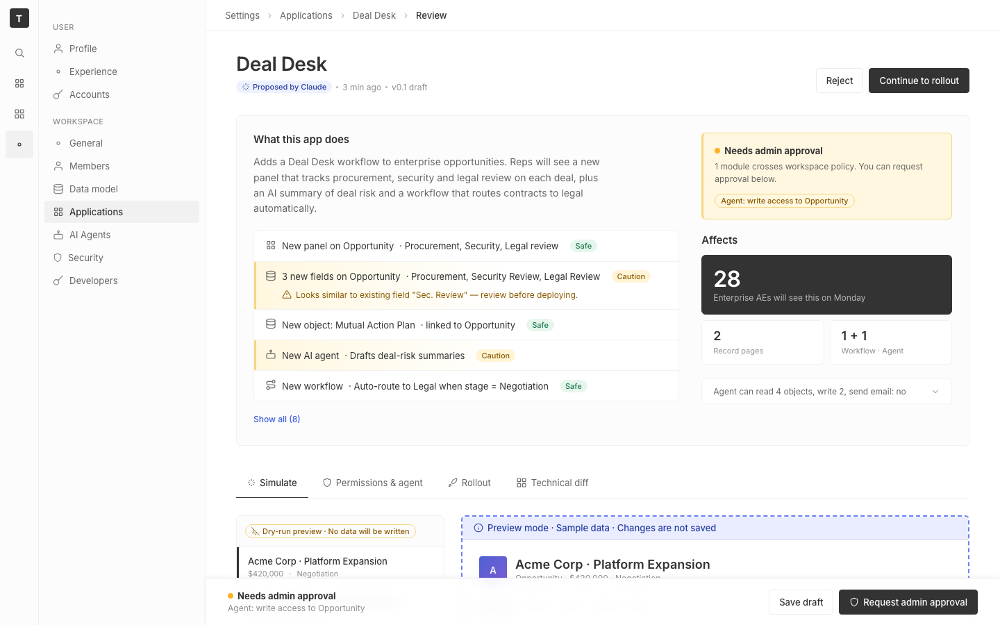

# m2-structural · deal-desk-prototype-1

## Screenshots
| before (origin) | after (working copy) |
|---|---|
|  |  |

## Goal achievement
Targeted the three in-scope dimensions and left content / copy / palette otherwise alone.

**Information hierarchy / scannability / focal points**
- Bumped page H1 from 22 → 28 px with tighter letter-spacing so the top of the page reads as a single decisive title instead of competing with its meta line.
- Reordered the "Affects" stats and promoted "28 Enterprise AEs will see this on Monday" into a full-width dark-on-light primary tile (32 px numeral). The most decisive impact metric is now the page's secondary focal point after the page header.
- Distinguished Caution change-rows from Safe rows with an amber wash + 3 px inset left bar; severity is now scannable in a glance instead of requiring tag-reading. The inline conflict hint reads as a calm amber note instead of red error chrome.
- Promoted the change-list from naked rows into a bordered, contained block so it reads as one scannable object instead of dissolving into the page background.
- Constrained the lede paragraph to `max-width: 58ch` for fast reading and bumped it to 14 px.

**Composition & balance**
- Replaced the symmetric `1fr / 1fr` summary grid with an asymmetric `1.7fr / 1fr`. The "what this app does" column gets primacy and the trust column reads as a true supporting sidebar — directional tension instead of a static mirror.
- Increased page-level rhythm (`--space-6` → `--space-8` gap, added `--space-10`) and breathing room around focal blocks.
- Sticky sim-sidebar and rollout impact-card stay in view while detail content scrolls — gives the page a visual anchor and reduces scrub-thrash.
- Sticky footer now uses a translucent `backdrop-filter` blur so body content terminates against a clear surface layer instead of a hard white slab.

**Responsive behavior**
- Replaced the lone `@media (max-width: 1100px)` with a layered set at 960 / 720 / 640 / 560 / 480 px (16 media queries total). Summary, simulate, rollout, fieldset, review-row, filter-row, cap-row, stable-row, and the sticky footer all reflow cleanly across them.
- Topbar and tablist now scroll horizontally on narrow widths instead of wrapping into broken stacks.
- Settings sidebar collapses to 200 px below 960 px and disappears under 720 px (the icon nav remains). The footer's hard-coded `left: 296px` was replaced with a CSS-var-driven `--shell-offset`, so it tracks sidebar width and goes full-width below 640 px (where it also stacks into two rows).
- Touch targets: buttons 32 → 36 px (36 min-width), toggle 32×18 → 36×20, tab rows 44 px min-height, chip × given a real 18×18 hit-area + hover bg, stepper 32 px tall with 28 px wide hit minimums, breadcrumbs got hover-padded targets, nav-icon 36 → 40 px, settings nav-items 32 px min-height, `.sim-opp` 56 px min-height with an active-state left bar.

## Cost
- wall time: 7m 44s
- turns: 67
- tokens (input / cache-create / cache-read / output): 82 / 173660 / 6254486 / 36898
- $ estimate: $5.135477999999999

## How Claude achieved it
- Read `src/App.tsx` (556 lines) and `src/App.css` (825 lines) in full; the prototype is a single-page React app, so structural changes live almost entirely in those two files.
- Glanced at `grounding/twenty/packages/twenty-ui/src/theme-constants/theme-light.css` to confirm twenty's spacing scale (`--t-spacing-1…32` in 4 px steps) and verify the prototype's existing 4 px-step scale was already aligned. Did not pull in new tokens.
- Could not preview live (the Vite dev server bound only to IPv6 `localhost:5228` and the playwright browser session resolved to IPv4); reasoned from the code and the existing CSS rules instead. Vite HMR confirmed the edits compiled cleanly via `curl /src/App.css`.
- All edits were structural: layout grids, breakpoints, focal weights, hit areas, sticky behavior. Colors, copy, icons, and component behavior were not changed. Two small JSX tweaks: tagged the two Caution change-rows with a `caution` class for the new severity treatment, and reordered the stats tiles so the dominant "28 reps" tile comes first as the new `primary` tile.

## Prompt
```
/goal Improve the structural design of this prototype (http://localhost:5228/), which is a mock of a future feature built into twenty (live codebase is at ../../grounding/twenty for reference to use as a baseline to adhere to). Scope to information hierarchy (scannability, focal points), composition & balance (asymmetry, whitespace, tension), and responsive behavior (breakpoints, reflow, touch targets). Ignore issues outside this scope.
```
