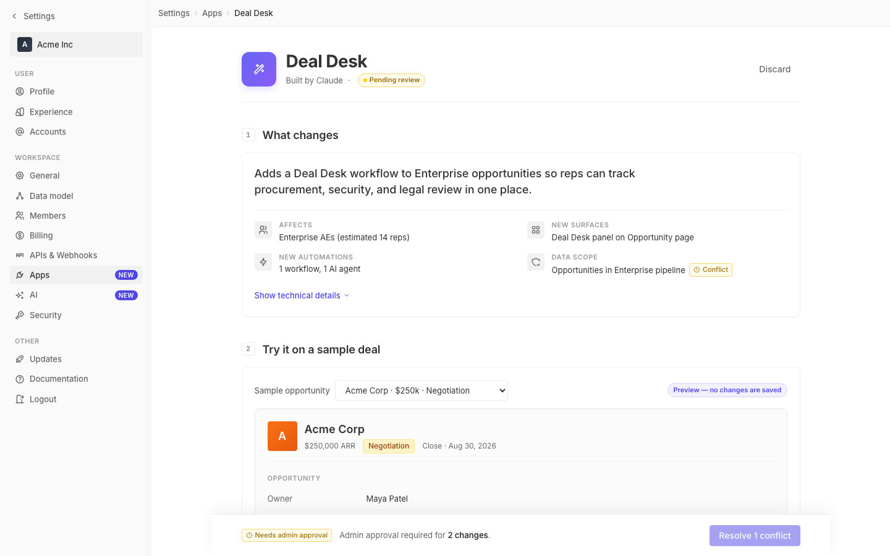

# m2-structural · deal-desk-prototype-2

## Screenshots
| before (origin) | after (working copy) |
|---|---|
|  |  |

## Goal achievement
Improved structural design across all three scoped dimensions while preserving twenty's design vocabulary (tokens, chip vocabulary, sidebar, sticky deploy bar).

**Information hierarchy** — The page header is now a true focal point: 56px app icon with shadow, 28px bold title (was 20px), and a divider that anchors it as a hero band. Section numbers were demoted from filled circles to small monospace boxed tags so they read as ordinals, not co-equal focal points. The summary headline jumped to 18px/medium and sits above a divider with the metadata grid below, establishing a clear primary→secondary read. The Deal Desk panel (the actual feature being added) got a filled blue tag, gradient fill, and soft shadow so it's the most visually-loaded element in the preview — making the "what's new" obvious at a glance.

**Composition & balance** — Replaced uniform tight spacing with deliberate rhythm: 40px between sections (was 24px), 40px page top, max-content widened to 920px (1000px ≥1400px) so the canvas no longer feels lonely. Summary metadata icons now sit in 28px squared tiles for visual weight against the text-heavy headline. The "Estimated reach" row became a filled callout (was dashed lines) creating a focal beat between filters and pilot controls. Card shadow added for subtle depth.

**Responsive behavior** — Added a proper breakpoint ladder: ≥1400px (wider canvas), ≤1024px (compact sidebar), ≤768px (sidebar hides, field rows stack to label/value pairs, page header reflows to icon+title with action below, preview select goes full-width, deploy bar stacks), ≤480px (deploy bar becomes vertical, breadcrumb shrinks). A `@media (pointer: coarse)` block enlarges switches to 36×22px and bumps small buttons to 32px regardless of viewport. Filter row converted from fixed `min-width:180px` flex children to a `repeat(auto-fit, minmax(180px, 1fr))` grid so the four filter controls reflow cleanly. All interactive controls now have `min-height` ≥28px (≥36px on touch) — previously switches and `.btn-sm` were below comfortable targets.

## Cost
- wall time: 5m 8s
- turns: 27
- tokens (input / cache-create / cache-read / output): 37 / 89690 / 2057138 / 27113
- $ estimate: $2.2671415

## How Claude achieved it
Read the current screenshot, App.tsx, and styles.css to map the existing structure (single-column 800px content, 2×2 summary grid, no responsive rules, fixed-width selects, undersized switches). Rewrote `src/styles.css` only — no JSX changes — to keep the diff scoped to structure/visual hierarchy:

- Promoted the page header to a hero band (larger icon with shadow, 28px title, divider).
- Demoted section numbers (circle filled tile → small monospace bordered tag) so titles dominate.
- Restructured the summary card: hero headline above a divider, metadata grid below with tiled icons.
- Gave the Deal Desk panel focal-point treatment (filled tag, gradient, shadow) inside the preview frame, so the new feature reads as the most important element.
- Replaced fixed `min-width` patterns in filters with `auto-fit grid` for graceful reflow.
- Added breakpoints at 1400, 1024, 768, 480 plus a `pointer: coarse` block — sidebar collapses then hides, field rows stack, deploy bar reflows, touch targets grow to ≥36px (switches to 36×22).
- Tuned whitespace: section gap 24→40px, page padding 32→40px, content max 800→920px (1000px on large displays), card shadow added.
- Preserved twenty's tokens, chip vocabulary, breadcrumb, sidebar nav structure, and sticky deploy bar so changes feel native to the existing design language.

## Prompt
```
/goal Improve the structural design of this prototype (http://localhost:5208/), which is a mock of a future feature built into twenty (live codebase is at ../../grounding/twenty for reference to use as a baseline to adhere to). Scope to information hierarchy (scannability, focal points), composition & balance (asymmetry, whitespace, tension), and responsive behavior (breakpoints, reflow, touch targets). Ignore issues outside this scope.
```
