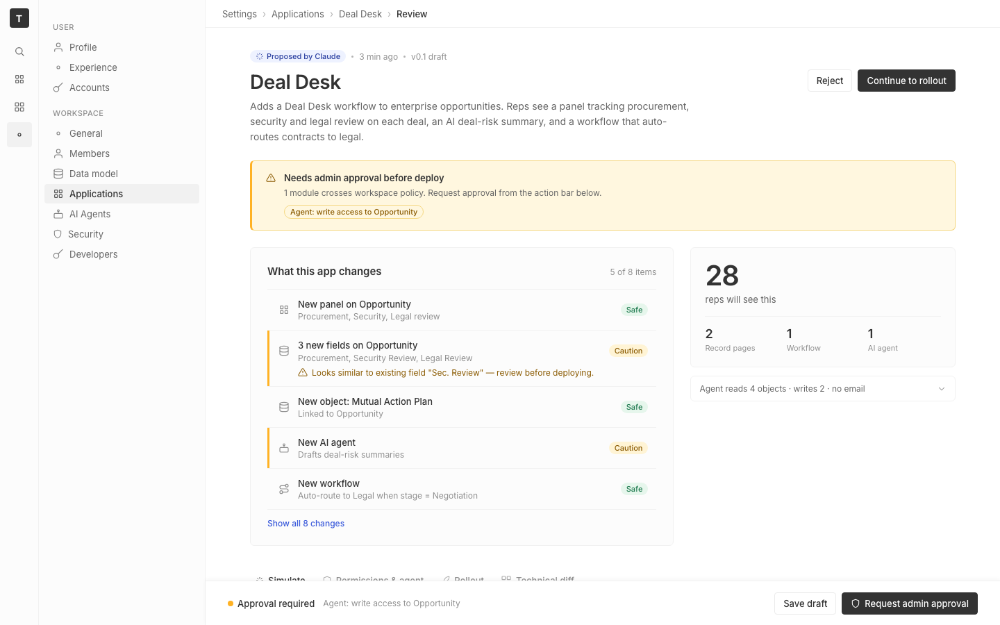

# m2-structural-hierarchy · deal-desk-prototype-1

## Screenshots
| before (origin) | after (working copy) |
|---|---|
|  |  |

## Goal achievement
Rebuilt the top of the Deal Desk review page to give it a clear visual reading order. The page now reads as: (1) what is this app, (2) what's the blocker, (3) what does it change, (4) who/what it touches, (5) deep-dive tabs, (6) persistent action bar — instead of the previous wall of a single mixed two-column card.

Specific hierarchy improvements:
- **Page header is now the dominant focal point.** Title bumped from 22px → 28px with tightened tracking, and the lede paragraph moved up from inside the card to sit directly under the H1 (matches twenty's `SubMenuTopBarContainer` + lede pattern). The "Proposed by Claude · 3 min ago · v0.1 draft" line is demoted to a small eyebrow above the title so the title leads.
- **Single approval banner.** The "Needs admin approval" message was previously duplicated between an inline policy banner inside the summary card and the sticky footer. The banner is now promoted to a full-width lead element directly under the header with a left-edge accent stripe, an icon, a strong title, and the conflict chip. The sticky footer was simplified to "Approval required" + sub-line so it reads as the action bar, not a second alert.
- **Split the dense summary card into two.** Left card = "What this app changes" (list of diff items). Right card = "Impact" with a hero number ("28 reps will see this", 40px) and a three-cell secondary stat row. Numbers now have a clear primary/secondary split instead of three same-sized tiles.
- **Risk-coded change rows.** Each row gets a 3px left accent: amber for `Caution`, transparent for `Safe`. Label and detail are stacked into a two-line cell instead of a long single-line run, so the user can scan the list vertically by risk color in <2 seconds instead of reading each row's tag.
- **Tab list de-emphasized.** Lowered tab color contrast in the resting state (tertiary text + 0.7 icon opacity) and added margin-top so it visually clears the impact card. Active tab still has full contrast + indicator.
- **Card head pattern.** Adopted twenty's `H2Title` shape (title + meta on the right, e.g. "5 of 8 items") so future cards have a consistent header.

## Cost
- wall time: 4m 59s
- turns: 45
- tokens (input / cache-create / cache-read / output): 65 / 132609 / 3417582 / 20358
- $ estimate: $3.046872250000001

## How Claude achieved it
1. Read `App.tsx` and `App.css` end-to-end to understand the existing component structure, plus skimmed `grounding/twenty/packages/twenty-front/src/pages/settings/applications/SettingsApplicationDetails.tsx` and `SettingsProfile.tsx` to anchor on twenty's section/H2Title/SubMenuTopBarContainer conventions.
2. Identified the four hierarchy problems on the existing page: (a) hero lede buried inside a card, (b) "Needs admin approval" duplicated in two places, (c) three same-weight stat tiles with no primary number, (d) change rows where risk is encoded only in a far-right tag.
3. Restructured `App.tsx`:
   - Moved the description paragraph up into the page header (`.title-block` with eyebrow + h1 + page-sub).
   - Promoted the policy warning to a full-width lead banner directly under the header.
   - Replaced the wrapping `<div className="summary">` two-column with a `<div className="summary-grid">` holding two independent cards: changes (left) and impact (right).
   - Refactored each change row into `icon + (label / detail stacked) + tag` and added a `risk-safe`/`risk-caution` modifier class.
   - Reworked the impact card to a hero (`28 reps`) + 3-cell secondary grid.
   - Simplified the sticky footer left side to a single line.
4. Updated `App.css`:
   - Bigger H1, tighter tracking, new eyebrow and page-sub styles.
   - New `.summary-grid`, `.card-head`, `.card-title` patterns.
   - `.change-row-wrap::before` accent stripe driven by `.risk-caution` / `.risk-safe`.
   - New `.policy-banner.lead`, `.impact-summary`, `.impact-hero`, `.impact-grid`, `.impact-cell` styles.
   - De-emphasized tab resting state and adjusted icon opacity.
5. Verified the result with `tsc --noEmit` (clean) — the dev server hot-reloads, so changes are live at the prototype URL.

## Prompt
```
/goal Improve the information hierarchy of this prototype (http://localhost:5229/), which is a mock of a future feature built into twenty (live codebase is at ../../grounding/twenty for reference to use as a baseline to adhere to). Focus on scannability and focal points. Ignore unrelated design issues.
```
