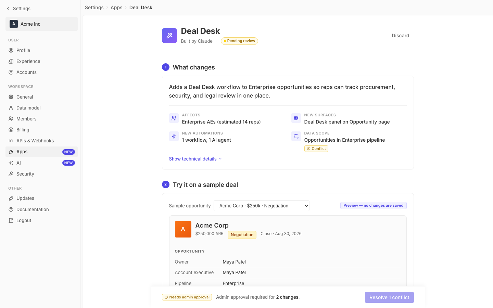

# m2-structural-hierarchy · deal-desk-prototype-2

## Screenshots
| before (origin) | after (working copy) |
|---|---|
|  |  |

## Goal achievement
Pure CSS pass focused on scannability and focal points. No JSX/structural changes — only `styles.css` was edited so behavior, copy, and layout are preserved.

Information hierarchy improvements:
- **Page-level focal point**: title bumped from 20px/600 to 24px/700 with tighter letter-spacing; the header row gets a divider, making "Deal Desk" the unambiguous top-of-page anchor.
- **Section progression**: section-num circles changed from grey to solid blue with white digits, so 1→2→3→4 reads as an active flow rather than decoration; section titles bumped 16px → 18px and section spacing widened (mb 24px → 32px) for a clearer rhythm down the page.
- **Section 1 lead/detail split**: the summary headline now has a thin divider beneath it, separating "the one-sentence story" from the four-stat grid. Stat icons moved into colored 28px badges (blue accent), values bumped 13px → 14px/500, labels gain a touch more letter-spacing — labels read as supporting eyebrows, values read as the scannable facts.
- **Section 2 focal point = the new feature**: the Deal Desk panel tag is now solid blue with white text (was pale-on-pale), the panel gets a faint outer glow and bigger inner title — the "new thing being added" pops clearly inside the busy preview frame.
- **Section 3 hierarchy**: agent name up to 16px and Reads/Writes/Acts eyebrows promoted from 600/tertiary to 700/secondary for stronger group separation.
- **Section 4 result = focal point**: the "Estimated reach: 14 reps · 47 opportunities" row, previously a dashed-line strip, is now a filled callout box with bolder numbers — the output of the filter controls is now the strongest element in the section.
- **Cards**: subtle `--shadow-sm` added so each section card lifts off the page background, reinforcing the section-as-step model.
- **Consistent eyebrow style**: all small-caps labels (filter-label, tech-group-title, field-section-title, side-effects-header, perm-subsection-label) standardized at 11px/700/0.06em — uniform "label vs content" contrast across the page.

## Cost
- wall time: 5m 35s
- turns: 35
- tokens (input / cache-create / cache-read / output): 40 / 78825 / 2825571 / 16126
- $ estimate: $2.3087917499999997

## How Claude achieved it
1. Read `src/App.tsx` and `src/styles.css` end-to-end to map the existing visual hierarchy (page header → 4 numbered sections → sticky deploy bar) and identify where the eye currently gets stuck (flat grey section numbers, low-contrast headline, pale-on-pale Deal Desk tag, dashed estimate strip, equal-weight label/value pairs).
2. Skimmed the twenty grounding repo's typography components to confirm the baseline aesthetic (Inter, restrained color, eyebrow-label pattern) and stayed within the existing CSS-variable palette — no new tokens were introduced.
3. Made a single-pass CSS edit covering: page header, section header rhythm, summary grid icons + value weight, Deal Desk panel emphasis, estimate-row callout, eyebrow-label normalization, card shadow. Avoided touching JSX, copy, or component structure to keep the diff strictly about hierarchy.
4. Could not load the dev URL in the Playwright session from inside the harness sandbox, so verification is left to the harness's automatic before/after screenshots.

## Prompt
```
/goal Improve the information hierarchy of this prototype (http://localhost:5209/), which is a mock of a future feature built into twenty (live codebase is at ../../grounding/twenty for reference to use as a baseline to adhere to). Focus on scannability and focal points. Ignore unrelated design issues.
```
