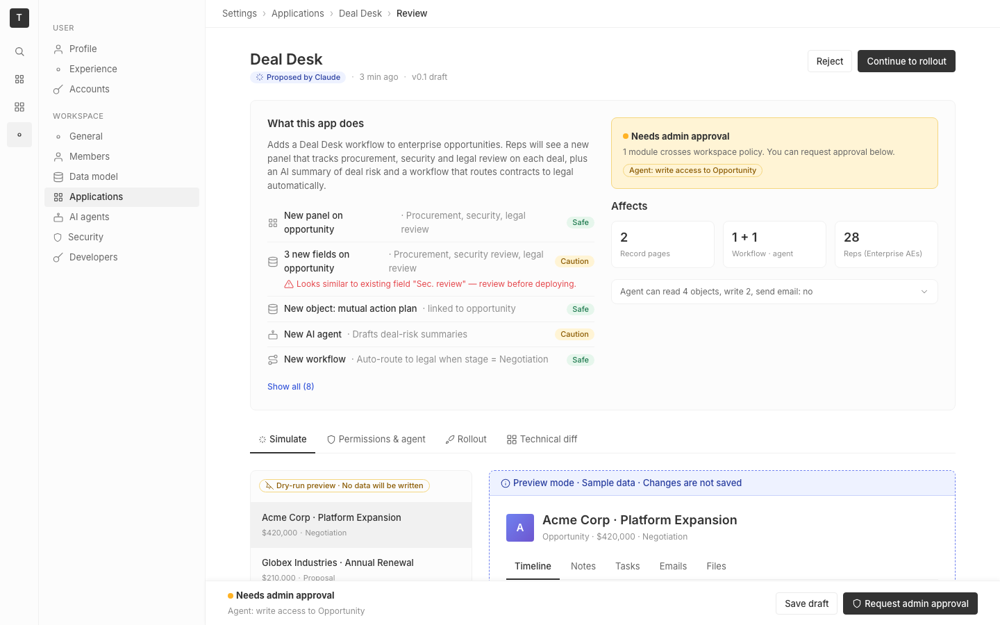

# m4-design-debt · deal-desk-prototype-1

## Screenshots
| before (origin) | after (working copy) |
|---|---|
|  |  |

## Goal achievement
Reduced design debt to a unified system. Inventoried 12 categories of inconsistency in the original prototype — typography sizes used ad-hoc, a `.dot` class collision (3 px bullet vs 8 px status vs 16 px radio), section headings at three sizes for the same semantic level, off-grid spacing (10 px, 6 px paddings, 2 px), hardcoded hex colors, divergent tab styling between `.tablist` and `.record-tabs`, mixed Title-Case / sentence-case field labels, inconsistent Tag variant usage, three different card paddings, magic numbers (`left: 296px`), dead styles (`.btn.amber`, `.warn-box`), and ~10 scattered inline `style` props that bypassed the tokens. Replaced these with a single 4 px-grid spacing scale, an explicit typography scale (xs/sm/md/lg/xl/2xl/display) wired into every heading and body style, a `.tab-row` primitive shared between the page tabs and the record tabs, a consolidated radius scale (xs/sm/md/pill) aligned with Twenty's tokens, and CSS variables for every previously-hardcoded color and width.

## Cost
- wall time: 6m 24s
- turns: 34
- tokens (input / cache-create / cache-read / output): 49 / 142413 / 2490612 / 36029
- $ estimate: $3.036357249999999

## How Claude achieved it
1. Read the prototype's `App.tsx` and `App.css` and Twenty's design tokens (`twenty-ui/src/theme/constants/*`) to ground the conventions: 4 px spacing, Inter, an xs→xxl scale, sm/md radius.
2. Inventoried the inconsistencies in code and grouped them into 12 debt categories (typography, name collisions, headings, off-grid spacing, inline styles, hardcoded colors, tab variants, casing, tag usage, card padding, magic numbers, dead styles).
3. Rewrote `App.css` around explicit tokens: `--font-{xs,sm,md,lg,xl,2xl,display}`, `--font-weight-{regular,medium,semibold}`, `--line-{tight,base}`, layout tokens (`--nav-rail-width`, `--nav-sidebar-width`, `--footer-height`, `--topbar-height`, `--control-height`). Every previous magic number was either replaced by a token or computed from one (e.g. `.sticky-footer { left: calc(var(--nav-rail-width) + var(--nav-sidebar-width)); }`).
4. Collapsed `.tablist` + `.record-tabs` into a single `.tab-row .tab` primitive used in both places, so the page-level tab strip and the in-record tab strip share font size, gap, padding, and active-state styling.
5. Standardized headings: every "subsection" heading now uses `.section-title` at `--font-lg / 600`; eyebrow-style labels (`.diff-section h3`, sidebar `h4`, `.stable-head`) all use `--font-xs / 500 / uppercase`.
6. Removed the `.dot` collision by replacing the page-header bullet `<span className="dot" />` with literal `·` separators styled by `.sep`. `.status .dot` and `.radio .dot` remain but are scoped under their parent component.
7. Replaced hardcoded hex (`#4e60d3`, `#7c5dd4`, `#d9cef9`, raw `296px`, `#8a5a00` aliased twice) with `--blue7`, `--purple`, `--purple5`, computed layout values, and consolidated `--amber11` (dropped the duplicate `--amber80`).
8. Moved every inline `style={{ ... }}` into a class (`.btn.block`, `.sidebar-footer`, `.impact-rows`, `.side-effects .label`, `.side-effects .chips`). Dropped dead styles (`.btn.amber`, `.warn-box`, the old separate `.change-row` ruleset).
9. Standardized casing in field labels and option names: properties / record fields use sentence case ("Security review", "Legal review", "Mutual action plan", "AI agents") — matching "Stage", "Amount", "Close date", "Account owner".
10. Normalized Tag usage: all status indicators are solid (`Safe`, `Caution`, `Approved`, `In review`, `Not started`, `New`, `AI preview`), and "needs attention" emphases are outline (`Needs admin approval`, `Dry-run preview`, the policy-banner chip). Added outline variants for every color so the system is uniform.
11. Aligned all spacing to 4 px: replaced 10 px paddings in `.disclosure` / `.stable-row` with `--space-2` / `--space-3`; replaced 6 px paddings with `--space-1`/`--space-2`; replaced 4 px+6 px ad-hoc gaps with token gaps.
12. Type-checked with `tsc -b` to confirm no regressions.

## Prompt
```
/goal Minimize the design debt in this prototype (http://localhost:5240/), which is a mock of a future feature built into twenty (live codebase is at ../../grounding/twenty for reference to use as a baseline to adhere to). Define design debt as the consistency across the overall design and how it functions as a unified system. For each component, element, or grid, count its contribution to design debt as +1 for every inconsistent approach it takes (e.g. font sizes that don't align to the text hierarchy, elements that don't align to a grid, spacing or aesthetic that isn't respected). Continue working until the total design debt is 0.
```
