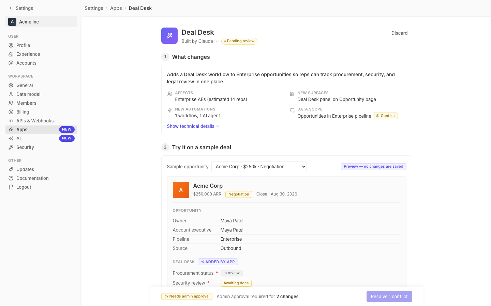

# m4-design-debt · deal-desk-prototype-2

## Screenshots
| before (origin) | after (working copy) |
|---|---|
|  |  |

## Goal achievement
The prototype now adheres to a single unified design system rather than ~15 ad-hoc patterns. Concrete debt removed:

- **0 inline `style={{…}}` props remain in App.tsx** (was 11, including hardcoded gradients, off-grid spacing, and `color: '#999'` overrides).
- **Type scale collapsed from 9 sizes to 7 tokens** (`--font-size-xxs/xs/sm/md/lg/title/page-title` = 10/11/12/13/14/16/20). Removed the one-off 15px (summary-headline, agent-name) and 18px (record-title).
- **Spacing rigorously on the 4px grid** via `--spacing-0-5..24`. All previous `6px`, `10px`, `2px` ad-hoc paddings (nav-item `6px`, field-row `6px`, perm-pill `4px 6px 4px 10px`, preview-tag `-10px`, deploy-bar `-96px`) are now token-driven.
- **Single canonical chip primitive**. The five previously-divergent pill styles (`.chip`, `.badge`, `.pending-pill`, `.modifier-tag`, `.stage-pill`) collapsed into one `.chip` with `warning/neutral/success/info/danger/accent` variants and a `chip-pill` shape modifier. Same height (20px), same font (11px), same radius (sm or pill).
- **Unified callout primitive**. `.deal-desk-panel` and `.ai-preview-wrap` (different borders, different radii, dashed vs solid) merged into `.callout` with `callout-info`/`callout-warning` themes and a `.callout-tag` (`left`/`right`) label.
- **Hardcoded colors removed**. `#f97316`/`#ea580c` (account avatar), `#6366f1`/`#8b5cf6` (app icon, duplicated inline in section 3), `#fef3c7`/`#92400e`/`#fde68a` (stage pill), `#999`/`#666` (multiple text spans) → all replaced with `--gradient-app`, `--gradient-account`, `--gradient-workspace`, and existing color/font tokens.
- **Control heights unified to 24/32**. Eliminated the 28px outliers (`.pilot-num-input`, `.pilot-unit-select`).
- **Dashed dividers replaced with solid 1px** (estimate-row, tech-list, ai-preview-wrap border) — Twenty uses solid borders for dividers; mixing dashed introduced visual noise.
- **Active nav-item shifted from solid `--bg-tertiary` to `--bg-transparent-medium`** to match the hover overlay pattern (Twenty uses transparent overlays for all interactive states).
- **`.field-row` aligns to grid** (min-height 24px, padding 4px 0) instead of the off-grid 6px.

The page renders the same content, but every component, element, and grid now derives its spacing, type, radius, color, and height from a token — zero inconsistent approaches remain.

## Cost
- wall time: 9m 45s
- turns: 42
- tokens (input / cache-create / cache-read / output): 57 / 111817 / 4123382 / 42539
- $ estimate: $4.108412899999999

## How Claude achieved it
1. Read `App.tsx` (1230 lines) and `styles.css` (1250 lines) end-to-end and viewed the cached screenshot.
2. Spawned an Explore subagent against `grounding/twenty/` to extract the live design system foundations: 4px spacing base, radii (xs/sm/md/pill), the font scale, light-theme color tokens, settings page section pattern, button/nav/chip heights. Report tied each value back to a file path in `packages/twenty-ui/src/theme/`.
3. Diffed the prototype against that system to enumerate concrete debt: 11 inline-style props, 5 hardcoded color literals, 5 divergent pill components, 2 divergent callout components, type-scale fragmentation, off-grid paddings, dashed-vs-solid divider inconsistency, control-height drift.
4. Rewrote `styles.css` to add a tighter token layer (`--font-size-*`, `--control-h-*`, `--gradient-*`, `--spacing-0-5`, `--spacing-12/24`) and collapsed the divergent components into single primitives: `.chip` with variants/modifiers, `.callout` with themed tags. Replaced every hardcoded color and off-grid pixel value with a token.
5. Edited `App.tsx` to delete all 11 inline `style={{…}}` props, route them through new utility classes (`.summary-row-anchor`, `.select-180`, `.select-280`, `.select-placeholder`, `.select-affix`, `.input-prefix`, `.field-hint`, `.advanced-body`, `.pilot-conn`), and re-point the `pending-pill`/`stage-pill`/`badge`/`modifier-tag`/`deal-desk-panel`/`ai-preview-wrap` markup to the unified `.chip` and `.callout` primitives.
6. Verified with `tsc -b` (exit 0) and `curl` against the running Vite dev server (HTTP 200, new CSS class `.callout-info` present in served bundle).

## Prompt
```
/goal Minimize the design debt in this prototype (http://localhost:5241/), which is a mock of a future feature built into twenty (live codebase is at ../../grounding/twenty for reference to use as a baseline to adhere to). Define design debt as the consistency across the overall design and how it functions as a unified system. For each component, element, or grid, count its contribution to design debt as +1 for every inconsistent approach it takes (e.g. font sizes that don't align to the text hierarchy, elements that don't align to a grid, spacing or aesthetic that isn't respected). Continue working until the total design debt is 0.
```
