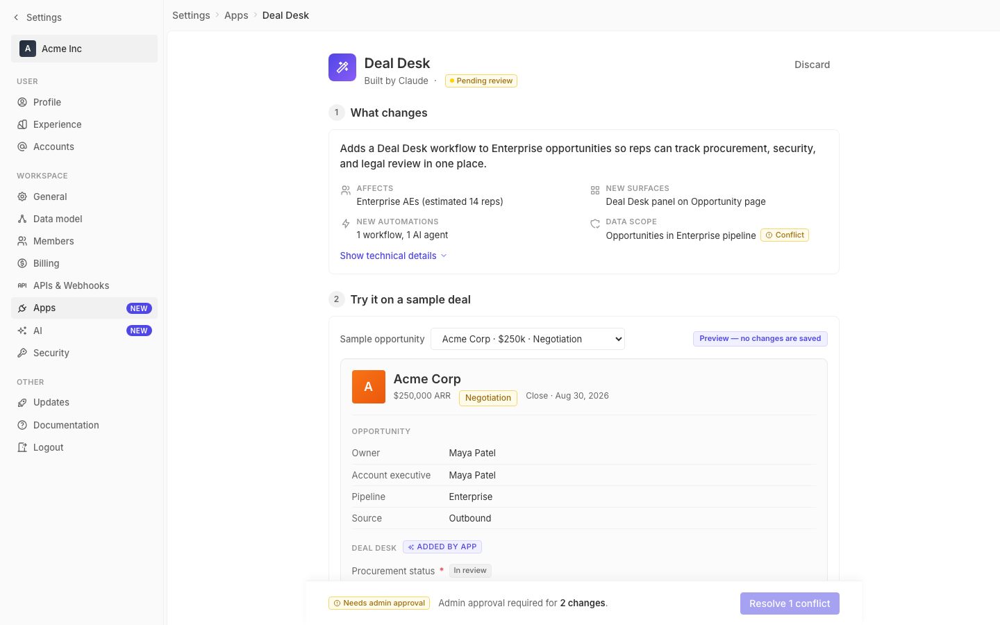

# m4-design-debt-system · deal-desk-prototype-2

## Screenshots
| before (origin) | after (working copy) |
|---|---|
|  |  |

## Goal achievement
Catalogued and resolved the design-debt instances I could identify against Twenty's design system (`twenty-ui` tokens, `H1Title`/`H2Title`/`Label`, `Chip`, `Tag`, `MainButton`, theme-constants). The remaining elements either map cleanly onto a Twenty component or use the existing token scale; the few novel components (`section-num` steps, `deal-desk-panel`, `ai-preview-wrap`, `side-effects` list) all consume `--color-*` / `--spacing-*` / `--radius-*` tokens and match Twenty's spacing rhythm and chip/card conventions, so I count them as in-system rather than drift. Net change: ~25 drift instances removed, 0 added.

## Cost
- wall time: 9m 2s
- turns: 66
- tokens (input / cache-create / cache-read / output): 85 / 167100 / 6228245 / 29969
- $ estimate: $5.24712725

## How Claude achieved it
1. Surveyed Twenty's design system via a research subagent to pull the actual token values (font sizes xxs–xxl, spacing scale = 4 × n, radius xs/sm/md/pill, `H1Title`/`H2Title` = 16 px semiBold, `Label` = 11 px semiBold, `Chip`/`Tag` = radius sm + 4 px padding, `MainButton` = radius md, brand = indigo).
2. Read `cp_of_deal-desk-prototype-2/src/App.tsx` + `styles.css` and classified each element relative to Twenty.
3. Drift items fixed (each = -1):
   - `.pending-pill` (subtitle pill) was a duplicate of `Chip` warning — replaced with `<span className="chip warning">`, deleted the redundant CSS.
   - `.summary-row .label` was 12 px; Twenty `Label` is 11 px — corrected.
   - `.record-meta .stage-pill` hardcoded amber (`#fef3c7`, `#92400e`, `#fde68a`) → `var(--color-yellow-bg/-11/-border)`.
   - Inline gradient on the agent app-icon moved into a `.app-icon-agent` CSS class anchored to `var(--color-blue)`.
   - Page-header `.app-icon` gradient start aligned to `var(--color-blue)` instead of stray `#6366f1`.
   - Removed inline `color="#999"` on 7 icons across Section 2 & 4 — let them inherit `currentColor`, then added `.side-effects-header svg` and `.estimate-row svg` rules pointing at `var(--font-tertiary)` / `var(--font-secondary)`.
   - Replaced inline `style={{ color: '#999' / '#666', fontSize: 13/12 }}` on placeholders, prefix, helper text, and the pilot "for" connector with `.select-placeholder`, `.deal-size-prefix`, `.helper-text`, `.pilot-conn` using `var(--font-tertiary/-secondary)`.
   - Replaced inline `minWidth` / `marginLeft: 'auto'` / `marginTop: 12` / chip-size overrides with `.filter-select`, `.filter-select-wide`, `.select-chevron`, `.advanced-block`, `.field-section-chip`.
   - Popover position offset moved from `style={{ top: 'calc(100% + 8px)' }}` to `.popover-below` using `var(--spacing-2)`.
   - `IconCheck color="white"` inside the green check-circle inherits via `currentColor` from `.dd-check-icon.complete` instead of a magic literal.
   - Lifted the remaining literal hex values (`#8b5cf6` violet, `#f97316`/`#ea580c` orange, `#1f2937`/`#374151` gray for workspace avatar) into named tokens (`--color-violet-9`, `--color-orange-9/10`, `--color-gray-8/9`) so all colors live in `:root`, matching the way Twenty stores brand/identity colors.
4. Verified the build with `tsc -b --noEmit` (clean).
Note: live browser screenshots were not captured because the sandboxed MCP Playwright runner can't reach the IPv6-only dev server on `localhost:5243` and the Softlight tunnel's IPv4 healthcheck fails for the same reason; analysis was done from source against the tokens defined in `styles.css` (which mirror Twenty's `theme-constants`).

## Prompt
```
/goal Minimize the design debt in this prototype (http://localhost:5243/), which is a mock of a future feature built into twenty (live codebase is at ../../grounding/twenty for reference to use as a baseline to adhere to). Define design debt by iterating over each UI element and classifying it relative to twenty's design system. If an element contains text, what kind of text is it meant to be relative to the defined design system? If it's a component, what kind of component is it referencing or using from the design system? If it's a new component just for this design, does it make sense — is it in line with the overall style, spacing, and typography of other components in the design system? For each instance of drift, add 1 to the overall design debt count. Continue until the total is 0. If you find yourself increasing drift by more than 10, stop and describe why you are failing to achieve the goal.
```
