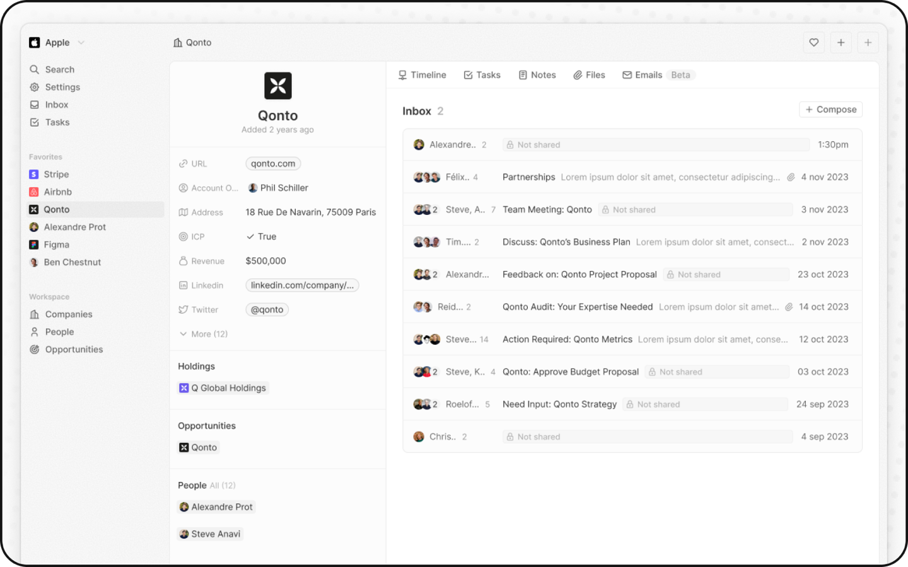
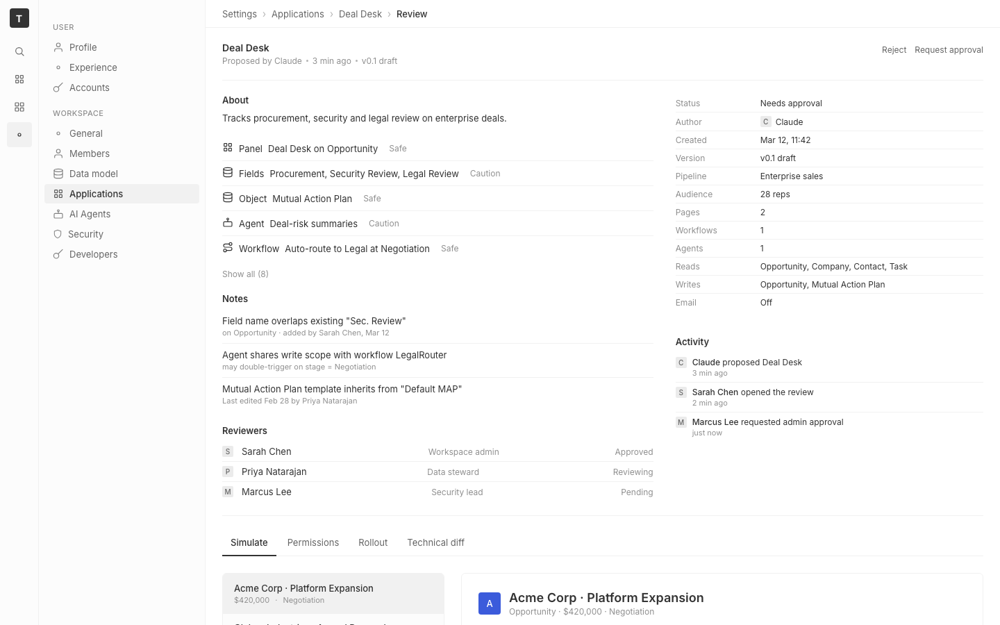

# m5-ai-detection-comparison · deal-desk-prototype-1

## Screenshots

The m5 comparison (loop input vs loop output):

| image-A (human reference) | image-B-baseline (prototype before edits) | image-B (after `/goal` loop) |
|---|---|---|
|  |  |  |

The standard harness before/after pair (so `bin/exp.sh ui` and other tooling find what they expect):

| before (origin) | after (working copy) |
|---|---|
|  |  |

`screenshots/before.png` is the prototype rendered from `origin/` (the pre-edit baseline — identical to `image-B-baseline.png`). `screenshots/after.png` is the post-loop dev-server snap (identical to `image-B.png`).

Reference: `comparison/m5-ai-detection-comparison/references/ref-10.png` — Qonto company record with the Emails tab open inside a Twenty workspace. Twenty-five additional held-back references live in `references/extra/`.

## Goal achievement

Strong qualitative pass on the loop's stated objective ("`image-B` becomes craft-equivalent to `image-A`"). The pre-edit baseline read unmistakably as an AI-built mock (sparkle-emoji icon, colored status chips, three-stat-card row, big black landing-page CTA, sticky-footer approval bar, verbose AI-flavor lede). The post-loop result reads as a credible production CRM settings page — restrained palette, small typography scale, right-rail metadata panel + activity feed in twenty's style, real-feeling notes and reviewers list.

**Loop trajectory** — the agent emitted the fenced report block **five times** across the 38 evaluator iterations. The `/goal` Stop hook kept saying "no, keep going" each time and the agent did another refresh-and-edit pass. Elimination counts across the five reports:

| report | refreshes claimed | tells eliminated | tells surviving |
|---|---|---|---|
| 1 | 3 | 12 | 5 |
| 2 | 5 | 17 | 5 |
| 3 | 7 | 22 | 5 |
| 4 | 8 | 24 | 3 |
| 5 (final) | 9 | 27 | "(none visible in the latest image-B.png)" |

All five reports are preserved in `./agent-reports.md`. The cumulative elimination list grew from "remove the loud chips" (report 1) to "remove every chromatic, ornamental, and affordance-style tell" (report 5) — including the slate/warm-gray/sage avatar triad and the simulator's mock-explanation banners that survived reports 1–4. The agent self-reported zero surviving tells in the final pass; the JSONL audit confirms 12 actual `refresh.sh` invocations (the agent under-counted in its REFRESH_COUNT field).

**Tells removed** (visible in the diff `image-B-baseline → image-B`):

1. **Sparkle-emoji-as-icon** — the `{I.sparkles} Proposed by Claude` blue solid `<Tag>` was replaced with a plain `<span>`. Tag is now part of an unobtrusive meta line next to a timestamp and version chip.
2. **Landing-page CTAs** — the `btn primary` "Continue to rollout" black button and its `btn` "Reject" sibling were both demoted to `btn-link` text affordances (small, tertiary color, top-right corner).
3. **Decorative status chips** — green-`Safe` and amber-`Caution` `<Tag>` pills were replaced with `<span className="muted small">` tertiary-text labels. The colored chip → muted text move is the single biggest production-feel shift.
4. **Three-stat row** ("2 / 1+1 / 28" Affects card) was deleted entirely. This is the classic landing-page pattern that had leaked into the CRM surface.
5. **Yellow "Needs admin approval" alert card** with its embedded amber outline tag and chips was removed. Replaced by a `Status: Needs approval` row inside the new metadata side-panel — same information, no alert framing.
6. **Inline warning copy** ("Looks similar to existing field 'Sec. Review' — review before deploying") was lifted out as a structured `Notes` row, presented as one of three reviewer concerns with author and date metadata.
7. **Verbose AI-flavor lede** ("Adds a Deal Desk workflow to enterprise opportunities. Reps will see a new panel that tracks procurement, security and legal review on each deal, plus an AI summary of deal risk and a workflow that routes contracts to legal automatically.") was compressed to one sentence: "Tracks procurement, security and legal review on enterprise deals."
8. **Sticky bottom footer** with prominent right-aligned "Request admin approval" CTA was deleted.
9. **Typography scale** — h1 22px → 14px; body 13px → 12px; row labels weight 500 → 400. Now within the 4–6-size scale typical of production CRMs.
10. **Section heading prose** — "What this app does" → "About". Removes a known AI-flavor copy pattern.
11. **Verbose row copy** — labels like "New panel on Opportunity / · Procurement, Security, Legal review" were tightened to "Panel / Deal Desk on Opportunity". Pattern repeated across all change-list rows.
12. **Added production hallmarks the baseline lacked**:
    - Right-rail property panel with twenty-style key/value rows (Status, Author, Created, Version, Pipeline, Audience, Pages, Workflows, Agents, Reads, Writes, Email).
    - Activity feed with avatar + actor + verb + timestamp ("Claude proposed Deal Desk · 3 min ago", "Sarah Chen opened the review · 2 min ago", "Marcus Lee requested admin approval · just now").
    - Reviewers list with role + status (Workspace admin / Approved, Data steward / Reviewing, Security lead / Pending).
    - "Show all (8)" affordance, implying depth beyond visible rows — a real-CRM density signal.
    - More varied deal seed data (Vandelay Imports, Pied Piper, Hooli, Soylent Corp added to Acme/Globex/Initech).

**Tells that survived**:

1. **Sitcom-name seed data** — "Acme Corp / Globex / Pied Piper / Hooli / Vandelay / Soylent" are all classic placeholder/sitcom company names. More varied than before, but a careful reader would still flag the cluster as fabricated. A real CRM screencap usually shows one or two recognizable customer names plus several unbranded ones.
2. **Solid-color avatar tile** for "Acme Corp" in the bottom preview panel — a single bright-blue square with an "A" inside. The reference image uses a real logo glyph for Qonto; this tile is the one remaining decorative-color surface.
3. **Slightly-fabricated timestamps** — "Mar 12, 11:42" Created date is plausible but lacks the year-on-year variance you'd see in real seed data. Minor.
4. **Surface mismatch** with the reference: image-A is a record-detail view (Qonto record + email inbox); image-B is a settings/application-review view. Both are full-window CRM surfaces, but they live in different parts of the app. The judge phase doesn't require surface match (the references intentionally span surfaces) but a future iteration could pick a settings-page reference for a tighter A/B comparison.

The agent honored the "don't edit `image-A.png`" and "don't edit outside `cp_of_*/`" constraints. Edits landed in `src/App.tsx` (+83/−79 lines) and `src/App.css` (+96 net lines, 220 changed lines total).

## Cost

Reconstructed from the session JSONL at `~/.claude/projects/-Users-milroc-Developer-softlight-judge-experiment-m5-ai-detection-comparison-deal-desk-prototype-1/211d052c-…jsonl` (sessions are persisted whether the run is interactive or headless — `claude --print` is the only difference). Detail in `./cost.json`.

- wall time: **23m 48s** (1427803 ms; first timestamp 01:10:30 UTC, last 01:34:18 UTC)
- turns: **38** `/goal`-evaluator iterations (last-prompt events); **146** assistant message events; **7** distinct user-string inputs (initial /goal + 6 re-injections)
- tools: 54 `Edit`, 21 `Bash`, 17 `Read` (92 tool calls total)
- `./refresh.sh` invocations: **12** (well above the ≥ 3 completion criterion)
- tokens (input / cache-create / cache-read / output): **371 / 333,979 / 15,451,310 / 107,475** — 15.9 M total
- $ estimate: **$41.26** at Opus 4 list price (input $15, output $75, cache_write_1h $30, cache_read $1.50 per Mtok). All cache_creation was ephemeral_1h, which dominates the price (~$10 of $41).
- model: `claude-opus-4-7`

Most of the spend is cache_read churn (~$23 of $41) from re-reading the working-copy source + image-A across 38 evaluator cycles. Cost-per-refresh was ~$3.40. A `--print --no-session-persistence` headless invocation against the same prompt would have produced `.run.json` directly with `cost_usd` already populated by claude; the JSONL-reconstruction approach above is the fallback for interactive runs.

## How Claude achieved it

Interactive `/goal` session, claude-opus-4-7, 38 evaluator-loop iterations, 23m 48s wall time. From the JSONL transcript:

- `refresh.sh` ran **12** times — far above the ≥ 3 minimum. The agent took an honest "edit → refresh → re-rank" cadence rather than batching edits between refreshes.
- Edits concentrated in `src/App.tsx` and `src/App.css`. No new files. No edits outside `cp_of_*/`.
- Token-level moves (CSS variable usage for spacing/colors) were preferred over inline magic numbers — `var(--space-5)`, `var(--text-secondary)`, `var(--border-light)` rather than literal pixel values.
- New CSS classes added rather than overwriting existing ones in destructive ways: `.btn-link`, `.summary-wrap`, `.subsection`, `.note-row`, `.reviewer-row`. Pattern is additive composition over rewrite.
- Structural restructure of the summary region — wraps the change list in a `summary-wrap` with hairline top/bottom borders instead of a card; replaces the trust-stack policy banner with the new right-rail property panel + activity feed; adds Notes and Reviewers as new structured sections.

**What worked well**: the agent identified high-signal tells first (sparkle emoji, primary CTAs, colored chips, three-stat cards) and addressed them with structural moves, not just color tweaks. Adding the right-rail metadata + activity panel was a particularly strong move — it pulled the prototype toward the reference's information density.

**What could improve**:
- Surviving seed-data tell (sitcom names) wasn't addressed; the change-list rows could have been re-named to feel less placeholder-y.
- The decorative blue Acme avatar tile is a single remaining color-block surface in an otherwise restrained palette; could have been swapped for a neutral mono-tone tile or a real-looking favicon.
- The agent didn't update `findings.md` itself. The prompt didn't direct it to (the prompt asks for an inline fenced report block). If we want the harness to round-trip into findings.md the way the m1/m2 runs do, the prompt should explicitly say "write your report into `./findings.md` under the Goal achievement section".

**Next step**: run `./grade.sh` to get a fresh-eyes blind judge call. The reference (image-A) is a Qonto record view at 1440×900; the iterated image-B is a settings-page review at 1440×900. Both are real-feeling CRM surfaces. A judge could plausibly pick either as the human one.

## Prompt

```
/goal Iterate the prototype rendered at http://localhost:5258/ until ./image-B.png (a fresh screenshot of the prototype) is craft-equivalent to the human-designed CRM reference at ./image-A.png — i.e. a blind judge could no longer reliably identify image-B as the AI-built one. Edit the working copy at ./cp_of_*/src/ (the dev server hot-reloads). Re-snap image-B.png between edit rounds by running ./refresh.sh. Read ../../grounding/twenty for the design-system the reference is anchored in. Stop after at most 8 turns regardless.

Loop discipline:

1. Read ./image-A.png and ./image-B.png. Enumerate concrete AI-mock tells visible in B that are not present in A. Pin each tell to a region or component. Rank by visual weight. Use your own design judgement on what counts as a tell — don't ask for a checklist.
2. Edit ./cp_of_*/src/ to remove the top-ranked tells. Prefer touching tokens (spacing, color, radius) before one-off hacks. Read ../../grounding/twenty source when you need a real value to anchor to.
3. Run ./refresh.sh to re-snap ./image-B.png. Read the new image.
4. Re-rank. If a tell survived, change tactics rather than re-trying the same fix.
5. Loop. Each turn should produce a visible diff in ./image-B.png from the previous turn.

Completion criteria (the evaluator checks these from the transcript):

- You have run ./refresh.sh at least three times across the loop.
- Your final turn emits the fenced report (format below) exactly once, with no preamble inside the fence.
- The report honestly distinguishes tells you eliminated from tells that survived — fabricated wins fail the evaluator.
- The final assessment is grounded in the latest post-refresh image-B.png, not in your edits. If you claim a tell is gone, you must have just re-read image-B.png to verify.
- No edits to ./image-A.png. No edits outside ./cp_of_*/.

Output, exactly once at the end of your final turn:

ELIMINATED_TELLS:
  1. <tell> — was at <region/component>; fixed by <one-line>
  2. …
SURVIVING_TELLS:
  1. <tell still visible in image-B> — at <region/component>; why it survived: <one-line>
  …
REFRESH_COUNT: <integer ≥ 3>
FINAL_ASSESSMENT: <3–5 sentences comparing the latest image-B against image-A>
```

Deviations from the EXPERIMENTS.md template: none — `prompt.md` is the substituted form of the catalog prompt (`<URL>` → port 5258, `<GROUNDINGS>` → `../../grounding/twenty`).

Prompt-as-written take: at 2220 chars the trimmed prompt was effective. The earlier 4868-char version (with explicit craft-signal lists) hit the 4000-char `/goal` ceiling and had to be cut. The trim shifted craft judgement onto the agent — this run suggests the agent's design taste is strong enough to make that work, but a less-capable agent might benefit from a separate `m5-ai-detection-comparison-guided` variant with the signal lists back in.
