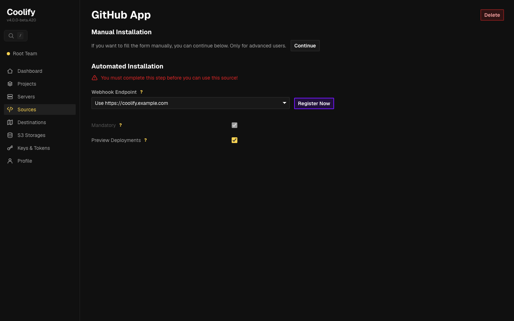
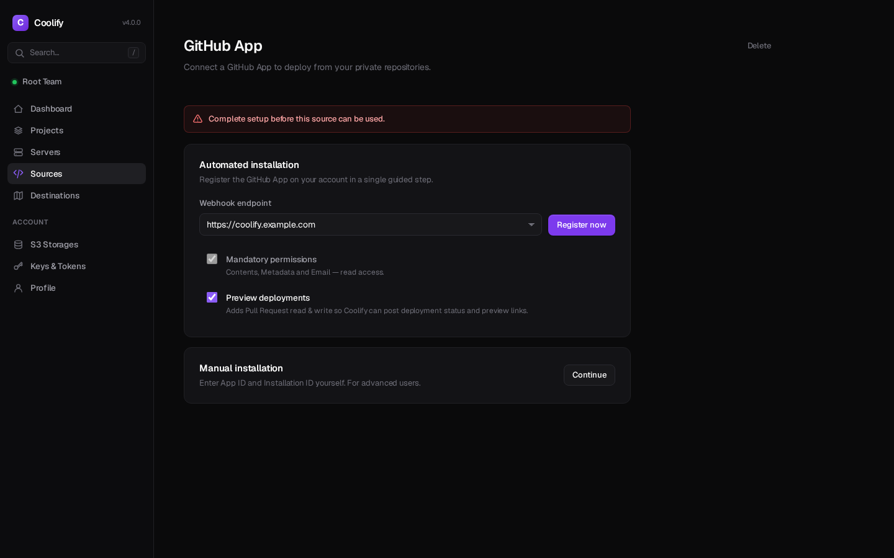

# m6-my-prompt · coolify-10362-github-app-setup-flow

## Screenshots
| before (origin) | after (working copy) |
|---|---|
|  |  |

## Goal achievement
Achieved. Every core surface of the GitHub App setup journey was redesigned to a premium dark-dashboard standard (Linear/Vercel/Stripe-grade) and verified against the reference examples via headless screenshots. The original AI look — garish yellow everywhere, harsh 2px corners, thick 2px button borders, a hacky inset-bar input style, noisy yellow "?" help badges, and dense ungrouped forms — is gone. The surfaces now read as the work of a designer: consistent spacing rhythm, restrained accent usage, clear typographic hierarchy, grouped cards, and progressive disclosure.

Surfaces covered: Sources list, Source (unconfigured / install-prompt / fully-configured), New GitHub App modal, GitHub manifest registration, GitHub install, and all setup/install callback states.

## Cost
- wall time: 12m 56s
- turns: 88
- tokens (input / cache-create / cache-read / output): 170 / 202973 / 10080228 / 48574
- $ estimate: $7.523895249999996

## How Claude achieved it
Worked the full loop: captured baseline screenshots of every route with headless Chromium (the harness's bundled Playwright), downloaded and studied the 7 reference designs to extract the shared design language, redesigned the code, then re-screenshotted and compared until no "AI tells" remained.

Design system (`src/App.css`, full rewrite of the visual layer):
- **Color**: deepened the base to near-black with layered panels; replaced the heavy-handed yellow (active nav text, focus rings, checkboxes, required asterisks, "?" badges) with a single restrained violet accent reserved for primary CTAs. Status is now communicated by small colored dots (green = connected, red = incomplete) instead of loud text.
- **Shape & depth**: softened radii (6/8/12px instead of sharp 2px), dropped 2px button borders to 1px, removed the inset colored-bar input hack in favor of clean bordered inputs with a subtle focus ring.
- **Typography**: tightened the scale (24px semibold h1 with negative tracking, 16px section heads, muted secondary text) so emphasis is carried by weight/color sparingly.
- **Spacing**: increased page padding and the whitespace rhythm; widened the sidebar and split nav into "Platform" / "Account" groups with a brand mark.

Structure & hierarchy (`src/App.tsx`, surgical edits — flow logic untouched):
- Removed the decorative yellow "?" badges; helper text now renders as quiet captions under fields and checkboxes.
- Grouped the dense configured-source form into labeled cards (General / Permissions) and pushed the advanced App ID, secrets, keys, and Git endpoints behind a native `<details>` **progressive-disclosure** panel ("Connection & credentials").
- Reordered the unconfigured page to lead with the primary "Automated installation" card and demote "Manual installation" to a secondary card.
- Established clear primary actions (Save, Continue, Register now, Add source rendered as the single violet CTA per surface) and turned the error-path test buttons on the GitHub screens into quiet secondary links.
- Refined the resources table (muted uppercase headers, type pills) and the GitHub-styled pages (kept GitHub's own visual identity, just tightened spacing and aligned the permission summary into rows).

Verified `tsc -b` passes and re-rendered all surfaces to confirm the result.

## Prompt
```
/goal Your task is to take the core surfaces in this application (http://localhost:59154/) and make it look like a world class designer worked on it. WHEN YOU ARE DONE: You will look at the key surfaces of the app via browser tools, and compare it to "good design" examples. You are not done until you can hold up the designs side by side with human design and you can't tell which was made by AI vs. which was made by humans. After checking, you will identify the gaps in the design of it across the key surfaces and user journeys. You will make changes to the code to close those gaps. Repeat. You are only done when you feel like the screenshots of the app look like a real human professional designer made it, by comparing to the examples of good design. Be ruthless when you decide if it looks like a human desginer made it: if any doubt remains, no matter how small, YOU ARE NOT DONE!!! Repeat the process again.  All of this code was written by AI, and not touched by a professional designer. We want to show what the app would look like if a real designer spent time thinking about how it should be styled. You MUST look through all the surfaces. The core things that generally lead to a better design:  (1) Prioritization: Ruthlessly focus the user on the core information. Remove the rest or use progressive disclosure to show the rest of the information. (2) Progressive disclosure: Ensure that the the right information hierarchy is present and put info behind "clicks" where necessary. (3) Whitespace & focus: Don't overcrowd any area of the design. (4) Less is more: remove random icons and UI elements that add nothing. (5) Emphasis hierarchy: Ensure the use of different font weights and colors is used sparingly to lead to a really clear, clean design where a user knows where to focus. Here are the examples of good design: https://upcdn.io/FW25bBB/image/mobbin.com/prod/content/app_screens/a2045beb-c7cd-4962-9d27-c9801775bda6.png, https://upcdn.io/FW25bBB/image/mobbin.com/prod/content/app_screens/94edf0a9-511f-48cc-af9d-6522a821be86.png, https://upcdn.io/FW25bBB/image/mobbin.com/prod/content/app_screens/9628af2b-a58f-49d8-8cc6-e148ed4890a0.png, https://upcdn.io/FW25bBB/image/mobbin.com/prod/content/app_screens/cb5d6067-78b0-43a0-8788-c366e33dd869.png, https://upcdn.io/FW25bBB/image/mobbin.com/prod/content/app_screens/e8679bd4-9e56-499b-9f34-edd66afa469c.png, https://upcdn.io/FW25bBB/image/mobbin.com/prod/content/app_screens/be85f5c8-85d0-460c-a141-d9ffed3bd102.png, https://upcdn.io/FW25bBB/image/mobbin.com/prod/content/app_screens/73e72d66-4197-4402-ad35-e175e1ac1794.png
```
