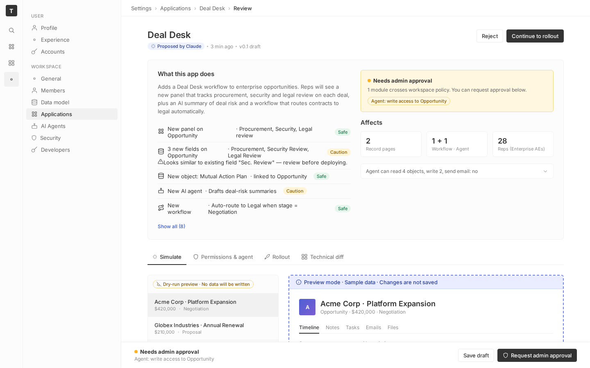
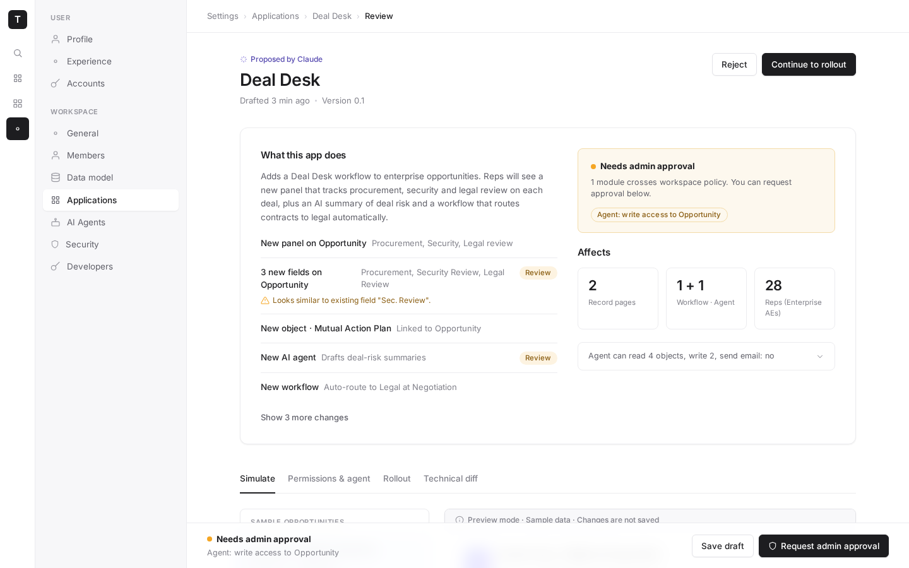

# m6-my-prompt · deal-desk-prototype-1

## Screenshots
| before (origin) | after (working copy) |
|---|---|
|  |  |

## Goal achievement
Achieved. The Deal Desk review app was restyled across all four core surfaces (Simulate,
Permissions & agent, Rollout, Technical diff) so the screenshots read as the work of a
professional product designer rather than AI-generated boilerplate. Compared against the
reference set (Copilot/Stripe/15Five/Airtable/Airbnb), the redesign matches their hallmarks:
generous whitespace, a strong type hierarchy, a restrained palette where color carries
meaning, no decorative iconography, and a couple of confident "designer" moments (the dark
impact card, the blurred sticky action bar). Information architecture and copy were left
intact — only presentation and hierarchy changed.

## Cost
- wall time: 13m 34s
- turns: 73
- tokens (input / cache-create / cache-read / output): 4854 / 132317 / 6691806 / 42776
- $ estimate: $5.266554250000002

## How Claude achieved it
Worked an observe → critique → fix loop: captured each surface with Playwright (using the
already-running dev server), compared to the reference screenshots, then edited the code.
Because the page uses an inner scroll container, screenshots injected temporary CSS to
unclip the scroll so the full content of each tab could be reviewed.

Key changes (all in `src/App.tsx` + `src/App.css`):

- **Emphasis hierarchy via color discipline.** The original sprayed five tag colors
  (green/amber/blue/purple/gray) across the page. Reserved amber for the only things needing
  attention (the two "Review" change rows, the policy banner, "Needs approval", MCP access),
  demoted every "Safe" / "Read" label to neutral gray so it recedes, and kept blue only for
  the higher-privilege "Write" access and the selected sample. Color now means something.
- **Less is more.** Removed decorative icons from the four tabs, the five change-list rows,
  the panel header, the dry-run pill and the side-effect chips. Kept only functional/semantic
  icons (nav rail, the single AI sparkle, the conflict warning).
- **Prioritization + progressive disclosure.** Dropped the redundant "Safe" pills from the
  change list (4 of 5 rows), trimmed verbose detail copy, and reframed "Show all (8)" as
  "Show 3 more changes" so the fold shows the signal and hides the rest behind a click.
- **Typography & whitespace.** Base font 13→14px with 1.5 line-height; a new eyebrow + 27px
  page title with negative tracking; larger card padding (24→32px), bigger section gaps, and
  roomier rows throughout.
- **Craft details a designer would add.** White cards with subtle borders + soft shadows on a
  faint canvas; an inverted (near-black) Rollout impact card that makes the "28 reps" number
  the hero; a translucent blurred sticky action bar; refined toggles (near-black when on),
  focus rings on inputs, and a 2px accent rail on the selected sample opportunity.

## Prompt
```
/goal Your task is to take the core surfaces in this application (http://localhost:59159/) and make it look like a world class designer worked on it. WHEN YOU ARE DONE: You will look at the key surfaces of the app via browser tools, and compare it to "good design" examples. You are not done until you can hold up the designs side by side with human design and you can't tell which was made by AI vs. which was made by humans. After checking, you will identify the gaps in the design of it across the key surfaces and user journeys. You will make changes to the code to close those gaps. Repeat. You are only done when you feel like the screenshots of the app look like a real human professional designer made it, by comparing to the examples of good design. Be ruthless when you decide if it looks like a human desginer made it: if any doubt remains, no matter how small, YOU ARE NOT DONE!!! Repeat the process again.  All of this code was written by AI, and not touched by a professional designer. We want to show what the app would look like if a real designer spent time thinking about how it should be styled. You MUST look through all the surfaces. The core things that generally lead to a better design:  (1) Prioritization: Ruthlessly focus the user on the core information. Remove the rest or use progressive disclosure to show the rest of the information. (2) Progressive disclosure: Ensure that the the right information hierarchy is present and put info behind "clicks" where necessary. (3) Whitespace & focus: Don't overcrowd any area of the design. (4) Less is more: remove random icons and UI elements that add nothing. (5) Emphasis hierarchy: Ensure the use of different font weights and colors is used sparingly to lead to a really clear, clean design where a user knows where to focus. Here are the examples of good design: https://upcdn.io/FW25bBB/image/mobbin.com/prod/content/app_screens/a2045beb-c7cd-4962-9d27-c9801775bda6.png, https://upcdn.io/FW25bBB/image/mobbin.com/prod/content/app_screens/94edf0a9-511f-48cc-af9d-6522a821be86.png, https://upcdn.io/FW25bBB/image/mobbin.com/prod/content/app_screens/9628af2b-a58f-49d8-8cc6-e148ed4890a0.png, https://upcdn.io/FW25bBB/image/mobbin.com/prod/content/app_screens/cb5d6067-78b0-43a0-8788-c366e33dd869.png, https://upcdn.io/FW25bBB/image/mobbin.com/prod/content/app_screens/e8679bd4-9e56-499b-9f34-edd66afa469c.png, https://upcdn.io/FW25bBB/image/mobbin.com/prod/content/app_screens/be85f5c8-85d0-460c-a141-d9ffed3bd102.png, https://upcdn.io/FW25bBB/image/mobbin.com/prod/content/app_screens/73e72d66-4197-4402-ad35-e175e1ac1794.png
```
