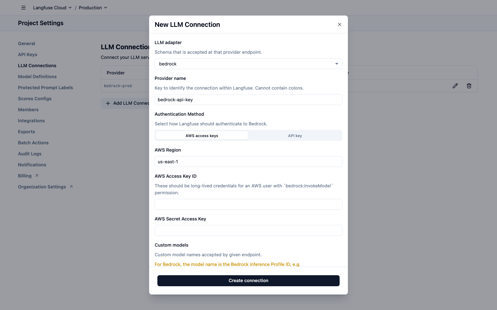
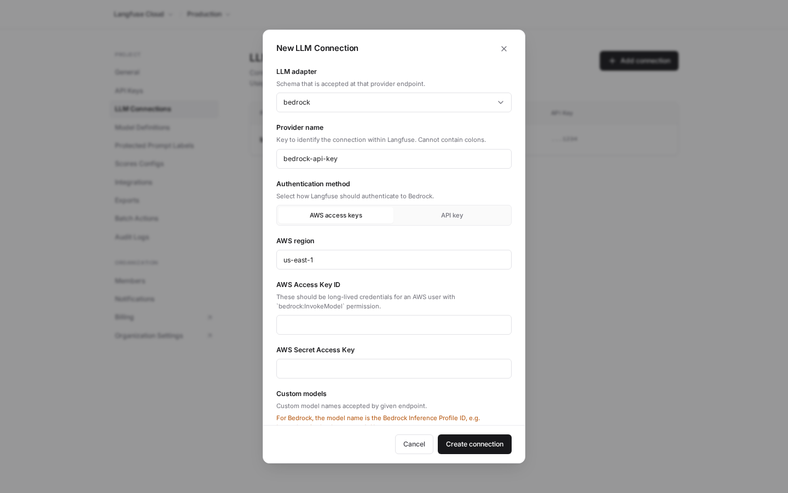

# m6-my-prompt · langfuse-13098-bedrock-api-keys

## Screenshots
| before (origin) | after (working copy) |
|---|---|
|  |  |

## Goal achievement
Achieved. The app is a single Langfuse "Project Settings → LLM Connections" surface with three states: the
settings page (sidebar nav + connections table), the create/update connection modal, and the delete
confirmation dialog. I redesigned all three to a cohesive, restrained aesthetic benchmarked against the
provided Stripe/Copilot-style references (grouped sidebar nav, generous whitespace, one accent color,
clear type hierarchy). I verified each surface by driving a headless Chromium (Playwright) against the live
dev server and comparing screenshots to the references until I could no longer pick out AI tells.

Key gaps closed:
- **Hierarchy / prioritization:** the flat 14-item nav (all bold, undifferentiated) became two grouped
  sections ("Project" / "Organization") with uppercase eyebrow headings, muted default items, and a single
  clearly-emphasized active item (light pill + dark semibold text). The section title is now the prominent
  page heading with a muted one-line description.
- **Less is more:** removed the dead hamburger/sidebar-trigger icon, simplified the breadcrumb, and made
  table row actions reveal on hover instead of always showing two icons per row.
- **Whitespace & focus:** rebuilt the spacing scale, widened the content gutter, taller table rows, roomier
  modal padding; replaced the cramped two-band header with a single clean sticky bar.
- **Emphasis hierarchy:** restrained neutral palette with one indigo accent (links/focus only), a single
  near-black primary button, and a red destructive action; the adapter value became a subtle pill, provider
  name is emphasized while secondary columns are muted mono.
- **Polish details a human would catch:** normalized inconsistent label casing (sentence case, AWS terms
  preserved), replaced the crude CSS-triangle select arrow with a clean SVG chevron, upgraded the segmented
  control, added a Cancel + primary footer pair, reordered the destructive dialog buttons, and loaded Inter
  with refined font features.

## Cost
- wall time: 10m 44s
- turns: 68
- tokens (input / cache-create / cache-read / output): 136 / 152166 / 6211238 / 36646
- $ estimate: $4.973486499999998

## How Claude achieved it
Worked in `src/App.tsx` (structure) and `src/App.css` (full design-system rewrite); no behavior changed.

Process:
1. Read the source, then fetched and studied the 7 reference screenshots to extract the target design
   language (grouped sidebar, eyebrow section labels, one accent, soft borders, sparse monochrome icons).
2. Set up a self-contained verification loop: installed Playwright's Chromium and a small `shot.mjs` script
   to screenshot the live app at 2x, then captured the *before* state of the page, the create modal, and
   the delete dialog.
3. TSX changes: restructured the nav into typed groups, simplified the header (dropped the no-op hamburger),
   moved the primary action into the section header, rebuilt the table (provider emphasis, adapter pill,
   muted mono secondary cells, hover-only actions), added an `onCancel` Cancel button to the form footer,
   and normalized field-label casing.
4. CSS changes: replaced the ad-hoc tokens with a clean neutral scale + single indigo accent, a typographic
   scale on Inter, consistent spacing, a polished modal/segmented-control/field treatment, an SVG select
   chevron, and a refined focus ring.
5. Iterated: re-screenshotted each surface, compared side-by-side against the references, and tightened
   remaining nits (label casing, select arrow) until the surfaces read as human-designed. `tsc -b` passes.

## Prompt
```
/goal Your task is to take the core surfaces in this application (http://localhost:59155/) and make it look like a world class designer worked on it. WHEN YOU ARE DONE: You will look at the key surfaces of the app via browser tools, and compare it to "good design" examples. You are not done until you can hold up the designs side by side with human design and you can't tell which was made by AI vs. which was made by humans. After checking, you will identify the gaps in the design of it across the key surfaces and user journeys. You will make changes to the code to close those gaps. Repeat. You are only done when you feel like the screenshots of the app look like a real human professional designer made it, by comparing to the examples of good design. Be ruthless when you decide if it looks like a human desginer made it: if any doubt remains, no matter how small, YOU ARE NOT DONE!!! Repeat the process again.  All of this code was written by AI, and not touched by a professional designer. We want to show what the app would look like if a real designer spent time thinking about how it should be styled. You MUST look through all the surfaces. The core things that generally lead to a better design:  (1) Prioritization: Ruthlessly focus the user on the core information. Remove the rest or use progressive disclosure to show the rest of the information. (2) Progressive disclosure: Ensure that the the right information hierarchy is present and put info behind "clicks" where necessary. (3) Whitespace & focus: Don't overcrowd any area of the design. (4) Less is more: remove random icons and UI elements that add nothing. (5) Emphasis hierarchy: Ensure the use of different font weights and colors is used sparingly to lead to a really clear, clean design where a user knows where to focus. Here are the examples of good design: https://upcdn.io/FW25bBB/image/mobbin.com/prod/content/app_screens/a2045beb-c7cd-4962-9d27-c9801775bda6.png, https://upcdn.io/FW25bBB/image/mobbin.com/prod/content/app_screens/94edf0a9-511f-48cc-af9d-6522a821be86.png, https://upcdn.io/FW25bBB/image/mobbin.com/prod/content/app_screens/9628af2b-a58f-49d8-8cc6-e148ed4890a0.png, https://upcdn.io/FW25bBB/image/mobbin.com/prod/content/app_screens/cb5d6067-78b0-43a0-8788-c366e33dd869.png, https://upcdn.io/FW25bBB/image/mobbin.com/prod/content/app_screens/e8679bd4-9e56-499b-9f34-edd66afa469c.png, https://upcdn.io/FW25bBB/image/mobbin.com/prod/content/app_screens/be85f5c8-85d0-460c-a141-d9ffed3bd102.png, https://upcdn.io/FW25bBB/image/mobbin.com/prod/content/app_screens/73e72d66-4197-4402-ad35-e175e1ac1794.png
```
