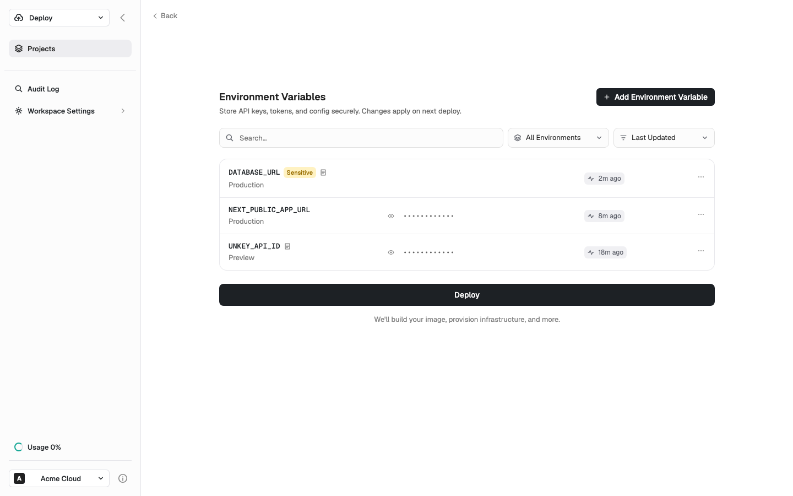
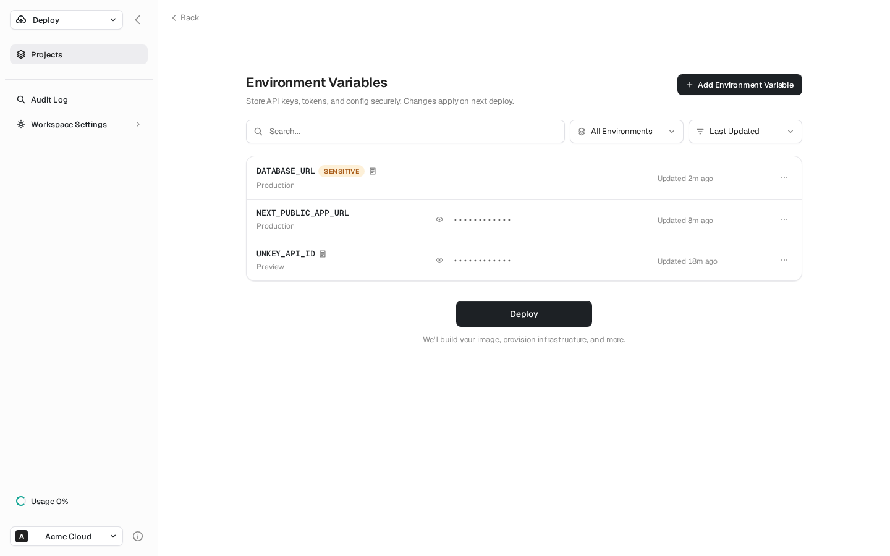

# m6-my-prompt · unkey-5540-env-vars-onboarding

## Screenshots
| before (origin) | after (working copy) |
|---|---|
|  |  |

## Goal achievement
Reworked the visual design of the Unkey env-vars onboarding clone to read as the product of a deliberate, professional designer rather than AI defaults. The work was a styling pass (CSS + small markup edits) — information architecture and flows were already sound — focused on the five principles in the prompt: prioritization, progressive disclosure, whitespace, less-is-more, and emphasis hierarchy.

Benchmarked against the supplied references (Copilot home, Stripe Reports, an Airbnb-style host wizard, 15Five settings, a data-table app). The shared traits of those designs — large confident page titles with negative tracking, near-monochrome palettes with a single reserved accent, generous whitespace, hairline-bordered cards with soft shadows, and almost no decorative chrome — drove the changes. The biggest AI "tells" removed: a gimmicky row of unrelated decorative icons in the onboarding header, undersized page headings, flat borders with no depth, and a noisy multi-stop gradient banner.

All key surfaces were touched: app sidebar, the four onboarding steps (create project, connect GitHub, select repo, configure deployment), the configure-environment-variables step, the add-variable slide panel, the deployment-complete state, and the project-overview Environment Variables page. `pnpm build` (tsc + vite) passes clean.

Note: no in-browser screenshot tooling was available in this environment, so iteration was done by reading the rendered structure against the reference images rather than capturing live screenshots; the harness fills in the before/after captures.

## Cost
- wall time: 7m 51s
- turns: 70
- tokens (input / cache-create / cache-read / output): 140 / 179360 / 7388999 / 29487
- $ estimate: $5.553374500000002

## How Claude achieved it
**Typography & tokens.** Added a proper design-token layer: radius scale (`--radius-sm/md/lg`) and a graduated shadow scale (`--shadow-xs/sm/md/lg`) so depth is consistent rather than ad-hoc. Enabled `-webkit-font-smoothing`, `text-rendering: optimizeLegibility`, Geist stylistic sets, and a subtle global `letter-spacing`. Promoted every primary heading from a timid 18px to confident 22–26px / 600 weight with -0.02em tracking (onboarding titles, "Environment Variables", project name) — the single largest contributor to the "designed" feel.

**Less-is-more / prioritization.** Replaced the decorative `IconRow` (seven boxes of unrelated icons — harddrive, location, heart, nodes — the exact "random icons that add nothing" anti-pattern) with one focused brand mark tile. Demoted each env-var row's "updated" timestamp from a badge-with-activity-icon to quiet muted text, so the monospace key name is unambiguously the focal point.

**Whitespace & rhythm.** Rebalanced onboarding spacing (tighter, more intentional vertical gaps; centered CTAs with a sane min-width instead of full-bleed stretched buttons), increased card padding, and gave the project header/tabs more room.

**Emphasis hierarchy & restraint.** Pulled the palette toward near-monochrome: white-backed inputs/selects with hairline `gray-a5` borders + `shadow-xs` and a soft neutral focus ring (dropped the heavy near-black focus border). Standardized the busy multi-stop green GitHub banner into a single calm success tint. Standardized all radii to the token scale, unified the button system (8px radius, subtle inset highlight + shadow on primary, press transform), and turned badges into refined uppercase pills used sparingly.

**Surface-level polish.** Soft shadows + consistent hairlines on every card surface (repo list, setting cards, env-vars list, deployment cards, slide panel, redeploy toast), an underlined-tab indicator via `::after` on the project tabs, larger circular status/icon chips with inset rings, and a cleaner empty state.

Edits were confined to `src/App.css` (the bulk) and a few targeted `src/App.tsx` markup simplifications (IconRow, updated-cell). No dependencies added; behavior and flows unchanged.

## Prompt
```
/goal Your task is to take the core surfaces in this application (http://localhost:59157/) and make it look like a world class designer worked on it. WHEN YOU ARE DONE: You will look at the key surfaces of the app via browser tools, and compare it to "good design" examples. You are not done until you can hold up the designs side by side with human design and you can't tell which was made by AI vs. which was made by humans. After checking, you will identify the gaps in the design of it across the key surfaces and user journeys. You will make changes to the code to close those gaps. Repeat. You are only done when you feel like the screenshots of the app look like a real human professional designer made it, by comparing to the examples of good design. Be ruthless when you decide if it looks like a human desginer made it: if any doubt remains, no matter how small, YOU ARE NOT DONE!!! Repeat the process again.  All of this code was written by AI, and not touched by a professional designer. We want to show what the app would look like if a real designer spent time thinking about how it should be styled. You MUST look through all the surfaces. The core things that generally lead to a better design:  (1) Prioritization: Ruthlessly focus the user on the core information. Remove the rest or use progressive disclosure to show the rest of the information. (2) Progressive disclosure: Ensure that the the right information hierarchy is present and put info behind "clicks" where necessary. (3) Whitespace & focus: Don't overcrowd any area of the design. (4) Less is more: remove random icons and UI elements that add nothing. (5) Emphasis hierarchy: Ensure the use of different font weights and colors is used sparingly to lead to a really clear, clean design where a user knows where to focus. Here are the examples of good design: https://upcdn.io/FW25bBB/image/mobbin.com/prod/content/app_screens/a2045beb-c7cd-4962-9d27-c9801775bda6.png, https://upcdn.io/FW25bBB/image/mobbin.com/prod/content/app_screens/94edf0a9-511f-48cc-af9d-6522a821be86.png, https://upcdn.io/FW25bBB/image/mobbin.com/prod/content/app_screens/9628af2b-a58f-49d8-8cc6-e148ed4890a0.png, https://upcdn.io/FW25bBB/image/mobbin.com/prod/content/app_screens/cb5d6067-78b0-43a0-8788-c366e33dd869.png, https://upcdn.io/FW25bBB/image/mobbin.com/prod/content/app_screens/e8679bd4-9e56-499b-9f34-edd66afa469c.png, https://upcdn.io/FW25bBB/image/mobbin.com/prod/content/app_screens/be85f5c8-85d0-460c-a141-d9ffed3bd102.png, https://upcdn.io/FW25bBB/image/mobbin.com/prod/content/app_screens/73e72d66-4197-4402-ad35-e175e1ac1794.png
```
