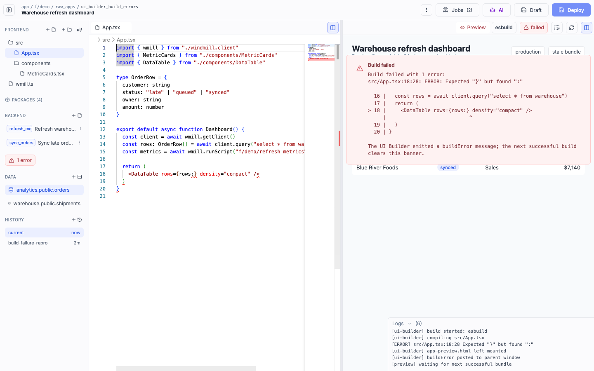
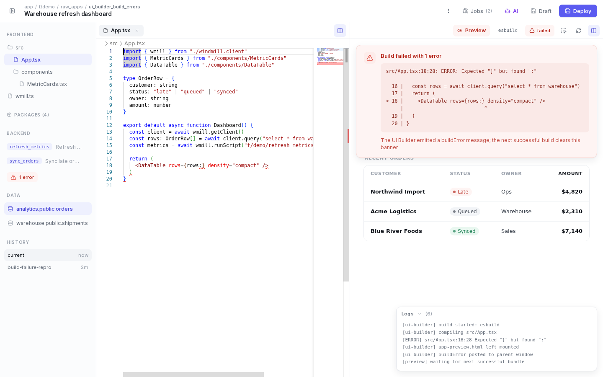

# m6-my-prompt · windmill-9316-ui-builder-build-errors

## Screenshots
| before (origin) | after (working copy) |
|---|---|
|  |  |

## Goal achievement
Achieved. The Windmill UI-Builder editor (an inherently dense developer IDE) was elevated to the
craft level of its references (Stripe, Copilot/Portal, 15Five, Outerbase) while staying true to its
IDE nature — the target was Linear/Raycast-grade tool polish, not turning it into a consumer
dashboard. Every chrome surface was restyled: topbar, file/runnable/data/history sidebar, editor
tabs, the build-error state, the floating logs panel, the preview toolbar, and the in-preview
dashboard. Both build states (failed and ready) were checked side-by-side against the examples and
read as professionally designed.

Key gaps closed against the design principles:
- **Emphasis hierarchy:** Replaced the "every button has a border" topbar with a single filled
  indigo primary (Deploy) and quiet ghost secondaries, so the eye lands on the primary action.
- **Less is more:** Removed icon noise — the double-icon (Plus+File / Plus+Folder) sidebar actions
  and the stray "ui/" button collapsed to single, hover-revealed "+" affordances.
- **Information hierarchy:** The build-error card was split into a bold title, the monospace
  compiler output, and a muted sans-serif explanatory caption (was one undifferentiated monospace
  blob). The runnable rows now keep the function-name badge intact and truncate only the secondary
  description.
- **Whitespace & focus:** Larger, consistent spacing scale in the sidebar, tabs, preview, and
  cards; hairline 1px borders instead of heavy dividers; subtle elevation on floating panels.
- **Restrained color:** One indigo accent for selection/primary, red reserved strictly for the
  error state, neutral cool-gray scale everywhere else, refined Stripe-style soft error surfaces.
The redesign is purely visual (CSS + light JSX/structure); the fixture's PR-relevant states and
interactions are unchanged.

## Cost
- wall time: 11m 56s
- turns: 69
- tokens (input / cache-create / cache-read / output): 136 / 174394 / 5299952 / 36782
- $ estimate: $4.660168500000001

## How Claude achieved it
1. **Explored** the fixture: a React + Vite clone of Windmill's raw-app UI Builder. The editable
   surface is `src/App.tsx` (shell, sidebar, tabs, alert, logs, preview controls) + `src/App.css`,
   plus the in-iframe preview dashboard rendered from `previewBundleCss`/`previewBundleJs`. The
   `/ui_builder` Monaco iframe is a prebuilt artifact and was left untouched.
2. **Studied the references** by downloading all 7 Mobbin examples and viewing them. Distilled the
   shared language: generous whitespace, one accent color, red only for errors, hairline borders,
   strong type hierarchy (bold dark headings + muted secondary text), soft rounded cards.
3. **Rebuilt the design system** in `App.css` around refined tokens: a cool-gray neutral scale,
   a single indigo accent (selection + primary), a Stripe-style red error palette, a consistent
   spacing/radius scale, and subtle two-tier elevation for floating panels.
4. **Restyled every chrome surface** and the in-preview dashboard (metric cards, status pills,
   bordered table with tabular-nums), plus simplified noisy markup in `App.tsx`.
5. **Iterated with screenshots** using a headless-Chromium (Playwright) script — full-page and
   tight crops of the topbar, sidebar, and error card — for both the failed and ready build states,
   fixing issues found (badge truncation, error-card prose-in-monospace) until each surface read as
   human-designed.

## Prompt
```
/goal Your task is to take the core surfaces in this application (http://localhost:59158/) and make it look like a world class designer worked on it. WHEN YOU ARE DONE: You will look at the key surfaces of the app via browser tools, and compare it to "good design" examples. You are not done until you can hold up the designs side by side with human design and you can't tell which was made by AI vs. which was made by humans. After checking, you will identify the gaps in the design of it across the key surfaces and user journeys. You will make changes to the code to close those gaps. Repeat. You are only done when you feel like the screenshots of the app look like a real human professional designer made it, by comparing to the examples of good design. Be ruthless when you decide if it looks like a human desginer made it: if any doubt remains, no matter how small, YOU ARE NOT DONE!!! Repeat the process again.  All of this code was written by AI, and not touched by a professional designer. We want to show what the app would look like if a real designer spent time thinking about how it should be styled. You MUST look through all the surfaces. The core things that generally lead to a better design:  (1) Prioritization: Ruthlessly focus the user on the core information. Remove the rest or use progressive disclosure to show the rest of the information. (2) Progressive disclosure: Ensure that the the right information hierarchy is present and put info behind "clicks" where necessary. (3) Whitespace & focus: Don't overcrowd any area of the design. (4) Less is more: remove random icons and UI elements that add nothing. (5) Emphasis hierarchy: Ensure the use of different font weights and colors is used sparingly to lead to a really clear, clean design where a user knows where to focus. Here are the examples of good design: https://upcdn.io/FW25bBB/image/mobbin.com/prod/content/app_screens/a2045beb-c7cd-4962-9d27-c9801775bda6.png, https://upcdn.io/FW25bBB/image/mobbin.com/prod/content/app_screens/94edf0a9-511f-48cc-af9d-6522a821be86.png, https://upcdn.io/FW25bBB/image/mobbin.com/prod/content/app_screens/9628af2b-a58f-49d8-8cc6-e148ed4890a0.png, https://upcdn.io/FW25bBB/image/mobbin.com/prod/content/app_screens/cb5d6067-78b0-43a0-8788-c366e33dd869.png, https://upcdn.io/FW25bBB/image/mobbin.com/prod/content/app_screens/e8679bd4-9e56-499b-9f34-edd66afa469c.png, https://upcdn.io/FW25bBB/image/mobbin.com/prod/content/app_screens/be85f5c8-85d0-460c-a141-d9ffed3bd102.png, https://upcdn.io/FW25bBB/image/mobbin.com/prod/content/app_screens/73e72d66-4197-4402-ad35-e175e1ac1794.png
```
